# VLMS — Beta UML

Snapshot of **branch `Beta`** at `bdb2435` plus the uncommitted
`ListPageFrame` extract (2026-09-05). Project version **0.2.0**.
SQLite `PRAGMA user_version` / `Database::kSchemaVersion` = **4**.

This is a reverse-engineered design of the code as it stands, not a proposal.
Diagrams are top-down so they print in a narrow A4 column.

---

## 1. System context

Desktop library management for one library. One process, one SQLite file,
no network service, no member login. Librarians work in four pages:
catalog, members, circulation, metrics.


OCR is optional: if Tesseract or traineddata is missing, `Ocr::isAvailable()`
is false and the book editor disables the button.

---

## 2. Build packages

CMake produces four link units. Core and Ocr are Qt-free; that is a
**link error**, not a comment.

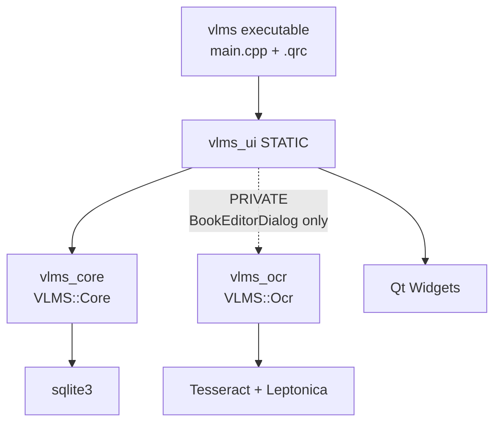

| Target | Qt | Depends on | Public language |
| --- | --- | --- | --- |
| `vlms_core` | no | sqlite3 | `std::string`, `int64_t`, `Result<T>` / `Status` |
| `vlms_ocr` | no | Tesseract, Threads | `std::string`, `Ocr::Result` |
| `vlms_ui` | yes | Core, Widgets, Ocr (private) | `QWidget`, `QtBridge` |
| tests | Test | Core and/or `vlms_ui` | `TestEnv` `qs`/`ss`/`qd`/`cd` |

---

## 3. Runtime composition

Two trees, not one tangle. `Application` owns persistence.
`MainWindow` owns four pages. Each page is the UI of **one**
repository. Repositories hold a `SqliteSession&` and must die
**before** `Database`.

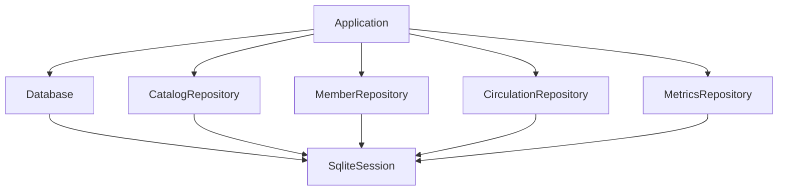

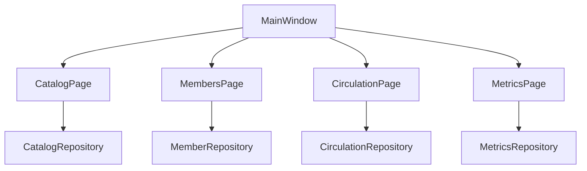

`MembersPage` also reads `CirculationRepository` for the loans
dialog. `CirculationPage` also reads `CatalogRepository` for
cover paths. Those are lookups, not a second owner.

---

## 3.1 List page frame

The four pages are one machine. On screen the row is LTR
(RTL flips it). The diagram is top-down so it prints.

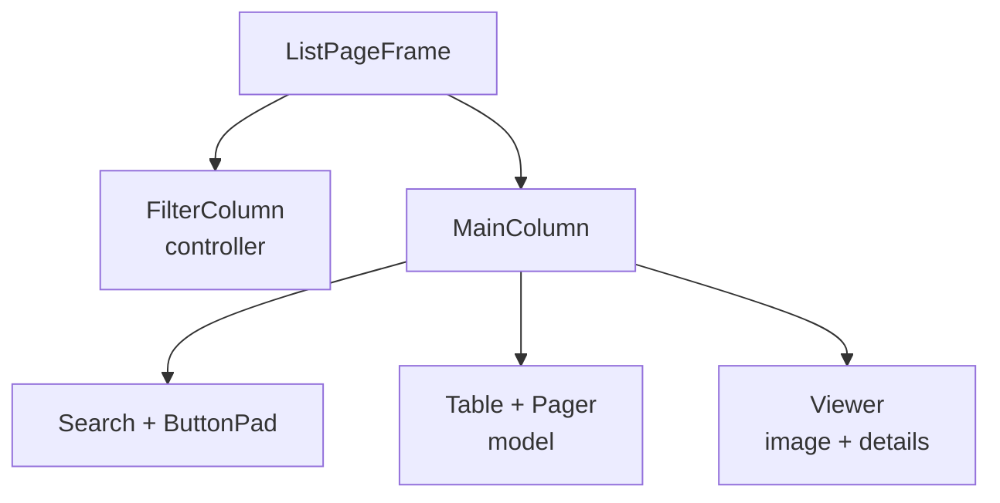

| Slot | Role |
| --- | --- |
| `FilterColumn` | Facets that rewrite the query. Controller. |
| `Search` | Text that also rewrites the query. Part of the model key. |
| `ButtonPad` | 4 / 3 / 1 actions. Add, modify, delete, plus one page option — or only Refresh. |
| `Table + Pager` | The list. Selection drives the viewer. |
| `Viewer` | Image box (cover, member photo, or placeholder) plus the detail pad. |

How each page fills the slots:

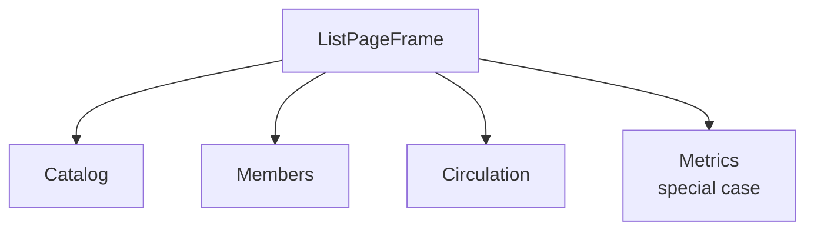

| | Filters | ButtonPad | Table | Viewer image |
| --- | --- | --- | --- | --- |
| Catalog | language, category, cover | Add Edit Delete Categories | books | book cover / placeholder |
| Members | status | Loans Add Edit Delete | members | photo / placeholder |
| Circulation | open / overdue / returned | Checkout Extend Return | loans | book cover / placeholder |
| Metrics | none | Refresh | none | overloaded: cards + activity + top categories |

Metrics is the same frame with the filter column empty, no search,
a one-button pad, and the viewer taking the whole main column.

`ListPageFrame` is that class. Pages compose it; they do not inherit it.
Metrics calls `buildDashboard`.

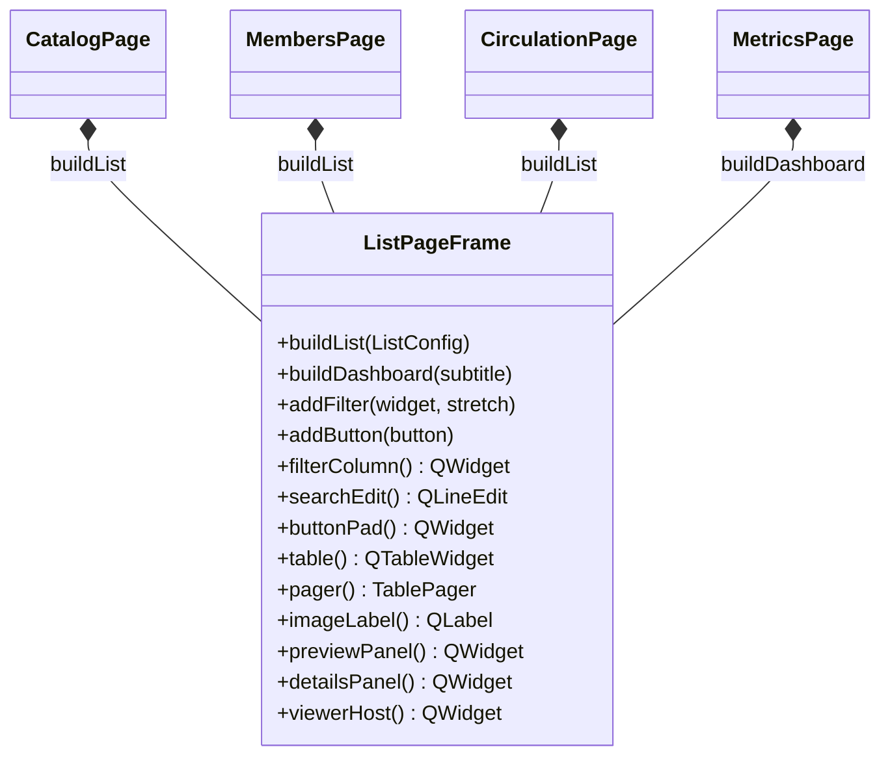

Startup, in order (`Application` constructor, then `main`):

1. `Paths::setProjectRoot` if unset
2. `Locale` load from `QSettings`, apply RTL, install Qt catalogue
3. `Theme::loadSaved`, Fusion style, palette + stylesheet
4. `Paths::ensureLayout`
5. `Database::open` — refuse if a newer schema wrote the file
6. construct the four repositories on `database.session()`
7. `MainWindow` only if `isDatabaseReady()`

---

## 4. Layer stack

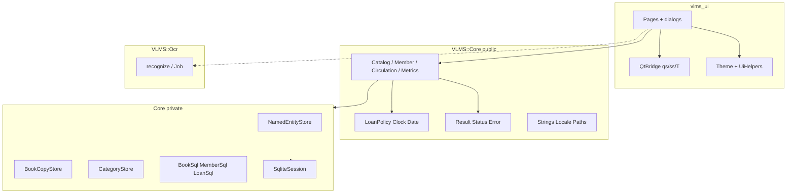

UI never talks to sqlite. Repositories never include Qt. OCR never includes
Core or Qt. `QtBridge` is the only place that converts `std::string` / `Date`
to `QString` / `QDate`.

---

## 5. Error channel

There is no `lastError()` on repositories. A valued call returns `Result<T>`;
a mutation returns `Status`. The UI maps `Error.key` through `Strings::t`.

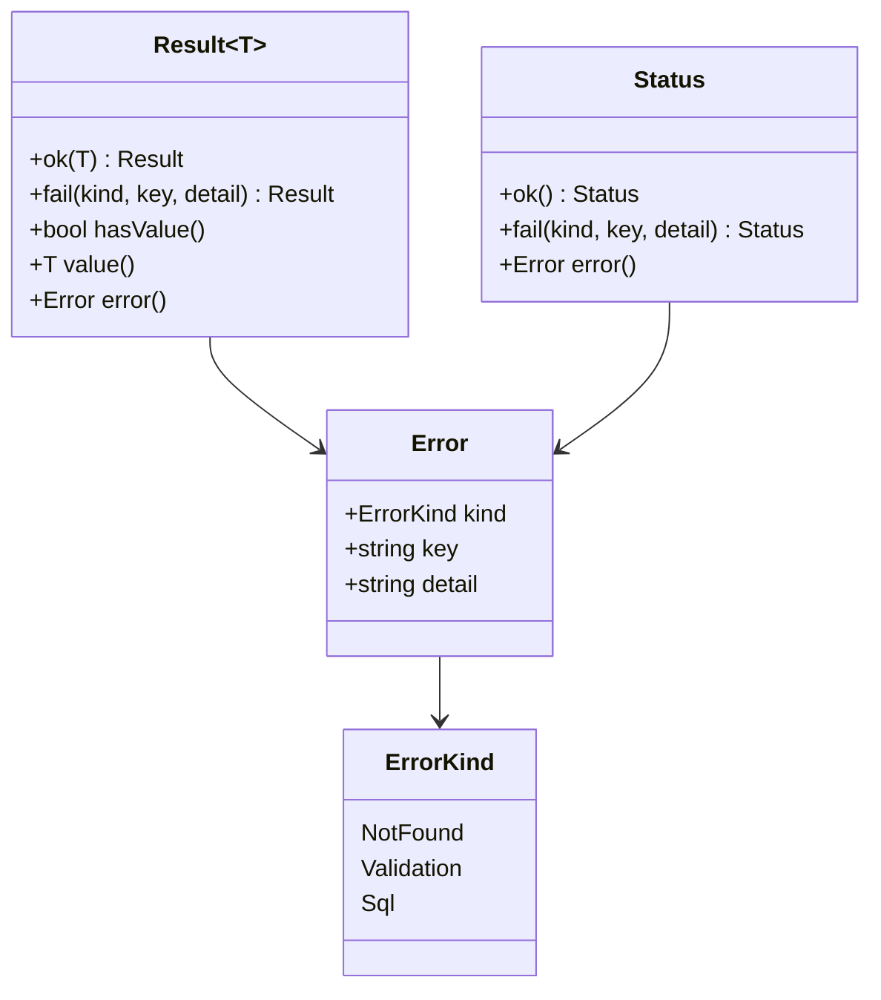

`RepoSql` is the private helper that turns a driver fragment into
`ErrorKind::Sql` + key `error.sql`, or a validation / not-found `Status`.

---

## 6. Persistence

### 6.1 Session and schema owner

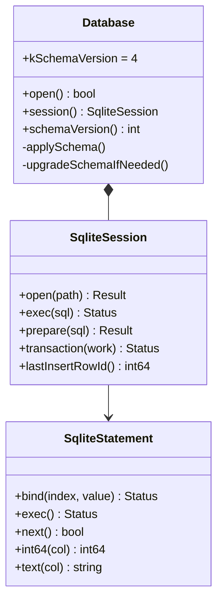

`Database` still uses a string `lastError()` for open/migrate failures.
That is process-startup, not a repository call.

### 6.2 Catalog facade

`CatalogRepository` is a facade. Book rows, names, copies, and categories
are four stores sharing one session.

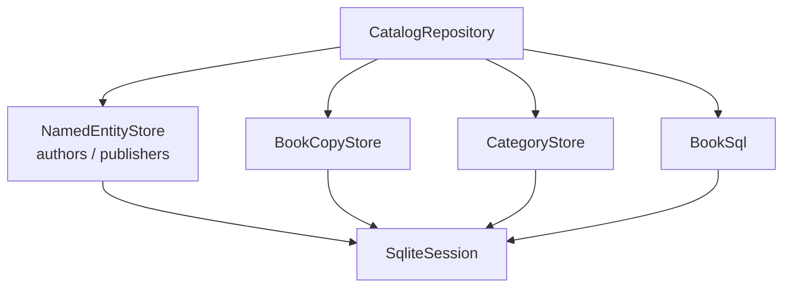

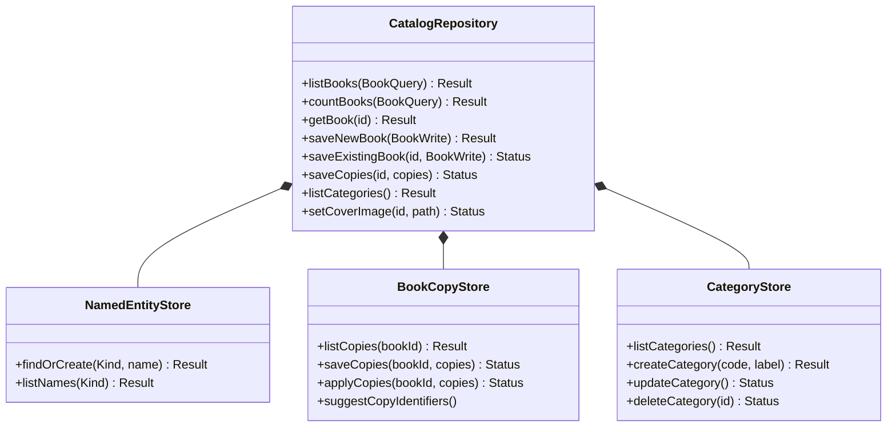

`saveNewBook` / `saveExistingBook` run book fields, copies, and cover copy
in **one** `SqliteSession::transaction`.

### 6.3 Members and circulation

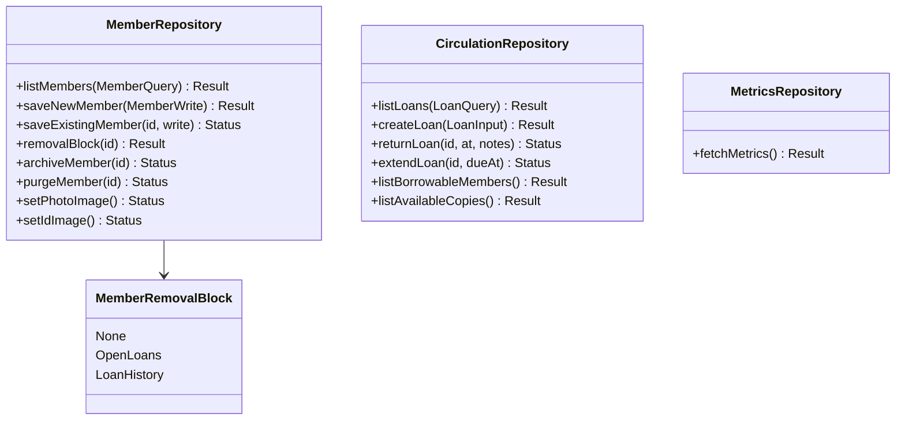

Member delete is not a single SQL `DELETE`:

- `OpenLoans` — refuse; UI offers to jump to circulation
- `LoanHistory` — `archiveMember` (set `archived_at`, keep FKs)
- `None` — `purgeMember`

`CirculationRepository` checks `memberCanBorrow` and `copyIsAvailable`
before insert. The unique index `idx_loans_one_open_per_copy` is the
constraint under that check.

---

## 7. Domain types

Plain structs. No Qt. No methods beyond data.

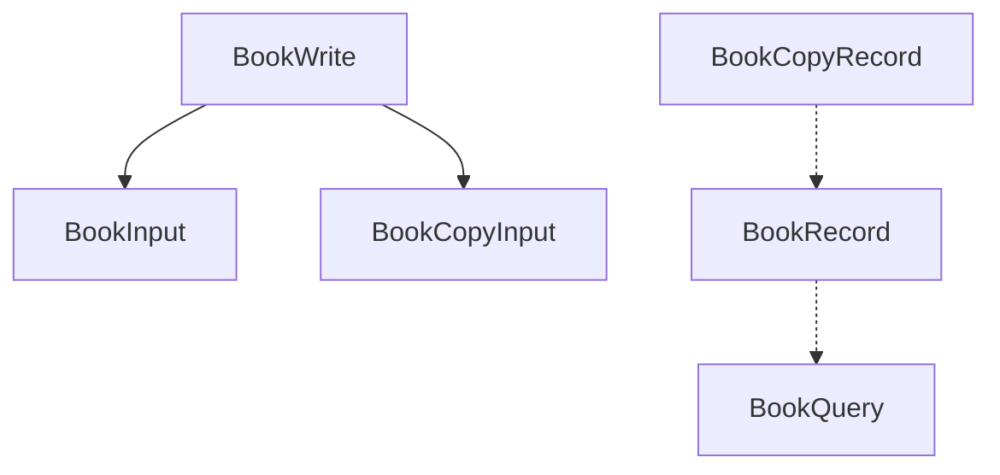

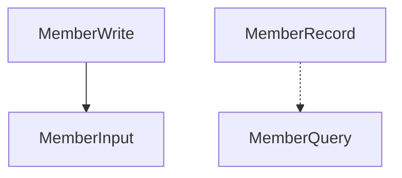

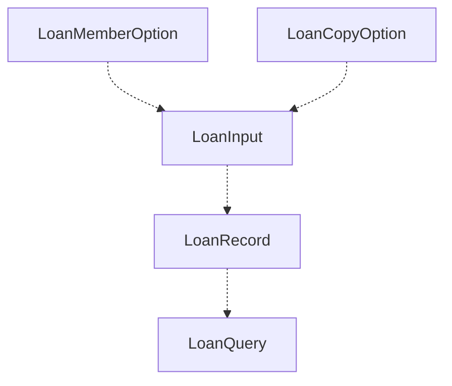

`LibraryMetrics` aggregates title/copy/member/loan counts plus
`MetricsPeriodCounts` for today / this week / this month, and
`topCategories`.

Value types that are not records:

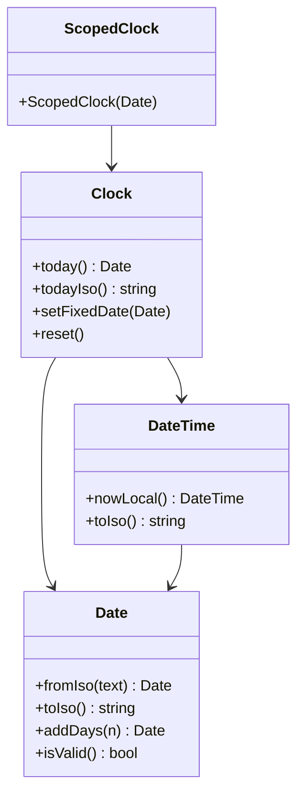

`Clock` is the only allowed "now". C++ guards and SQL `:today` binds must
agree. Time is **local** (Ksour Essef), not UTC `date('now')`.

`LoanPolicy` (14-day default) validates checkout, return, and extension
dates against `Clock::today()`.

---

## 8. UI classes

### 8.1 Shell

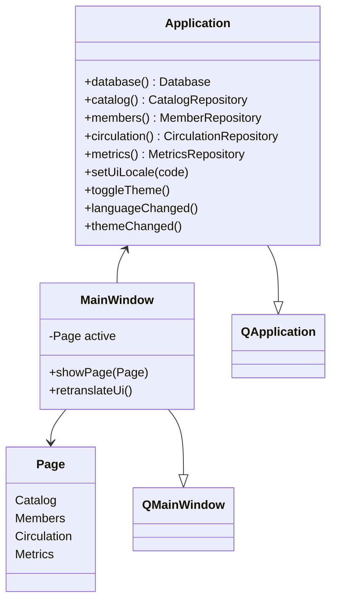

`MainWindow` listens to `languageChanged` / `themeChanged` and retranslates
the four pages. Navigation is a `QStackedWidget`.

### 8.2 Pages and dialogs

Each page is a `ListPageFrame` bound to one repository (section 3.1).
Dialogs are what the ButtonPad opens — they are not a second layout.

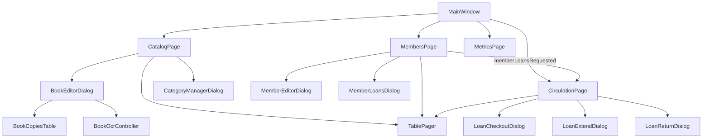

`TablePager` (page size 50) is the model pager inside the frame.
Metrics has no pager: its viewer is the whole dashboard.

| Dialog | Writes through | Notes |
| --- | --- | --- |
| `BookEditorDialog` | `saveNewBook` / `saveExistingBook` | composes copies table + OCR |
| `CategoryManagerDialog` | `create` / `update` / `deleteCategory` | |
| `MemberEditorDialog` | `saveNewMember` / `saveExistingMember` | photo + ID card files |
| `MemberLoansDialog` | read-only `listLoans` | history for one member |
| `LoanCheckoutDialog` | `createLoan` | uses `LoanPolicy` dates |
| `LoanExtendDialog` | `extendLoan` | |
| `LoanReturnDialog` | `returnLoan` | no repository in the dialog |

`BookOcrController` owns `Ocr::Job`, polls it on a `QTimer`, and emits
`textReady` on the UI thread. The dialog stays a composer.

---

## 9. Cross-cutting services

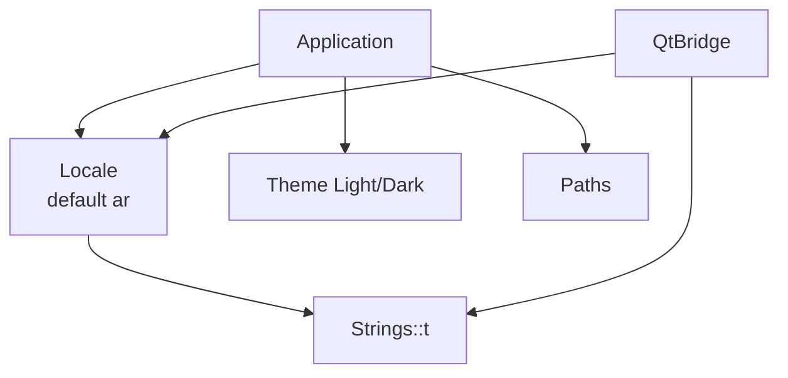

- `Locale` — `ar` / `fr` / `en`; `isRtl()` drives layout direction
- `Strings` — key tables, never raw `QSqlError` text
- `Theme` — Fusion + stylesheet + palette for chrome Qt will not style
- `Paths` — injected project root; Core never reads `QCoreApplication`
- `QtBridge` — `qs` / `ss` / `qsl` / `svl` / `qd` / `cd` / `T`

---

## 10. Data model

```mermaid
flowchart TD
    employees[employees]
    members[members]
    msh[member_status_history]
    authors[authors]
    publishers[publishers]
    categories[categories]
    books[books]
    copies[book_copies]
    loans[loans]

    members --> msh
    authors --> books
    publishers --> books
    categories --> books
    books --> copies
    members --> loans
    copies --> loans
    employees -.-> loans
    employees -.-> msh
```

Cardinalities that matter:

- `books` 1—N `book_copies` (`ON DELETE CASCADE`)
- `members` 1—N `loans` (no cascade; archive instead)
- at most **one open loan per copy** (`UNIQUE` partial index)
- `members.archived_at` NULL means listed; lists filter it out
- `employees` exist for a default staff row and unused FK columns;
  there is no login UI in this build

---

## 11. Sequences

### 11.1 Process start

```mermaid
flowchart TD
    A[main] --> B[Application ctor]
    B --> C{Database::open}
    C -->|fail| D[showCritical<br/>app.databaseUnavailable]
    C -->|ok| E[new four repositories]
    E --> F[MainWindow]
    F --> G[showMaximized]
    G --> H[app.exec]
```

### 11.2 Save a new book

```mermaid
flowchart TD
    P[CatalogPage.addBook] --> D[BookEditorDialog]
    D --> I[collect BookWrite]
    I --> S[saveNewBook]
    S --> T[session.transaction]
    T --> N[NamedEntityStore.findOrCreate]
    T --> B[insert book row]
    T --> C[BookCopyStore.applyCopies]
    T --> Cov[copy cover into resources/books]
    T --> OK[Result int64 id]
    OK --> P2[refreshBooks]
```

### 11.3 Checkout

```mermaid
flowchart TD
    C[CirculationPage.checkoutLoan] --> D[LoanCheckoutDialog]
    D --> M[listBorrowableMembers]
    D --> A[listAvailableCopies]
    D --> P[LoanPolicy.validateLoanDates]
    P --> R[createLoan]
    R --> MC[memberCanBorrow]
    R --> CA[copyIsAvailable]
    R --> INS[INSERT loans]
    INS --> IDX[idx_loans_one_open_per_copy]
```

### 11.4 OCR a description

```mermaid
flowchart TD
    B[BookEditorDialog] --> C[BookOcrController.start]
    C --> J[Ocr::Job::start]
    J --> W[std::thread recognize]
    C --> T[QTimer poll]
    T --> D{job.done}
    D -->|no| T
    D -->|yes| E[take Result]
    E --> F[textReady]
    F --> G[appendRecognizedText]
```

---

## 12. Tests

```mermaid
flowchart TD
    Support[libraries/Core/test/support<br/>TestEnv TestDatabase TestSeed]
    CoreT[libraries/Core/test<br/>test_vlms_core]
    OcrT[libraries/Ocr/test<br/>test_vlms_ocr]
    UiT[applications/vlms/test<br/>test_vlms_ui]

    Support --> CoreT
    Support --> UiT
    CoreT --> CoreLib[vlms_core]
    OcrT --> OcrLib[vlms_ocr]
    UiT --> UiLib[vlms_ui]
```

Google Test. Core and Ocr tests are Qt-free. UI tests use Qt Widgets plus GTest.
`TestDatabase::scalar` treats SQL NULL as a null `SqlValue`.

---

## 13. What this snapshot deliberately is not

- No member-facing web or mobile client
- No employee login, despite `employees` in the schema
- No Qt types in Core or Ocr
- No second error channel on repositories
- No UTC clock in loan predicates
