# VLMS — Beta UML

Snapshot of **branch `Beta`** at `ce6fac0` (tag lineage **v1.2.0-1-gce6fac0**,
project version **1.2.0**). SQLite `PRAGMA user_version` /
`Database::Connection::kSchemaVersion` = **7**.

This is a reverse-engineered design of the code as it stands, not a proposal.
An approved frontend redesign
([spec](../superpowers/specs/2026-09-29-frontend-redesign-design.md))
restructures `applications/vlms/src/ui` later; it is **not** in this snapshot.
Diagrams are top-down so they print in a narrow A4 column.

---

## 1. System context

Desktop library management for one library. One process, one SQLite file,
no network service, no member login. Librarians work in five pages:
catalog, members, circulation, archive, metrics.

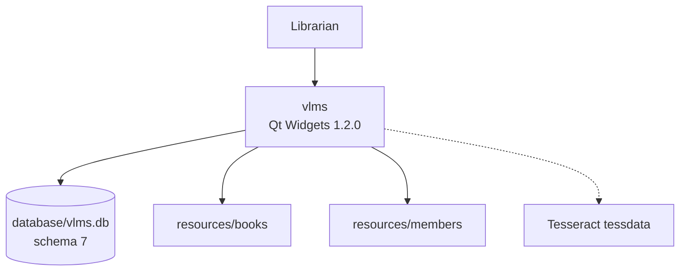

OCR is optional: if Tesseract or traineddata is missing, `Ocr::isAvailable()`
is false and the book editor disables the button.

---

## 2. Build packages

CMake produces five link units besides the executable. Boundaries that used
to be comments are **link errors**:

- `VLMS::Core` links nothing (std only).
- `VLMS::Database` is the only target that links sqlite3 (`PRIVATE`).
- `VLMS::Repositories` sees SQLite only through `SqliteSession`.
- `VLMS::Ocr` links Threads + Tesseract; no Core, no Qt.
- `vlms_ui` links Repositories publicly and Ocr privately.

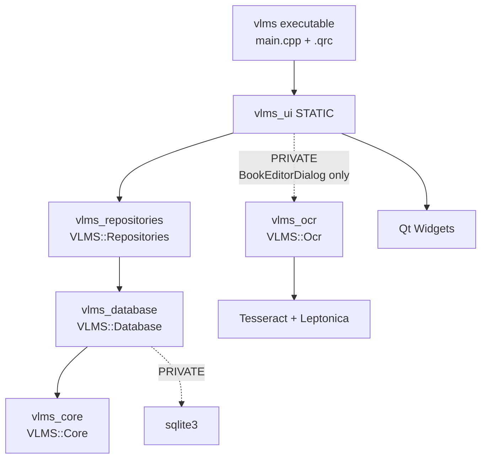

| Target | Namespace | Qt | Depends on | Public language |
| --- | --- | --- | --- | --- |
| `vlms_core` | `VLMS::Core` | no | *(none)* | `std::string`, `int64_t`, `Result<T>` / `Status` |
| `vlms_database` | `VLMS::Database` | no | Core; sqlite3 PRIVATE | `Connection`, `SqliteSession` |
| `vlms_repositories` | `VLMS::Repositories` | no | Database | repositories, records, `LoanPolicy` |
| `vlms_ocr` | `VLMS::Ocr` | no | Threads, Tesseract | `std::string`, `Ocr::Result` |
| `vlms_ui` | *(UI classes mostly global / `VLMS::`)* | yes | Repositories, Widgets, Ocr (private) | `QWidget`, `QtBridge` |
| tests | `Test::` helpers | Test | matching library and/or `vlms_ui` | `TestEnv` `qs`/`ss`/`qd`/`cd` |

Include prefixes mirror namespaces: `<VLMS/Core/…>`, `<VLMS/Database/…>`,
`<VLMS/Repositories/…>`, `<VLMS/Ocr/…>`.

---

## 3. Runtime composition

Two trees, not one tangle. `Application` owns persistence.
`MainWindow` owns five pages. Each live list page is the UI of **one**
primary repository. Repositories hold a `SqliteSession&` and must die
**before** `Connection`.

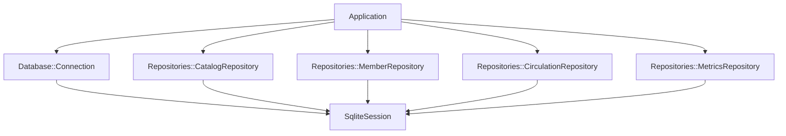

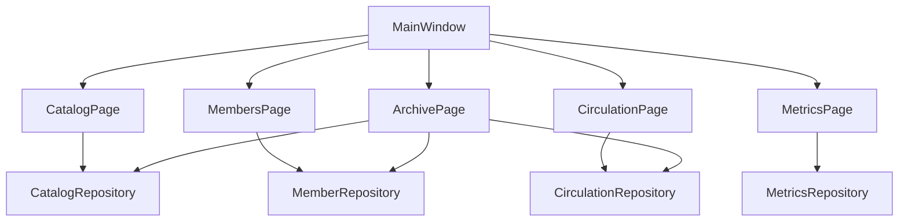

Cross-page repository reads (lookups, not second owners):

- `MembersPage` / `CatalogPage` → `CirculationRepository` for loan history dialogs.
- `CirculationPage` → `CatalogRepository` (covers) and `MemberRepository` (facets).
- `ArchivePage` binds all three write-capable repositories; scope is
  `ArchiveScope::Archived` (or `Any` for some facet lists).

---

## 3.1 List page frame

The list pages are one machine. On screen the row is LTR (RTL flips it).
The diagram is top-down so it prints.

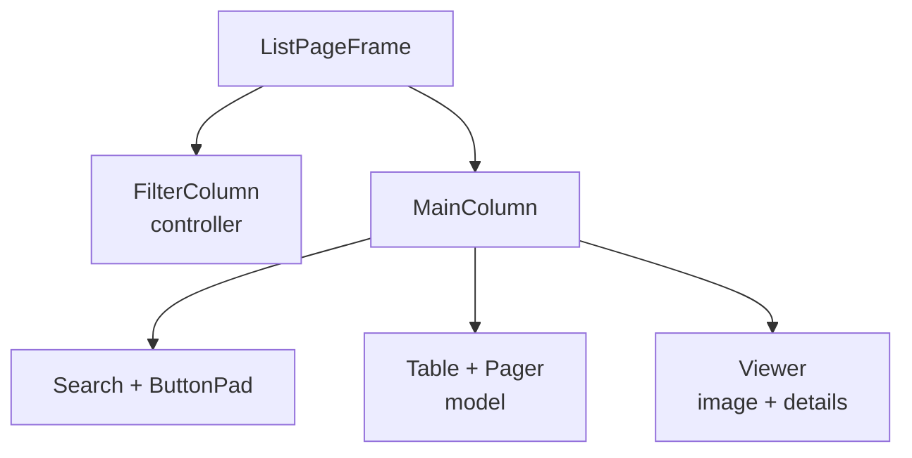

| Slot | Role |
| --- | --- |
| `FilterColumn` | Facets that rewrite the query. Controller. |
| `Search` | Text that also rewrites the query. Part of the model key. |
| `ButtonPad` | Page actions (add / edit / delete / loans / restore / …). |
| `Table + Pager` | The list. Selection drives the viewer. |
| `Viewer` | Image box (cover, member photo, dual cover+photo, or placeholder) plus the detail pad. |

How each page fills the slots:

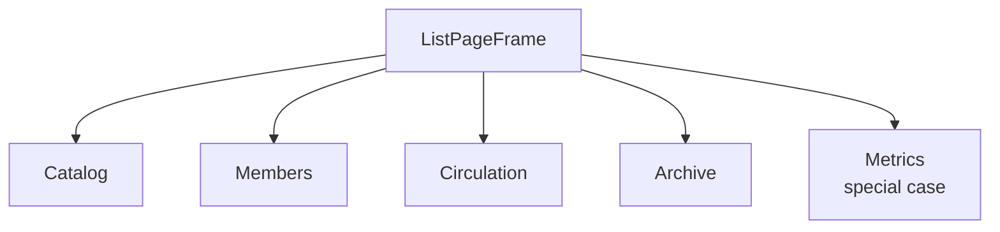

| | Filters | ButtonPad | Table | Viewer image |
| --- | --- | --- | --- | --- |
| Catalog | language, category, cover (`ArchiveScope::Live`) | Loans Add Edit Delete | books | book cover / placeholder |
| Members | status and other facets (`Live`) | Loans Add Edit Delete | members | photo / placeholder |
| Circulation | open / overdue / returned + years | Return Checkout Extend Delete | loans | cover **and** member photo |
| Archive | type switch + type-specific facets (`Archived`) | Loans / Reuse / Restore / Purge (by type) | archived rows | depends on type |
| Metrics | none | Refresh | none | overloaded: cards + activity + top categories |

Metrics is the same frame with the filter column empty, no search,
a one-button pad, and the viewer taking the whole main column.

`ListPageFrame` is that class. Pages compose it; they do not inherit it.
Metrics calls `buildDashboard`. `ListConfig` may set a second image label
(Circulation dual preview).

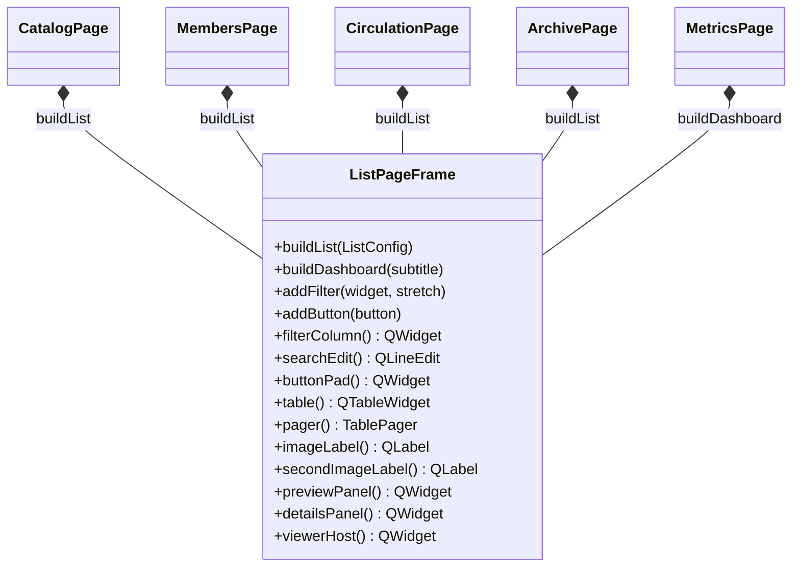

Startup, in order (`Application` constructor, then `main`):

1. App identity, window icon, desktop file name, Fusion style
2. `Paths::setProjectRoot` if unset
3. `Locale` load from `QSettings`, apply RTL + `QLocale`, install Qt catalogue
4. fonts, `Theme::loadSaved`, palette + stylesheet
5. `Paths::ensureLayout`
6. `Connection::open` — refuse if a newer schema wrote the file; on failure
   leave repositories unset (`isDatabaseReady()` false)
7. construct the four repositories on `connection.session()`
8. `MainWindow` only if `isDatabaseReady()`

---

## 4. Layer stack

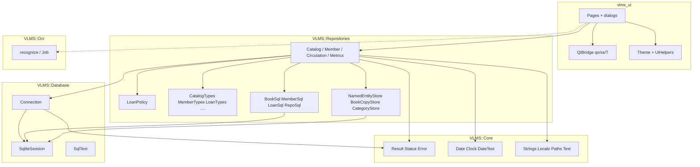

UI never talks to sqlite. Repositories never include Qt. OCR never includes
Core, Database, Repositories, or Qt. `QtBridge` is the only place that
converts `std::string` / `Core::Date` to `QString` / `QDate`.

---

## 5. Error channel

There is no `lastError()` on repositories. A valued call returns
`Core::Result<T>`; a mutation returns `Core::Status`. The UI maps
`Error.key` through `Core::Strings::t`.

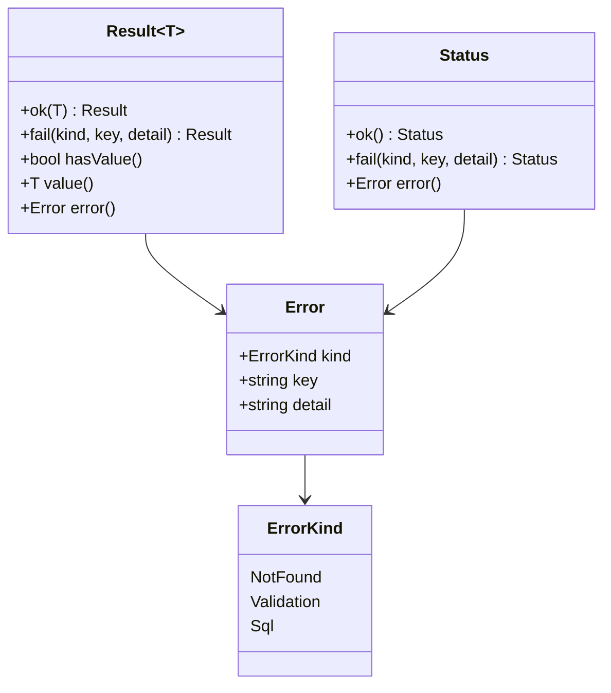

`RepoSql` (Repositories private) turns a driver fragment into
`ErrorKind::Sql` + key `error.sql`, or a validation / not-found `Status`.

`Connection` still uses a string `lastError()` for open/migrate failures.
That is process-startup, not a repository call.

---

## 6. Persistence

### 6.1 Session and schema owner

The class that opens the file, applies `database/schema.sql`, and runs
migrations is `VLMS::Database::Connection` (renamed from the old flat
`Database` so it does not collide with the `VLMS::Database` namespace).

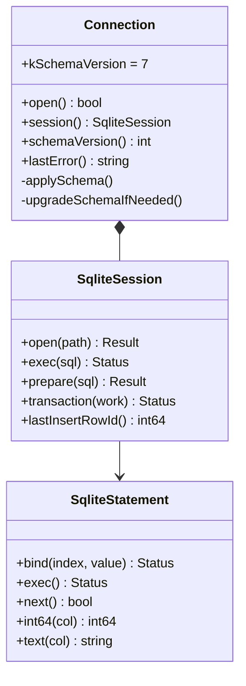

Notable migrations gated by `upgradeSchemaIfNeeded` (among others):
legacy shapes, catalog/language/description, member sex/email/archived/
spreadsheet columns, archive columns on books/copies/loans, member
`active_until`, date CHECKs, publication-date normalisation.

### 6.2 Catalog facade

`CatalogRepository` is a facade. Book rows, names, copies, and categories
are stores / SQL helpers sharing one session.

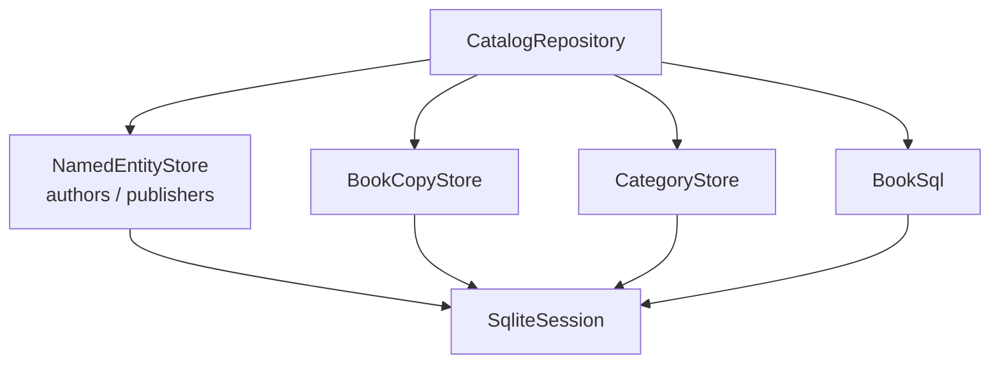

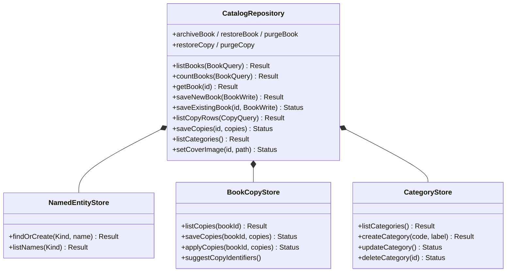

`saveNewBook` / `saveExistingBook` run book fields, copies, and cover copy
in **one** `SqliteSession::transaction`.

List queries take `ArchiveScope` (`Live` / `Archived` / `Any`). Live pages
pass `Live`; Archive passes `Archived`; history dialogs often use `Any`.

### 6.3 Members, circulation, archive funnel

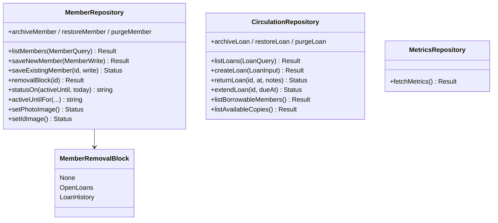

Member delete is not a single SQL `DELETE`:

- `OpenLoans` — refuse; UI offers to jump to circulation
- `LoanHistory` — `archiveMember` (set `archived_at`, keep FKs)
- `None` — `purgeMember`

Member **status is not a stored column**. A member is active while
`active_until` (last active day) is today or later. `statusOn` /
`activeUntilFor` derive and renew that date (register / renew → one year;
not active → ended yesterday).

`CirculationRepository` checks `memberCanBorrow` and `copyIsAvailable`
before insert. The unique index `idx_loans_one_open_per_copy` is the
constraint under that check.

Archive / restore / purge also exist for books, copies, and returned loans
(`canArchive*` / `canPurge*` are the read-only preflight answers).

---

## 7. Domain types

Plain structs in `VLMS::Repositories`. No Qt. No methods beyond data.

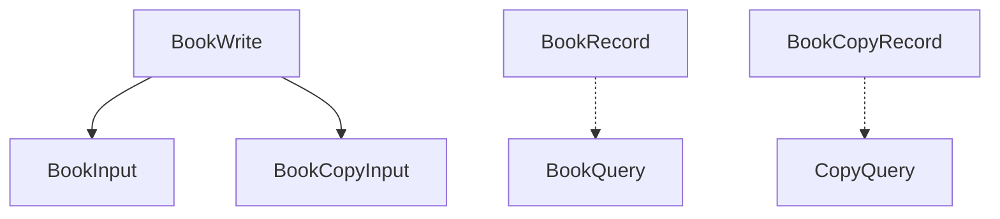

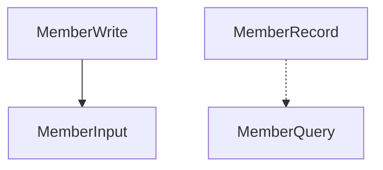

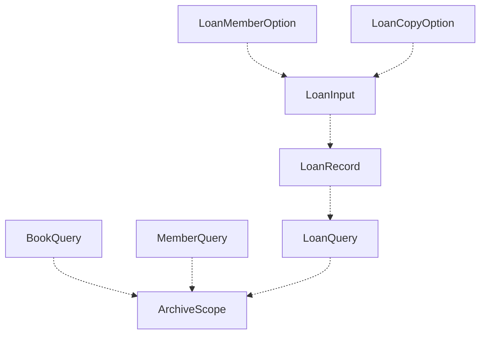

`LibraryMetrics` aggregates title/copy/member/loan counts plus
`MetricsPeriodCounts` for today / this week / this month, and
`topCategories`.

Value types in Core that are not records:

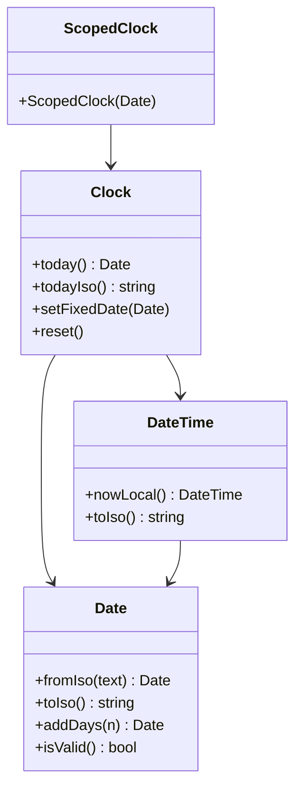

`Core::Clock` is the only allowed "now". C++ guards and SQL `:today` binds
must agree. Time is **local** (Ksour Essef / Africa/Tunis), not UTC
`date('now')`.

`Repositories::LoanPolicy` (14-day default) validates checkout, return, and
extension dates against `Clock::today()`.

---

## 8. UI classes

### 8.1 Shell

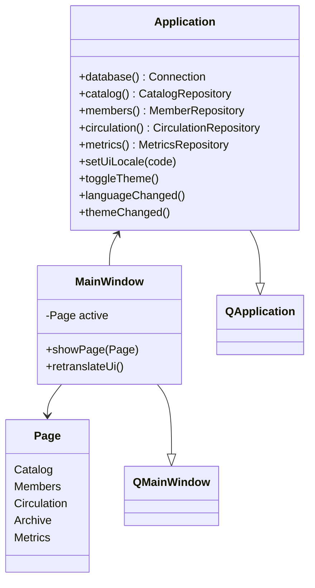

`MainWindow` listens to `languageChanged` / `themeChanged` and retranslates
the pages. Navigation is a `QStackedWidget`. Header also holds language
selector, theme toggle, and the user-manual button.

### 8.2 Pages and dialogs

Each list page is a `ListPageFrame` bound to repositories (section 3.1).
Dialogs are what the ButtonPad opens — they are not a second layout.

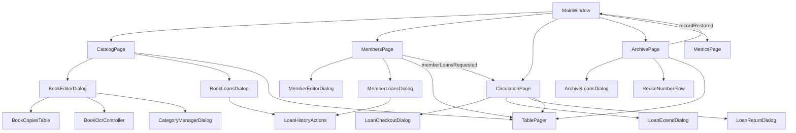

`TablePager` (page size 50; Show All is available) is the model pager inside
the frame. Metrics has no pager: its viewer is the whole dashboard.

| Dialog / helper | Writes through | Notes |
| --- | --- | --- |
| `BookEditorDialog` | `saveNewBook` / `saveExistingBook` | composes copies table + OCR |
| `CategoryManagerDialog` | `create` / `update` / `deleteCategory` | |
| `BookLoansDialog` | read-only `listLoans` | history for one book |
| `MemberEditorDialog` | `saveNewMember` / `saveExistingMember` | photo + ID card; `active_until` |
| `MemberLoansDialog` | read-only `listLoans` | history for one member |
| `LoanCheckoutDialog` | `createLoan` | uses `LoanPolicy` dates |
| `LoanExtendDialog` | `extendLoan` | |
| `LoanReturnDialog` | `returnLoan` | |
| `LoanHistoryActions` | return / extend / archive paths | shared loan actions |
| `ArchiveLoansDialog` | read-only | archived loan detail |
| `ReuseNumberFlow` | copy reuse into editor | archived local number → new copy |
| `LicenceDialog` / `ImageViewerDialog` | none | shell helpers |

`BookOcrController` owns `Ocr::Job`, polls it on a `QTimer`, and emits
`textReady` on the UI thread. The dialog stays a composer.

---

## 9. Cross-cutting services

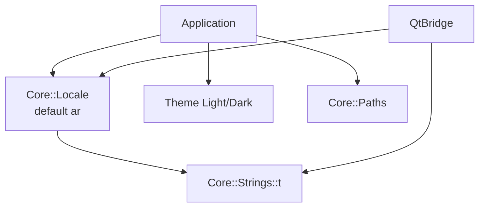

- `Core::Locale` — `ar` / `fr` / `en`; `isRtl()` drives layout direction;
  Tunisian Arabic `QLocale` for calendars (Latin digits)
- `Core::Strings` — key tables, never raw driver text
- `Theme` — Fusion + stylesheet + palette for chrome Qt will not style
- `Core::Paths` — injected project root; Core never reads `QCoreApplication`
- `QtBridge` — `qs` / `ss` / `qsl` / `svl` / `qd` / `cd` / `T`

---

## 10. Data model

```mermaid
flowchart TD
    employees[employees]
    members[members]
    msh[member_status_history]
    authors[authors]
    publishers[publishers]
    categories[categories]
    books[books]
    copies[book_copies]
    loans[loans]

    members --> msh
    authors --> books
    publishers --> books
    categories --> books
    books --> copies
    members --> loans
    copies --> loans
    employees -.-> loans
    employees -.-> msh
```

Cardinalities and rules that matter:

- `books` 1—N `book_copies` (`ON DELETE CASCADE`)
- `members` 1—N `loans` (no cascade; archive instead)
- at most **one open loan per copy** (`UNIQUE` partial index)
- `archived_at` NULL means live; list queries filter via `ArchiveScope`
  on members, books, copies, and loans
- member status is **derived** from `active_until`, not stored on `members`
- `employees` exist for a default staff row and unused FK columns;
  there is no login UI in this build
- date columns use round-trip `CHECK (date(x) IS x)` / `datetime(x) IS x`
  guards where corruption must be rejected

Schema 7 vs the old schema-4 snapshot (high level): archive columns on
catalog and loans, member spreadsheet fields, `active_until`, email/sex,
publication date original, and stricter date CHECKs.

---

## 11. Sequences

### 11.1 Process start

```mermaid
flowchart TD
    A[main] --> B[Application ctor]
    B --> C{Connection::open}
    C -->|fail| D[showCritical<br/>app.databaseUnavailable]
    C -->|ok| E[new four repositories]
    E --> F[MainWindow]
    F --> G[showMaximized]
    G --> H[app.exec]
```

### 11.2 Save a new book

```mermaid
flowchart TD
    P[CatalogPage.addBook] --> D[BookEditorDialog]
    D --> I[collect BookWrite]
    I --> S[saveNewBook]
    S --> T[session.transaction]
    T --> N[NamedEntityStore.findOrCreate]
    T --> B[insert book row]
    T --> C[BookCopyStore.applyCopies]
    T --> Cov[copy cover into resources/books]
    T --> OK[Result int64 id]
    OK --> P2[refreshBooks]
```

### 11.3 Checkout

```mermaid
flowchart TD
    C[CirculationPage.checkoutLoan] --> D[LoanCheckoutDialog]
    D --> M[listBorrowableMembers]
    D --> A[listAvailableCopies]
    D --> P[LoanPolicy.validateLoanDates]
    P --> R[createLoan]
    R --> MC[memberCanBorrow]
    R --> CA[copyIsAvailable]
    R --> INS[INSERT loans]
    INS --> IDX[idx_loans_one_open_per_copy]
```

### 11.4 OCR a description

```mermaid
flowchart TD
    B[BookEditorDialog] --> C[BookOcrController.start]
    C --> J[Ocr::Job::start]
    J --> W[std::thread recognize]
    C --> T[QTimer poll]
    T --> D{job.done}
    D -->|no| T
    D -->|yes| E[take Result]
    E --> F[textReady]
    F --> G[appendRecognizedText]
```

### 11.5 Archive restore

```mermaid
flowchart TD
    A[ArchivePage.restore] --> R[restoreMember / restoreBook / restoreCopy / restoreLoan]
    R --> S[clear archived_at]
    S --> E[recordRestored]
    E --> MW[MainWindow refreshes live pages]
```

---

## 12. Tests

```mermaid
flowchart TD
    CoreT[libraries/Core/test<br/>test_vlms_core]
    DbT[libraries/Database/test<br/>test_vlms_database]
    RepoT[libraries/Repositories/test<br/>test_vlms_repositories]
    OcrT[libraries/Ocr/test<br/>test_vlms_ocr]
    UiT[applications/vlms/test<br/>test_vlms_ui]
    Env[Test::TestEnv]
    TDb[Test::TestDatabase]
    Seed[Test::TestSeed]

    Env --> CoreT
    TDb --> DbT
    TDb --> RepoT
    Seed --> RepoT
    Seed --> UiT
    CoreT --> CoreLib[vlms_core]
    DbT --> DbLib[vlms_database]
    RepoT --> RepoLib[vlms_repositories]
    OcrT --> OcrLib[vlms_ocr]
    UiT --> UiLib[vlms_ui]
```

Google Test. Core, Database, Repositories, and Ocr tests are Qt-free.
UI tests use Qt Widgets plus GTest. Test helpers live in `Test::`
(outside `VLMS`). `TestDatabase::scalar` treats SQL NULL as a null
`SqlValue`.

---

## 13. What this snapshot deliberately is not

- No member-facing web or mobile client
- No employee login, despite `employees` in the schema
- No Qt types in Core, Database, Repositories, or Ocr
- No sqlite3 link outside Database
- No second error channel on repositories
- No UTC clock in loan predicates
- No stored member-status column (status is derived from `active_until`)
- No frontend redesign (`ListSpec` / workflows / `DataEvents`) — that is
  approved separately and not present in this tree yet
