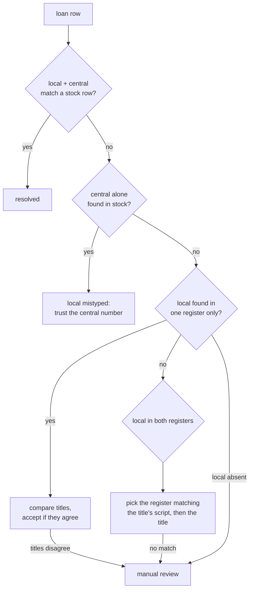

# Data quality of the library workbook — 2026-09-07

Audit of `واجهة المكتبة العمومية نسخة أمين بن حسين.xlsx` (kept outside the repo, in
`~/Dokumente/doc/VLMS resources/`). Read-only: nothing was written back to the source file.

Aggregate figures only. No member name, phone or address appears in this document —
those live in the companion workbook described at the bottom, which is deliberately
kept out of git.

## The four sheets

| sheet | header row | data rows | rows flagged |
|---|---|---|---|
| `إعارة من 2022` (loans) | 4 | 10,065 | 1,353 |
| `قائمة المشتركين` (members) | 5 | 4,667 | 438 |
| `الرصيد العربي` (Arabic stock) | 5 | 13,830 | 422 |
| `الرصيد الأجنبي` (foreign stock) | 4 | 6,690 | 707 |

Note the header rows: each sheet starts at row 4 or 5, and the leading rows are blank
or hold a title banner. Any reader that indexes rows positionally instead of using the
Excel row numbers swallows the header into the data — that happened twice while writing
this audit.

## The two identifiers, and what they are

Established in the same session, from the data:

- **Local number** (`الرقم المحلي` / `N.LOC`) — the library's own accession counter.
  One independent sequence per stock sheet, +1 per physical copy, never reused. Arabic
  has reached 19,773 and foreign 8,682. About 30% of each range is absent (weeded, lost
  or never transferred rows), so "next number = max + 1" is safe but "count = max" is not.
- **Central number** (`رقم مركزي` / `N.CENT.`) — **not generated by this library.** A
  single chronologically-running serial issued by the central authority, one per physical
  copy, allocated in ascending blocks at the moment of central registration and then
  transcribed by hand here. It had reached about 12.1 million by 2025, growing roughly
  230,000 a year; central bands line up with publication years (below 500,000 → median
  1974; 11–13 M → median 2020). The library should never mint one.

Because it is per-copy and hand-transcribed, the central number is a good cross-check
but a poor key. Note that `scripts/import_catalog.py`'s upstream `core_key`
includes `central_id` in the *bibliographic* dedup key; since the number is per-copy,
that splits multiple copies of one title into separate `books` rows.

## `الرصيد العربي` — Arabic stock, 422 of 13,830 rows flagged

| rows | issue |
|---|---|
| 369 | `central_missing` — blank or a filler mark (`**`, `*****`, `0`, `,,,,`) |
| 42 | `central_duplicated` — 21 central values used by two copies each |
| 9 | `central_out_of_range` — above 13,000,000, i.e. digits typed twice (up to 99,979,193) |
| 2 | `local_duplicated` — the single collision, both rows carrying local `0` |

This sheet is in good shape. Every local value is numeric, there are no blanks and no
mixed textual forms (no leading zeros, no `12.0`-style strings), and 13,829 of 13,830
rows carry a distinct local number. The one duplicate is `0` on two unrelated titles —
a "no number assigned yet" placeholder rather than a real clash. **`(source, local_id)`
uniqueness holds here.**

## `الرصيد الأجنبي` — foreign stock, 707 of 6,690 rows flagged

| rows | issue |
|---|---|
| 413 | `central_missing` |
| 179 | `local_duplicated` — 84 local values shared by two or more rows |
| 110 | `local_looks_like_a_year` — a publication year sitting in the `N.LOC` column |
| 98 | `central_duplicated` — 49 values on two copies each |
| 17 | `central_not_a_number` — title text spilled into `N.CENT.` (`winni`, `la foire a`, `l'étrange h`) |
| 7 | `central_out_of_range` — up to 114,696,154 |

**This sheet breaks `(source, local_id)`.** The 84 duplicated local values split as: 61
groups with a different title *and* a different central number (a genuine id clash), 13
where the row was simply typed twice, and 10 with different titles but the same central
number. Multiplicities go up to seven rows on one value.

A large part of the damage is a column shift: 15 of the 84 duplicated values are
publication years (1951, 1963, 1975, 1976, 1980, 1983, 1985–1989, 1991–1994), and 85
local values in total fall inside 1900–2025 across 110 rows. The `local 1991` group is
the clearest case — six rows with no central number and titles like
`guide économique de la Tunisie 1991`, plus one real copy.

A unique constraint would reject **95 rows** as things stand, or **70** once the
year-like values are corrected.

Across the two sheets, 2,564 local values appear in both, so uniqueness must stay scoped
per source. Only 7 central values are shared between the sheets, confirming one external
namespace with effectively no reuse.

## `إعارة من 2022` — loans, 1,353 of 10,065 rows flagged

Columns: `الاشتراك`, `المستعير`, `عنوان المستعير`, `الكتاب`, `المحلي`, `المركزي`,
`تاريخ الإعارة`, `ملاحظات`.

**The structural defect: there is no column saying which register the local number
belongs to.** Since both registers reuse the same local numbers, 1,244 loan rows carry a
local id that exists in both. The central number settles 1,033 of them; the remaining 211
can only be resolved by comparing titles.

| rows | share | outcome |
|---|---|---|
| 8,329 | 82.8% | fully consistent — local, central and title all agree with a stock row |
| 541 | 5.4% | local and title agree; the row has no central number |
| 304 | 3.0% | local and title agree, central number differs (transcription typos) |
| 275 | 2.7% | local id resolves, but the title belongs to a different book |
| 362 | 3.6% | no local id (`*****` or blank) — 39 are rescued by their central number |
| 227 | 2.3% | neither local nor central exists anywhere in stock |
| 27 | 0.3% | local absent from stock, central number identifies the row (local mistyped) |

Title agreement on matched rows is strong: median token overlap 1.00, 94.1% at or above
0.6. So the local numbers do, in the large majority, point at the right book.

Of the 275 title mismatches, 221 are a genuinely different book, 30 share words (other
edition or volume) and 24 are spelling or transliteration variants (`خطك رديئ` vs
`حظك رديء`, `unloss` vs `Unless`, `بيجماليون` vs `بيقماليون`).

**Foreign copies missing from stock.** 86 loan rows have a Latin-script title whose local
id exists only in the Arabic register, where the title is unrelated — `le cid` landing on
`ديوان شعر بشار ابن برد` at local 6,636. Widening the test, 145 Latin-title loan rows
have a local id below the foreign maximum (8,682) yet absent from the foreign register.
Those are foreign copies that were loaned but never recorded in, or later dropped from,
the foreign stock sheet.

**Books not in stock at all.** 3,928 distinct local ids appear in the loan sheet: 3,393
are in the Arabic register, 1,082 in the foreign one, and 93 in neither.

**Central number quality here.** Where a usable value exists, 8,417 rows match the stock
row exactly, 430 values appear nowhere in stock, and 51 belong to a *different* local id
(row 40: local 15,595 with central 9,391,779, which in stock belongs to local 16,595).

Resolution order that recovers the most rows:

## `قائمة المشتركين` — members, 438 of 4,667 rows flagged

Columns A–J: `ع.الإشتراك`, `ت.الإشتراك`, `الإسم واللقب`, `عنوان السكن`, `ت.الولادة`,
`العمر`, `الجنس`, `المهنة`, `هاتف`, `الفئة العمرية`. Dates are Excel serials.

**The sheet is a subscription log, not a person register.** 4,667 rows cover only 3,155
distinct name-plus-birth-date combinations. 1,021 people hold more than one row (up to
seven), 987 of those groups have exactly one row per registration year, and **in every
single group the membership number differs between rows** — a renewal gets a brand-new
number rather than reusing the person's. Registration years run 2019–2026, and membership
numbers 1–4,589 are complete with no gaps, i.e. one global counter in registration order
started in 2019.

This matters for VLMS: `membership_number` is unique per *row*, so the schema
constraint holds, but the same human being appears under several numbers, and any
"members" count, per-member loan history or status timeline built on it will be wrong.
A subscription (or renewal) entity distinct from a person is the real model.

| rows | issue |
|---|---|
| 156 | `membership_number_reused` — 78 numbers used twice, **all of them in 2019** |
| 106 | `same_person_twice_in_one_year` — 34 groups; distinct from the yearly renewals above |
| 93 | `address_without_city` — no `/ city` part, so the city cannot be split out |
| 74 | `phone_unexpected_format` — 71 with non-digits, 3 with seven digits |
| 5 | `age_group_conflicts_with_age` — `شباب` at 30+ or `كهول` under 30 |
| 3 | `age_column_disagrees_with_dates` |
| 2 | `occupation_blank`, 2 `address_blank`, 1 `birth_date_blank`, 1 `name_is_one_token` |
| 1 | `born_after_registration` |

Not flagged, because the field is optional: **864 rows have no phone number** (3,729 have
a clean eight-digit one).

The `العمر` column is **age at registration, not current age**: it agrees with the age
computed from the birth and registration dates in 4,662 of 4,665 rows, but disagrees with
today's age in 3,077. Treat it as historical and recompute for display. `الجنس` and
`الفئة العمرية` are clean — only the two expected values each, no blanks (3,618 female /
1,049 male; 4,435 `شباب` / 232 `كهول`).

## The companion workbook of ambiguous rows

`~/Dokumente/doc/VLMS resources/ambiguous-rows-2026-09-07.xlsx` — four sheets named after
the source sheets, holding only the flagged rows, each with `source_row` (the Excel row
number in the original), `issue` (semicolon-separated codes as used above), `detail` (which
other rows are involved, what the stock row actually says), and the source columns needed
to decide.

It is **outside the repository on purpose**: it contains real member names, phone numbers
and addresses, which per the project convention are never committed or published.

Rows are included when a human has to decide something. Merely missing optional data
(a blank phone) is not flagged; it is reported as an aggregate above.
