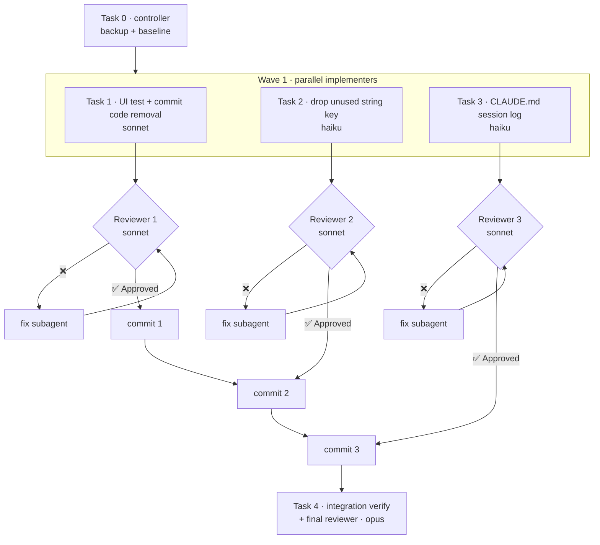

# Finish Occupation-Filter Removal Implementation Plan

> **For agentic workers:** REQUIRED SUB-SKILL: Use superpowers:subagent-driven-development to implement this plan task-by-task. Steps use checkbox (`- [ ]`) syntax for tracking. This plan deliberately overrides that skill's "never dispatch implementers in parallel" rule at the user's request; the **Execution Topology** section below is what makes the parallel wave safe.

**Goal:** Take the half-done, uncommitted removal of the members-page occupation facet to a green, reviewed, committed state on `Beta`.

**Architecture:** The production removal already sits uncommitted in the working tree (Core query field, repository method, SQL clause, UI facet, and two Core tests). Three independent pieces are left: the UI test still expects the facet, the translation key is now unused, and the session log is out of date. Each piece owns disjoint files, so all three run in one parallel wave. Each passes a reviewer gate before the controller commits it, and then a final whole-branch review checks the result.

**Tech Stack:** C++20, Qt 6 Widgets, SQLite, GoogleTest (FetchContent, source cached in `build/_deps/googletest-src`), CMake with Unix Makefiles.

## Global Constraints

- Work lands on branch `Beta` (the uncommitted work lives there). Do not push.
- Occupation stays a stored member field: the `members.occupation` column, `MemberInput::occupation`, `MemberRecord::occupation`, the member editor field, the details-panel row (`member.field.occupation`), the free-text search clause (`m.occupation LIKE :search`), and `scripts/import_members_from_xlsx.py` are all **kept**.
- **Removed:** `MemberQuery::occupations`, `MemberRepository::listOccupations()`, the `occupation_` IN clause, the `occupationFilter` facet, and the string key `members.allOccupations` in all three locales (ar, fr, en).
- The key `member.field.occupation` is **kept** (the editor and details panel still use it).
- No schema change, and `Database::kSchemaVersion` stays `5`.
- No unrelated cleanup, including the pre-existing warnings (`Date.h:32-35`, `MembersPage.cpp:445`, `Database.cpp:112`, `TestSeed.cpp:225`).
- Commit message style: one imperative sentence ending in a period, then a blank line, then `Co-Authored-By: Claude Opus 5 <noreply@anthropic.com>`.
- Never stage or commit `database/vlms.db`, `resources/books/**`, `resources/members/**`, `docs/data-quality/**`, or anything under `_backups/`.

---

## Execution Topology



### Why the wave is parallel-safe

| Task | Owns (the only files it may write) | Build dir | Commits? |
|---|---|---|---|
| 1 | `applications/vlms/test/src/test_member_filters.cpp` (edits). It also reviews and takes ownership of the 8 WIP files: `MembersPage.cpp`, `MembersPage.h`, `MemberRepository.h`, `MemberTypes.h`, `MemberRepository.cpp`, `MemberSql.cpp`, `test_member_injection.cpp`, `test_member_repository.cpp` | `build/` (existing, incremental) | No |
| 2 | `libraries/Core/src/Strings.cpp` | `build-sdd-core/` (new, Core only) | No |
| 3 | `CLAUDE.md` | none | No |

- **No two tasks write the same file.** Task 2 edits `Strings.cpp` with one `sed -i`, which writes a temp file and renames it. Task 1's build therefore sees the file either wholly before or wholly after the edit, never half-edited (a half-edited file would trip `test_strings_parity`). The key is unused in both states, so Task 1's results hold either way.
- **No two tasks share a build directory,** so parallel `make` runs don't race.
- **Implementers never commit.** Two agents running `git commit` in one working tree would collide on `.git/index.lock`, and interleaved commits would break per-task review ranges.

### Gate protocol (applies to every task)

1. The implementer finishes and writes its report to `.superpowers/sdd/occupation-filter-removal/task-N-report.md`.
2. The controller writes the review package from the working tree, limited to that task's owned paths:
   `{ echo "# Review package: Task N (working tree vs HEAD)"; git diff --stat -- <owned paths>; git diff -U10 -- <owned paths>; } > .superpowers/sdd/occupation-filter-removal/review-task-N.diff`
3. The controller dispatches a reviewer (subagent-driven-development `task-reviewer-prompt.md`) with the brief, report, and diff paths, plus the **Global Constraints** above copied verbatim.
4. **A task passes only when the reviewer returns `✅ Spec compliant` AND `Task quality: Approved`.** Any Critical or Important finding sends the task to a fix subagent, which appends its test evidence to the same report. The controller regenerates the package and runs a fresh re-review. Minor findings go into the ledger for the final reviewer to triage.
5. Only after a pass does the controller commit that task's owned paths, in the fixed order **1 → 2 → 3**. Task 2 waits for commit 1 because committing it first would leave a revision where the old `MembersPage` shows the raw key `members.allOccupations`. Task 3 waits for commit 2 because the log entry describes the finished state.
6. After each commit, append `Task N: complete (<sha7>, review clean)` to `.superpowers/sdd/occupation-filter-removal/progress.md`.

---

### Task 0: Controller pre-flight — backup and baseline

Run by the controller directly. No subagent and no review gate: nothing in the repo changes.

**Files:**
- Create: `_backups/<YYYYMMDD-HHMMSS>/{MANIFEST.md,uncommitted-files.tar.gz,uncommitted.patch,SHA256SUMS.txt}` (gitignored, per the CLAUDE.md convention)
- Create: `.superpowers/sdd/occupation-filter-removal/progress.md` (gitignored scratch; a separate ledger so the finished table-sort ledger in `.superpowers/sdd/progress.md` is not mistaken for this work)

- [ ] **Step 1: Back up the uncommitted work**

```bash
cd /home/amin/Dokumente/dev/VLMS
stamp=$(date +%Y%m%d-%H%M%S); dir="_backups/$stamp"; mkdir -p "$dir"
git diff > "$dir/uncommitted.patch"
git diff --name-only | tar -czf "$dir/uncommitted-files.tar.gz" -T -
{ echo "# Backup $stamp"; echo; echo "HEAD: $(git rev-parse HEAD)"; echo; echo "Before finishing the occupation-filter removal (plan 2026-09-15)."; echo; git status --short; } > "$dir/MANIFEST.md"
(cd "$dir" && sha256sum uncommitted.patch uncommitted-files.tar.gz MANIFEST.md > SHA256SUMS.txt)
```

Expected: the tarball lists 9 files (8 WIP code files and `CLAUDE.md`).

- [ ] **Step 2: Record BASE and the failing baseline**

```bash
git rev-parse HEAD   # expected 9bebb4c…; record it as BASE
mkdir -p .superpowers/sdd/occupation-filter-removal
printf '# SDD progress — finish occupation-filter removal\nBranch: Beta\nBASE: %s\n\n' "$(git rev-parse --short HEAD)" > .superpowers/sdd/occupation-filter-removal/progress.md
cmake --build build --parallel 8 && QT_QPA_PLATFORM=offscreen ctest --test-dir build -LE realdb 2>&1 | tail -6
```

Expected: `97% tests passed, 2 tests failed out of 62`, failing `test_ui_MemberFilters.FilterListsArePresent` and `test_ui_MemberFilters.YearOccupationAndAgeGroupNarrowTheTable`.

- [ ] **Step 3: Extract briefs**

```bash
P=docs/superpowers/plans/2026-09-15-finish-occupation-filter-removal.md
S=/home/amin/.cursor/plugins/cache/cursor-public/superpowers/d884ae04edebef577e82ff7c4e143debd0bbec99/skills/subagent-driven-development/scripts
D=.superpowers/sdd/occupation-filter-removal
for n in 1 2 3; do "$S/task-brief" "$P" "$n" "$D/task-$n-brief.md"; done
```

Then dispatch Tasks 1, 2, and 3 **in one message** (parallel).

---

### Task 1: Align the members UI test with the removal (and own the WIP code)

**Model:** sonnet (it must judge the pre-existing 8-file WIP, not just transcribe).

**Files:**
- Modify: `applications/vlms/test/src/test_member_filters.cpp` (includes near line 12; `FilterListsArePresent` at lines 104-113; `YearOccupationAndAgeGroupNarrowTheTable` at lines 164-190; one test added)
- Verify only: `applications/vlms/src/ui/members/MembersPage.cpp`, `applications/vlms/src/ui/members/MembersPage.h`, `libraries/Core/include/VLMS/Core/MemberRepository.h`, `libraries/Core/include/VLMS/Core/MemberTypes.h`, `libraries/Core/src/MemberRepository.cpp`, `libraries/Core/src/MemberSql.cpp`, `libraries/Core/test/src/test_member_injection.cpp`, `libraries/Core/test/src/test_member_repository.cpp` (already modified in the working tree; see `git diff -- <file>`)
- Do NOT touch: `libraries/Core/src/Strings.cpp` (Task 2 owns it), `CLAUDE.md` (Task 3 owns it)

**Interfaces:**
- Consumes: facet object names `statusFilter`, `sexFilter`, `yearFilter`, `ageGroupFilter`, `cityFilter`; the search box `QLineEdit` named `listSearch` (created in `ListPageFrame.cpp:55-56`, wired to `MembersPage::onSearchChanged`, no debounce); the fixture helper `seedTunisAndSfax()` (male: Tunis, occupation `قاضي`, adult, registered 2019; female: Sfax, occupation `تلميذة`, youth, registered 2024).
- Produces: nothing new for other tasks. After this task nothing in `applications/` or `libraries/` (outside `Strings.cpp`) names `occupationFilter`, `listOccupations`, or `occupations`.

- [ ] **Step 1: Confirm RED — the two failures are caused by the removal**

```bash
cd /home/amin/Dokumente/dev/VLMS
cmake --build build --target test_vlms_ui --parallel 8
QT_QPA_PLATFORM=offscreen ./build/bin/test_vlms_ui --gtest_filter='test_ui_MemberFilters.*'
```

Expected: 6 tests run and 2 fail. `FilterListsArePresent` fails on `findChild<QListWidget*>("occupationFilter")` returning null, and `YearOccupationAndAgeGroupNarrowTheTable` fails its `ASSERT_TRUE(selectFilterCode(...occupationFilter...))`. Paste the failing lines into the report as RED evidence.

- [ ] **Step 2: Verify the WIP removal is complete and nothing else was removed**

```bash
grep -rnE 'occupationFilter|listOccupations|\boccupations\b|occupation_' applications libraries --include=*.cpp --include=*.h --exclude=Strings.cpp
grep -rn 'occupation' libraries/Core/src/MemberSql.cpp
```

Expected: the first command prints hits **only** in `test_member_filters.cpp` (fixed in Step 3). The second prints exactly one line, the kept search clause `"OR m.occupation LIKE :search ESCAPE '\\' "`. If anything from the Global Constraints "kept" list is missing from `git diff` context, stop and report `DONE_WITH_CONCERNS`; do not patch production files on your own.

- [ ] **Step 3a: Make `FilterListsArePresent` assert the facet is gone**

Replace:

```cpp
    EXPECT_NE(m_page->findChild<QListWidget*>(QStringLiteral("occupationFilter")), nullptr);
```

with:

```cpp
    EXPECT_EQ(m_page->findChild<QListWidget*>(QStringLiteral("occupationFilter")), nullptr);
```

- [ ] **Step 3b: Replace the year/occupation/age-group test**

Replace the whole `TEST_F(test_ui_MemberFilters, YearOccupationAndAgeGroupNarrowTheTable) { … }` block with:

```cpp
TEST_F(test_ui_MemberFilters, YearAndAgeGroupNarrowTheTable)
{
    seedTunisAndSfax();
    m_page = std::make_unique<MembersPage>(*m_members, *m_circulation);

    auto* table = m_page->findChild<QTableWidget*>();
    ASSERT_NE(table, nullptr);

    ASSERT_TRUE(selectFilterCode(m_page->findChild<QListWidget*>(QStringLiteral("yearFilter")),
                                 QStringLiteral("2024")));
    ASSERT_EQ(table->rowCount(), 1);
    EXPECT_EQ(table->item(0, 0)->data(Qt::UserRole).toLongLong(), m_femaleId);

    ASSERT_TRUE(selectFilterCode(m_page->findChild<QListWidget*>(QStringLiteral("yearFilter")),
                                 QString()));
    ASSERT_TRUE(selectFilterCode(m_page->findChild<QListWidget*>(QStringLiteral("ageGroupFilter")),
                                 QString::fromLatin1(MemberAgeGroup::kYouth)));
    ASSERT_EQ(table->rowCount(), 1);
    EXPECT_EQ(table->item(0, 0)->data(Qt::UserRole).toLongLong(), m_femaleId);
}
```

- [ ] **Step 3c: Lock in that occupation is still reachable through search**

Now that the facet is gone, free-text search is the only way to find members by occupation on the list page. Core already covers the SQL (`test_member_repository.cpp`, `byJob.search = "قاضية"`); this test covers the page wiring.

Add `#include <QLineEdit>` to the Qt include block, between `#include <QApplication>` and `#include <QListWidget>`. Then add this test directly after `YearAndAgeGroupNarrowTheTable`:

```cpp
TEST_F(test_ui_MemberFilters, SearchStillFindsMembersByOccupation)
{
    seedTunisAndSfax();
    m_page = std::make_unique<MembersPage>(*m_members, *m_circulation);

    auto* table = m_page->findChild<QTableWidget*>();
    auto* search = m_page->findChild<QLineEdit*>(QStringLiteral("listSearch"));
    ASSERT_NE(table, nullptr);
    ASSERT_NE(search, nullptr);
    ASSERT_EQ(table->rowCount(), 2);

    search->setText(QStringLiteral("قاضي"));
    QApplication::processEvents();

    ASSERT_EQ(table->rowCount(), 1);
    EXPECT_EQ(table->item(0, 0)->data(Qt::UserRole).toLongLong(), m_maleId);
}
```

- [ ] **Step 4: GREEN — focused run**

```bash
cmake --build build --target test_vlms_ui --parallel 8
QT_QPA_PLATFORM=offscreen ./build/bin/test_vlms_ui --gtest_filter='test_ui_MemberFilters.*'
```

Expected: `[  PASSED  ] 7 tests.` Confirm the build printed no new warnings for `test_member_filters.cpp`.

- [ ] **Step 5: Full suite and leftover grep**

```bash
cmake --build build --parallel 8
QT_QPA_PLATFORM=offscreen ctest --test-dir build -LE realdb --output-on-failure 2>&1 | tail -8
grep -rnE 'occupationFilter|listOccupations|\boccupations\b|occupation_' applications libraries --include=*.cpp --include=*.h --exclude=Strings.cpp
```

Expected: `100% tests passed, 0 tests failed out of 63`. The grep should print only the `EXPECT_EQ(... "occupationFilter" ...)` line from Step 3a. (`Strings.cpp` may or may not already have lost `members.allOccupations`, depending on Task 2's timing. Both states are valid; don't touch it.)

- [ ] **Step 6: Report. Do not commit.**

Write `.superpowers/sdd/occupation-filter-removal/task-1-report.md` (RED and GREEN evidence, grep output, files changed, concerns). Leave everything uncommitted.

**Controller commit after the gate passes** (owned paths only):

```bash
git add applications/vlms/test/src/test_member_filters.cpp \
        applications/vlms/src/ui/members/MembersPage.cpp applications/vlms/src/ui/members/MembersPage.h \
        libraries/Core/include/VLMS/Core/MemberRepository.h libraries/Core/include/VLMS/Core/MemberTypes.h \
        libraries/Core/src/MemberRepository.cpp libraries/Core/src/MemberSql.cpp \
        libraries/Core/test/src/test_member_injection.cpp libraries/Core/test/src/test_member_repository.cpp
git commit -m "$(printf 'Drop the occupation facet from the members page; search still finds occupation.\n\nCo-Authored-By: Claude Opus 5 <noreply@anthropic.com>')"
```

---

### Task 2: Remove the now-unused `members.allOccupations` string

**Model:** haiku (a single mechanical deletion with an exact command).

**Files:**
- Modify: `libraries/Core/src/Strings.cpp:114` (ar), `:543` (fr), `:985` (en)
- Do NOT touch anything else. In particular, keep `member.field.occupation` on lines 163, 593, and 1034.

**Interfaces:**
- Consumes: none.
- Produces: `Strings::t("members.allOccupations")` no longer resolves. After Task 1 nothing calls it.

- [ ] **Step 1: Prove the key has no remaining callers outside the in-flight UI change**

```bash
cd /home/amin/Dokumente/dev/VLMS
grep -rn 'allOccupations' applications libraries scripts --include=*.cpp --include=*.h --include=*.py
```

Expected: exactly 3 hits, all in `libraries/Core/src/Strings.cpp`. The working-tree `MembersPage.cpp` no longer uses it. If `MembersPage.cpp` still shows a hit, stop and report `BLOCKED`.

- [ ] **Step 2: Delete the three lines in one atomic write**

```bash
sed -i '/{"members.allOccupations", /d' libraries/Core/src/Strings.cpp
grep -c 'allOccupations' libraries/Core/src/Strings.cpp       # expected: 0
grep -c '"member.field.occupation"' libraries/Core/src/Strings.cpp   # expected: 3
git diff --stat -- libraries/Core/src/Strings.cpp            # expected: 1 file changed, 3 deletions(-)
```

Use `sed -i` only; don't use a multi-step editor. The single rename matters because Task 1 builds in parallel against this file.

- [ ] **Step 3: Verify in a private Core-only build directory**

```bash
cmake -S . -B build-sdd-core -G "Unix Makefiles" -DCMAKE_BUILD_TYPE=Debug \
      -DBUILD_APPS=OFF -DVLMS_BUILD_TESTS=ON \
      -DFETCHCONTENT_SOURCE_DIR_GOOGLETEST="$PWD/build/_deps/googletest-src"
cmake --build build-sdd-core --target test_vlms_core --parallel 4
ctest --test-dir build-sdd-core -L core -LE 'realdb|ocr' --output-on-failure 2>&1 | tail -6
```

Expected: `100% tests passed`, including the locale parity checks in `test_strings_parity.cpp`. Don't use `build/`; Task 1 owns it.

There is no RED step: deleting dead data changes no behaviour, and the parity suite is the regression guard. Say so in the report.

- [ ] **Step 4: Report. Do not commit.**

Write `.superpowers/sdd/occupation-filter-removal/task-2-report.md`.

**Controller commit after the gate passes, and only after commit 1 exists:**

```bash
git add libraries/Core/src/Strings.cpp
git commit -m "$(printf 'Remove the members.allOccupations string the members page no longer shows.\n\nCo-Authored-By: Claude Opus 5 <noreply@anthropic.com>')"
```

---

### Task 3: Bring the CLAUDE.md session log up to date

**Model:** haiku (exact text given).

**Files:**
- Modify: `CLAUDE.md` Session log. The first bullet (`- 2026-09-07 — Audited the source workbook…`) is uncommitted, user-authored, and must stay byte-for-byte unchanged. The 2026-09-05 filters bullet is currently line 62.

**Interfaces:**
- Consumes: the end state defined in Global Constraints.
- Produces: none.

- [ ] **Step 1: Add the new newest-first entry**

Insert this line immediately **above** the `- 2026-09-07 — Audited the source workbook:` line:

```markdown
- 2026-09-15 — Removed the members-page occupation facet: `MemberQuery::occupations`, `MemberRepository::listOccupations()`, and the `members.allOccupations` string are gone. Occupation is still stored, editable in the member editor, shown in the details panel, and matched by the free-text search (guarded by `test_ui_MemberFilters.SearchStillFindsMembersByOccupation`).
```

- [ ] **Step 2: Correct the 2026-09-05 filters entry**

Replace exactly:

```markdown
- 2026-09-05 — Members page filters now include sex, inscription year, occupation, age group, and city (plus the existing status list). `MemberQuery` ANDs dimensions; year/occupation/city values come from distinct live rows.
```

with:

```markdown
- 2026-09-05 — Members page filters now include sex, inscription year, age group, and city (plus the existing status list; an occupation facet also shipped here and was removed 2026-09-15). `MemberQuery` ANDs dimensions; year/city values come from distinct live rows.
```

Leave the other 2026-09-05 entry ("Members schema v5: `occupation`, …") unchanged: the column still exists.

- [ ] **Step 3: Verify**

```bash
git diff -- CLAUDE.md
grep -n 'occupation' CLAUDE.md
```

Expected: the diff against HEAD shows three added lines (09-15, the pre-existing 09-07, and the new 09-05 wording) and one removed line (the old 09-05 wording). The grep shows the 09-15 entry, the corrected 09-05 filters entry, and the unchanged schema-v5 entry.

- [ ] **Step 4: Report. Do not commit.**

Write `.superpowers/sdd/occupation-filter-removal/task-3-report.md`.

**Controller commit after the gate passes, and only after commit 2 exists.** This also commits the user's pre-existing 2026-09-07 audit line.

```bash
git add CLAUDE.md
git commit -m "$(printf 'Log the occupation facet removal and the workbook audit in CLAUDE.md.\n\nCo-Authored-By: Claude Opus 5 <noreply@anthropic.com>')"
```

---

### Task 4: Integration verification and final whole-branch review

Run by the controller, then an **opus** final reviewer. This is the last gate: the work is done only if this reviewer returns "ready to merge" with no Critical or Important findings.

- [ ] **Step 1: Clean tree and full verification on the combined result**

```bash
cd /home/amin/Dokumente/dev/VLMS
git status --short          # expected: only untracked dirs (.vscode/, docs/architecture/, docs/data-quality/, docs/superpowers/plans/)
git log --oneline BASE..HEAD   # expected: exactly 3 commits, in order 1 → 2 → 3
cmake --build build --parallel 8 2>&1 | grep -E 'error|test_member_filters.cpp.*warning' ; echo "exit ${PIPESTATUS[0]}"
QT_QPA_PLATFORM=offscreen ctest --test-dir build -LE realdb --output-on-failure 2>&1 | tail -6
ctest --test-dir build -L realdb 2>&1 | tail -3
rm -rf build-sdd-core
```

Expected: build exit 0, `100% tests passed, 0 tests failed out of 63`, and the realdb test passes.

- [ ] **Step 2: Show the running app**

Following the memory notes `show-running-app-when-finishing` and `vlms-screenshot-recipe`, launch `build/bin/vlms` in the foreground with `QT_QPA_PLATFORM=xcb DISPLAY=:1`, open the Members page, and capture the window by id. Check that the filter column shows Status, Sex, Registered, Age group, and City, with no Occupation facet and no stray `members.allOccupations` text. Check the other locales too, if switching language is quick.

- [ ] **Step 3: Final reviewer**

```bash
S=/home/amin/.cursor/plugins/cache/cursor-public/superpowers/d884ae04edebef577e82ff7c4e143debd0bbec99/skills/subagent-driven-development/scripts
"$S/review-package" BASE HEAD .superpowers/sdd/occupation-filter-removal/review-final.diff
```

Dispatch the final reviewer on **opus** using `superpowers:requesting-code-review`'s `code-reviewer.md`, with: the package path, this plan's Global Constraints verbatim, the Minor findings list from `progress.md`, and the Step 1 and Step 2 evidence. Critical or Important findings go to **one** fix subagent with the whole list, then re-review. Log `Final review: ready to merge` in the ledger.

- [ ] **Step 4: Hand off**

Report the 3 commits, the test counts, and the screenshot to the user. Ask before pushing `Beta` or updating PR #7.
