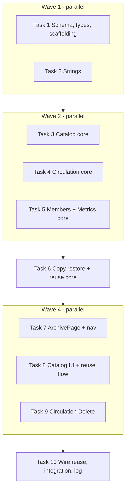

# Archive Page Implementation Plan

> **For agentic workers:** REQUIRED SUB-SKILL: Use subagent-driven-development (recommended) or executing-plans to implement this plan task-by-task. Steps use checkbox (`- [x]` / `- [ ]`) syntax for tracking. Closed-out 2026-09-21; see Close-out.

**Goal:** A fifth list page, Archive, that lists soft-archived members, books, copies, and loans; Catalog / book-editor / Circulation "delete" becomes "archive"; restore and local-number reuse keep a written timeline on the copy notes.

**Architecture:** Archive is an `archived_at` flag on the existing rows (schema v6). Every list query gains an `ArchiveScope` (`Live` default, `Archived` for the Archive page, `Any` for history views) so list / count / rank stay one code path per entity. `global_copy_id` is derived from `local_id` and is released and assigned together with it. Reuse runs inside the book save's own transaction (`BookWrite::releaseFromCopyId`), because `SqliteSession::transaction` is a plain `BEGIN` and does not nest.

**Tech Stack:** C++20, Qt 6.8 Widgets, SQLite, GoogleTest, CMake (Unix Makefiles in `build/`). Test binaries: `build/bin/test_vlms_core`, `build/bin/test_vlms_ui`.

**Spec:** [docs/superpowers/specs/2026-09-19-archive-page-design.md](../specs/2026-09-19-archive-page-design.md) (revised 2026-09-19).

## Global Constraints

- `archived_at` is stamped from `Clock::nowIso()` (`yyyy-MM-dd HH:mm:ss`). Never `datetime('now')` or `Date::todayLocal()` in new code.
- Live queries: `archived_at IS NULL`. Archive queries: `archived_at IS NOT NULL`. History views (member loan history) see both.
- `id` never changes. `local_id` and `global_copy_id` are released together (both `NULL`) and assigned together (`AR-<n>` for `arabic`, `FR-<n>` for `foreign`). Never store `''` for a released number.
- A book and the copies archived with it share one exact `archived_at` value (one `Clock::nowIso()` read). Book restore brings back only copies with that stamp and a number.
- Archiving a book keeps `resources/books/<id>` (unlike `deleteBook`).
- Reuse order inside one transaction: check the archived copy still holds the number → release it (+ `copy.note.wasIndexedAs`) → write the book and the live copy. Any failure rolls everything back.
- Notes remarks are written with `Strings::t(key, "number", n)` in the current UI language, appended with `"\n"` when `notes` is non-empty.
- All failures are `Result` / `Status` keys via `Strings::t`; no raw SQL text reaches the UI.
- Metrics: holdings (`bookTitles`, `totalCopies`, `availableCopies`, `topCategories`) count live rows; member and loan figures count every row.
- Implementers never `git commit`. The controller commits a task only after its reviewer returns `Spec: ✅ compliant` and `Task quality: Approved`. One imperative sentence per commit message, why not what, ending with the `Co-Authored-By` line.
- Never stage `database/vlms.db`, `resources/books/**`, `resources/members/**`, `_backups/`, or `scripts/import_members_from_xlsx.py` (unrelated user work in the tree).
- Always run UI tests with `QT_QPA_PLATFORM=offscreen` and a `timeout`; a missed modal box otherwise blocks forever.
- Full-suite check for every task: `cd build && QT_QPA_PLATFORM=offscreen timeout 600 ctest` → `100% tests passed`. (Running `test_vlms_core` directly from the repo root fails 16 schema/timezone tests for working-directory reasons; use ctest for the full run.)

## Refinements the code forced on the spec

These are decided; implement them as written.

1. **`ArchiveScope` instead of `bool archived`.** The spec's member loan history must see archived loans, which a boolean cannot express. `enum class ArchiveScope { Live, Archived, Any }`, default `Live`.
2. **Removal is caught by the constraint, not by editor-session tracking.** When a copy write hits `UNIQUE (source, local_id)` or `UNIQUE (global_copy_id)` and the holder is an archived copy, the error is `error.copy.numberHeldByArchived`. That covers "remove N and re-add N in one session" and every hand-typed clash with an archived number.
3. **MainWindow can be tested.** Without an `Application` instance it builds placeholder pages, so the nav test constructs it directly.

## File map

| File | Responsibility | Task |
|---|---|---|
| `database/schema.sql` | v6 shape: `archived_at` on books / book_copies / loans, nullable copy numbers | 1 |
| `libraries/Core/include/VLMS/Core/Database.h`, `libraries/Core/src/Database.cpp` | `kSchemaVersion = 6`, `migrateArchiveColumnsIfNeeded()` | 1 |
| `libraries/Core/include/VLMS/Core/ArchiveTypes.h` (new) | `ArchiveScope` | 1 |
| `libraries/Core/include/VLMS/Core/{CatalogTypes,LoanTypes,MemberTypes}.h` | scope on queries, `archivedAt` on records, sort keys, `CopyQuery`, `BookWrite::releaseFromCopyId` | 1 |
| `libraries/Core/test/data/schema_v5.sql` (new) | v5 fixture for the migration test | 1 |
| `libraries/Core/test/CMakeLists.txt`, `applications/vlms/CMakeLists.txt`, `applications/vlms/test/CMakeLists.txt` | register every new source and test file (as stubs) | 1 |
| `libraries/Core/src/Strings.cpp` | every new key in ar / fr / en | 2 |
| `libraries/Core/src/{BookSql.cpp,CatalogRepository.cpp,CategoryStore.cpp,BookCopyStore.{h,cpp}}`, `CatalogRepository.h` | book / copy archive, live filters, archived lists, book restore | 3 |
| `libraries/Core/src/{LoanSql.cpp,CirculationRepository.cpp}`, `CirculationRepository.h`, `applications/vlms/src/ui/members/MemberLoansDialog.cpp` | loan archive / restore, checkout filters, history scope | 4 |
| `libraries/Core/src/{MemberSql.cpp,MemberRepository.cpp,MetricsRepository.cpp}`, `MemberRepository.h` | member scope / restore / Clock stamp, metrics holdings | 5 |
| `libraries/Core/src/{BookCopyStore.{h,cpp},CatalogRepository.cpp}`, `CatalogRepository.h` | copy restore, reuse release inside the save | 6 |
| `applications/vlms/src/ui/archive/ArchivePage.{h,cpp}`, `src/ui/MainWindow.{h,cpp}`, `src/ui/TableHeaderSort.{h,cpp}` | Archive page, nav, restore | 7 |
| `applications/vlms/src/ui/archive/ReuseNumberFlow.{h,cpp}`, `src/ui/catalog/{CatalogPage,BookEditorDialog,BookCopiesTable}.{h,cpp}` | Catalog Delete archives, reserved copy row, reuse chooser + save | 8 |
| `applications/vlms/src/ui/circulation/CirculationPage.{h,cpp}` | Circulation Delete button | 9 |
| `applications/vlms/src/ui/archive/ArchivePage.cpp`, `CLAUDE.md` | wire Reuse to the flow, integration, session log | 10 |

Test files (created empty in Task 1, filled by the owning task): `libraries/Core/test/src/test_archive_catalog.cpp` (3), `test_archive_circulation.cpp` (4), `test_archive_members.cpp` (5), `test_archive_reuse.cpp` (6); `applications/vlms/test/src/test_archive_page.cpp` (7, 10), `test_archive_catalog_ui.cpp` (8), `test_archive_circulation_ui.cpp` (9).

## Execution topology



Tasks in one wave own disjoint files. Parallel implementers use separate build directories: the first implementer of a wave uses `build/`; the others configure `build-sdd-<task>/` once with `cmake -S . -B build-sdd-<task> -G "Unix Makefiles" -DCMAKE_BUILD_TYPE=Debug`.

Gate after every task: reviewer gets the task text, Global Constraints, Refinements, and `git diff` limited to the task's files; Critical / Important → fix → re-review; minors go to the ledger `.superpowers/sdd/archive-page/progress.md`. Final: whole-branch review on Opus.

---

### Task 1: Schema v6, shared types, test scaffolding

**Files:**
- Modify: `database/schema.sql`
- Modify: `libraries/Core/include/VLMS/Core/Database.h`
- Modify: `libraries/Core/src/Database.cpp`
- Create: `libraries/Core/include/VLMS/Core/ArchiveTypes.h`
- Modify: `libraries/Core/include/VLMS/Core/CatalogTypes.h`, `LoanTypes.h`, `MemberTypes.h`
- Create: `libraries/Core/test/data/schema_v5.sql`
- Modify: `libraries/Core/test/src/test_database_migrations.cpp`
- Modify: `libraries/Core/test/CMakeLists.txt`, `applications/vlms/CMakeLists.txt`, `applications/vlms/test/CMakeLists.txt`
- Create (empty stubs): the seven test files listed above, and `applications/vlms/src/ui/archive/ArchivePage.{h,cpp}`, `ReuseNumberFlow.{h,cpp}`

**Interfaces — Produces:**
- `enum class ArchiveScope { Live, Archived, Any };` in `<VLMS/Core/ArchiveTypes.h>`
- `BookQuery::archive`, `LoanQuery::archive`, `MemberQuery::archive` (`ArchiveScope`, default `Live`)
- `struct CopyQuery { std::string search; ArchiveScope archive = ArchiveScope::Live; int limit = 200; int offset = 0; std::string sortColumn; bool sortAscending = true; };`
- Sort keys: `BookSort::kArchivedAt`, `MemberSort::kArchivedAt`, `LoanSort::kReturned`, `LoanSort::kArchivedAt`, `CopySort::{kLocalId, kSource, kTitle, kArchivedAt}` (values `"archivedAt"`, `"returned"`, `"localId"`, `"source"`, `"title"`)
- Record fields: `BookRecord::archivedAt`, `BookCopyRecord::{bookTitle, archivedAt}`, `LoanRecord::archivedAt`, `MemberRecord::archivedAt` (all `std::string`, empty when live)
- `BookWrite::releaseFromCopyId` (`std::int64_t`, 0 = no reuse)

- [x] **Step 1: Capture the v5 fixture before touching the schema**

```bash
git show HEAD:database/schema.sql > libraries/Core/test/data/schema_v5.sql
cat >> libraries/Core/test/data/schema_v5.sql <<'SQL'

-- Rows for the v5 -> v6 migration test.
INSERT INTO books (id, title, language) VALUES (1, 'Muqaddima', 'ar');
INSERT INTO book_copies (id, book_id, global_copy_id, source, local_id)
    VALUES (1, 1, 'AR-7', 'arabic', '7');
INSERT INTO members (id, membership_number, first_name, last_name)
    VALUES (1, '1', 'Amina', 'Ben Salah');
INSERT INTO loans (id, member_id, book_copy_id, borrowed_at, due_at, returned_at)
    VALUES (1, 1, 1, '2026-01-02', '2026-01-16', '2026-01-10');
SQL
grep -c "PRAGMA user_version = 5" libraries/Core/test/data/schema_v5.sql
```

Expected: `1`.

- [x] **Step 2: Write the failing migration tests**

Append to `libraries/Core/test/src/test_database_migrations.cpp`:

```cpp
// ---------------------------------------------------------------------------
// v5 -> v6: archive columns and nullable copy numbers
// ---------------------------------------------------------------------------

TEST_F(test_core_DatabaseMigrations, VersionFiveGainsArchiveColumnsAndNullableCopyNumbers)
{
    const auto db = openFixture("schema_v5.sql");
    ASSERT_NE(db, nullptr);
    ASSERT_TRUE(db->isValid()) << db->lastError();

    EXPECT_EQ(db->scalar("PRAGMA user_version").toInt(), 6);
    for (const std::string table : {"books", "book_copies", "loans"}) {
        EXPECT_EQ(db->scalar("SELECT COUNT(*) FROM pragma_table_info('" + table
                             + "') WHERE name = 'archived_at'")
                      .toInt(),
                  1)
            << table;
    }
    for (const std::string column : {"local_id", "global_copy_id"}) {
        EXPECT_EQ(db->scalar("SELECT \"notnull\" FROM pragma_table_info('book_copies') "
                             "WHERE name = '" + column + "'")
                      .toInt(),
                  0)
            << column;
    }
}

TEST_F(test_core_DatabaseMigrations, VersionSixMigrationKeepsCopiesAndLoanReferences)
{
    const auto db = openFixture("schema_v5.sql");
    ASSERT_NE(db, nullptr);
    ASSERT_TRUE(db->isValid()) << db->lastError();

    EXPECT_EQ(db->scalar("SELECT global_copy_id FROM book_copies WHERE id = 1").toString(), "AR-7");
    EXPECT_EQ(db->scalar("SELECT local_id FROM book_copies WHERE id = 1").toString(), "7");
    EXPECT_EQ(db->scalar("SELECT book_copy_id FROM loans WHERE id = 1").toInt(), 1);
    EXPECT_EQ(db->scalar("SELECT COUNT(*) FROM pragma_foreign_key_check").toInt(), 0);
    EXPECT_EQ(db->scalar("PRAGMA foreign_keys").toInt(), 1);
    EXPECT_EQ(db->scalar("SELECT COUNT(*) FROM sqlite_master WHERE type = 'index' "
                         "AND name IN ('idx_books_archived', 'idx_copies_archived', "
                         "'idx_loans_archived', 'idx_copies_book', 'idx_copies_local', "
                         "'idx_copies_central')")
                  .toInt(),
              6);
}

TEST_F(test_core_DatabaseMigrations, VersionSixColumnOrderMatchesAFreshDatabase)
{
    const auto migrated = openFixture("schema_v5.sql");
    ASSERT_NE(migrated, nullptr);
    ASSERT_TRUE(migrated->isValid()) << migrated->lastError();
    TestDatabase fresh;
    ASSERT_TRUE(fresh.isValid()) << fresh.lastError();

    for (const std::string table : {"books", "book_copies", "loans"}) {
        const std::string columns = "SELECT group_concat(name, ',') FROM "
                                    "(SELECT name FROM pragma_table_info('" + table
            + "') ORDER BY cid)";
        EXPECT_EQ(migrated->scalar(columns).toString(), fresh.scalar(columns).toString()) << table;
    }
}

TEST_F(test_core_DatabaseMigrations, ArchivedCopiesMayShareNullNumbersButLiveOnesMayNot)
{
    TestDatabase db;
    ASSERT_TRUE(db.isValid()) << db.lastError();
    ASSERT_TRUE(db.exec("INSERT INTO books (id, title, language) VALUES (1, 'T', 'ar')"));
    ASSERT_TRUE(db.exec("INSERT INTO book_copies (book_id, global_copy_id, source, local_id, "
                        "archived_at) VALUES (1, NULL, 'arabic', NULL, '2026-09-19 10:00:00')"));
    EXPECT_TRUE(db.exec("INSERT INTO book_copies (book_id, global_copy_id, source, local_id, "
                        "archived_at) VALUES (1, NULL, 'arabic', NULL, '2026-09-19 10:00:00')"));
    ASSERT_TRUE(db.exec("INSERT INTO book_copies (book_id, global_copy_id, source, local_id) "
                        "VALUES (1, 'AR-5', 'arabic', '5')"));
    EXPECT_FALSE(db.exec("INSERT INTO book_copies (book_id, global_copy_id, source, local_id) "
                         "VALUES (1, 'AR-5b', 'arabic', '5')"));
    EXPECT_FALSE(db.exec("INSERT INTO book_copies (book_id, global_copy_id, source, local_id) "
                         "VALUES (1, 'AR-5', 'arabic', '6')"));
}
```

- [x] **Step 3: Register the fixture-free stubs and new sources**

Create each of these files with exactly one line, `// Filled by the archive-page plan (docs/superpowers/plans/2026-09-19-archive-page.md).`:
`libraries/Core/test/src/test_archive_catalog.cpp`, `test_archive_circulation.cpp`, `test_archive_members.cpp`, `test_archive_reuse.cpp`, `applications/vlms/test/src/test_archive_page.cpp`, `test_archive_catalog_ui.cpp`, `test_archive_circulation_ui.cpp`, `applications/vlms/src/ui/archive/ArchivePage.cpp`, `applications/vlms/src/ui/archive/ReuseNumberFlow.cpp`.

Create `applications/vlms/src/ui/archive/ArchivePage.h` and `ReuseNumberFlow.h` each containing only:

```cpp
#pragma once
```

In `libraries/Core/test/CMakeLists.txt`, append to `TST_SOURCES` after `src/test_database_realdb.cpp`:

```cmake
    src/test_archive_catalog.cpp
    src/test_archive_circulation.cpp
    src/test_archive_members.cpp
    src/test_archive_reuse.cpp
```

In `applications/vlms/CMakeLists.txt`, add after `src/ui/metrics/MetricsPage.cpp`:

```cmake
    src/ui/archive/ArchivePage.cpp
    src/ui/archive/ReuseNumberFlow.cpp
```

and after `src/ui/metrics/MetricsPage.h`:

```cmake
    src/ui/archive/ArchivePage.h
    src/ui/archive/ReuseNumberFlow.h
```

In `applications/vlms/test/CMakeLists.txt`, add after `src/test_metrics_activity_sort.cpp`:

```cmake
        src/test_archive_page.cpp
        src/test_archive_catalog_ui.cpp
        src/test_archive_circulation_ui.cpp
```

- [x] **Step 4: Run the migration tests to verify they fail**

```bash
cmake --build build --target test_vlms_core --parallel
cd build && QT_QPA_PLATFORM=offscreen ctest -R DatabaseMigrations --output-on-failure; cd ..
```

Expected: FAIL — `user_version` is 5, `archived_at` missing, `local_id` NOT NULL.

- [x] **Step 5: Add the shared types**

Create `libraries/Core/include/VLMS/Core/ArchiveTypes.h`:

```cpp
#pragma once

/// Which rows a list query sees. Live is every page's default; Archived is the
/// Archive page; Any is for history views, which must not lose archived rows.
enum class ArchiveScope {
    Live,
    Archived,
    Any,
};
```

In `CatalogTypes.h`: add `#include <VLMS/Core/ArchiveTypes.h>` after `#include <cstdint>`. Add to `BookRecord` after `int availableCopies = 0;`:

```cpp
    std::string archivedAt;
```

Add to `BookCopyRecord` after `bool onLoan = false;`:

```cpp
    std::string bookTitle;   // filled by the Archive copy list only
    std::string archivedAt;
```

Add to `namespace BookSort` after `kAvailable`:

```cpp
inline constexpr auto kArchivedAt = "archivedAt";
```

Add to `BookQuery` after `CoverFilter coverFilter = CoverFilter::All;`:

```cpp
    ArchiveScope archive = ArchiveScope::Live;
```

Add after `struct BookQuery { … };`:

```cpp
namespace CopySort {
inline constexpr auto kLocalId = "localId";
inline constexpr auto kSource = "source";
inline constexpr auto kTitle = "title";
inline constexpr auto kArchivedAt = "archivedAt";
}  // namespace CopySort

struct CopyQuery {
    std::string search;
    ArchiveScope archive = ArchiveScope::Live;
    int limit = 200;
    int offset = 0;
    std::string sortColumn;
    bool sortAscending = true;
};
```

Add to `BookWrite` after `std::string coverSourcePath;`:

```cpp
    /// Archive -> Reuse local number: the archived copy whose number one of
    /// `copies` takes. Released in the same transaction as the save; 0 = none.
    std::int64_t releaseFromCopyId = 0;
```

In `LoanTypes.h`: add `#include <VLMS/Core/ArchiveTypes.h>`; add `std::string archivedAt;` to `LoanRecord` after `bool isOverdue = false;`; add `ArchiveScope archive = ArchiveScope::Live;` to `LoanQuery` after `std::int64_t memberId = 0;`; add to `namespace LoanSort` after `kStatus`:

```cpp
inline constexpr auto kReturned = "returned";
inline constexpr auto kArchivedAt = "archivedAt";
```

In `MemberTypes.h`: add `#include <VLMS/Core/ArchiveTypes.h>`; add `std::string archivedAt;` to `MemberRecord` after `std::string fullName;`; add `ArchiveScope archive = ArchiveScope::Live;` to `MemberQuery` after `std::vector<std::string> cities;`; add `inline constexpr auto kArchivedAt = "archivedAt";` to `namespace MemberSort` after `kLoans`.

- [x] **Step 6: Schema v6 in `database/schema.sql`**

In `CREATE TABLE IF NOT EXISTS books`, after the `updated_at …` line insert:

```sql
    -- Set when Catalog Delete moves the title to the Archive. Last so an ALTER
    -- on an older database and a fresh one hold the columns in the same order.
    archived_at TEXT CHECK (datetime(archived_at) IS archived_at),
```

After `CREATE INDEX IF NOT EXISTS idx_books_author ON books(author_id);` add:

```sql
CREATE INDEX IF NOT EXISTS idx_books_archived ON books(archived_at);
```

Replace the whole `CREATE TABLE IF NOT EXISTS book_copies (…);` with:

```sql
CREATE TABLE IF NOT EXISTS book_copies (
    id INTEGER PRIMARY KEY AUTOINCREMENT,
    book_id INTEGER NOT NULL REFERENCES books(id) ON DELETE CASCADE,
    -- Derived from the local number (AR-<local_id>, FR-<local_id>) and moved
    -- with it: both are NULL on an archived copy that gave its number away.
    -- SQLite treats NULLs as distinct, so any number of those may coexist.
    global_copy_id TEXT UNIQUE,
    source TEXT NOT NULL CHECK (source IN ('arabic', 'foreign')),
    local_id TEXT,
    central_id TEXT,
    classification TEXT,
    subject TEXT,
    notes TEXT,
    inventory_status TEXT,
    compensation TEXT,
    location TEXT,
    index_code TEXT,
    source_row INTEGER,
    archived_at TEXT CHECK (datetime(archived_at) IS archived_at),
    UNIQUE (source, local_id)
);
```

After `CREATE INDEX IF NOT EXISTS idx_copies_central ON book_copies(central_id);` add:

```sql
CREATE INDEX IF NOT EXISTS idx_copies_archived ON book_copies(archived_at);
```

In `CREATE TABLE IF NOT EXISTS loans`, after `notes TEXT,` insert:

```sql
    -- Set when Circulation Delete moves a returned loan to the Archive.
    archived_at TEXT CHECK (datetime(archived_at) IS archived_at),
```

After `CREATE INDEX IF NOT EXISTS idx_loans_open ON loans(returned_at);` add:

```sql
CREATE INDEX IF NOT EXISTS idx_loans_archived ON loans(archived_at);
```

Change the last line to `PRAGMA user_version = 6;`.

- [x] **Step 7: The migration**

In `Database.h` change `kSchemaVersion = 5` to `kSchemaVersion = 6` and declare next to the other `migrate…IfNeeded` members:

```cpp
    bool migrateArchiveColumnsIfNeeded();
```

In `Database.cpp`, add after `migrateMemberSpreadsheetColumnsIfNeeded()`:

```cpp
bool Database::migrateArchiveColumnsIfNeeded()
{
    struct Added {
        const char* table;
        const char* index;
    };
    static const Added added[] = {
        {"books", "CREATE INDEX IF NOT EXISTS idx_books_archived ON books(archived_at)"},
        {"loans", "CREATE INDEX IF NOT EXISTS idx_loans_archived ON loans(archived_at)"},
    };
    for (const Added& table : added) {
        if (tableHasColumn(table.table, "archived_at")) {
            continue;
        }
        if (!m_session->exec(std::string("ALTER TABLE ") + table.table
                             + " ADD COLUMN archived_at TEXT "
                               "CHECK (datetime(archived_at) IS archived_at)")
            || !m_session->exec(table.index)) {
            warn(std::string("Archive column migration on ") + table.table
                 + " failed: " + m_session->lastError());
            return false;
        }
    }
    if (tableHasColumn("book_copies", "archived_at")) {
        return true;
    }

    // Rebuilt, not altered: local_id and global_copy_id lose NOT NULL so an
    // archived copy can give its number away, and SQLite cannot relax a
    // constraint in place. loans.book_copy_id points here, so foreign keys are
    // off for the swap (the pragma is a no-op inside a transaction) and
    // foreign_key_check must come back empty before the swap commits.
    if (!m_session->exec("PRAGMA foreign_keys = OFF")) {
        warn("Book copy archive migration could not disable foreign keys: "
             + m_session->lastError());
        return false;
    }
    const Status work = m_session->transaction([&] {
        static const char* const steps[] = {
            R"SQL(
                CREATE TABLE book_copies_new (
                    id INTEGER PRIMARY KEY AUTOINCREMENT,
                    book_id INTEGER NOT NULL REFERENCES books(id) ON DELETE CASCADE,
                    global_copy_id TEXT UNIQUE,
                    source TEXT NOT NULL CHECK (source IN ('arabic', 'foreign')),
                    local_id TEXT,
                    central_id TEXT,
                    classification TEXT,
                    subject TEXT,
                    notes TEXT,
                    inventory_status TEXT,
                    compensation TEXT,
                    location TEXT,
                    index_code TEXT,
                    source_row INTEGER,
                    archived_at TEXT CHECK (datetime(archived_at) IS archived_at),
                    UNIQUE (source, local_id)
                )
            )SQL",
            "INSERT INTO book_copies_new (id, book_id, global_copy_id, source, local_id, "
            "central_id, classification, subject, notes, inventory_status, compensation, "
            "location, index_code, source_row) "
            "SELECT id, book_id, global_copy_id, source, local_id, central_id, classification, "
            "subject, notes, inventory_status, compensation, location, index_code, source_row "
            "FROM book_copies",
            "DROP TABLE book_copies",
            "ALTER TABLE book_copies_new RENAME TO book_copies",
            "CREATE INDEX IF NOT EXISTS idx_copies_book ON book_copies(book_id)",
            "CREATE INDEX IF NOT EXISTS idx_copies_local ON book_copies(source, local_id)",
            "CREATE INDEX IF NOT EXISTS idx_copies_central ON book_copies(central_id)",
            "CREATE INDEX IF NOT EXISTS idx_copies_archived ON book_copies(archived_at)",
        };
        for (const char* step : steps) {
            if (const Status done = m_session->exec(step); !done) {
                return done;
            }
        }
        auto check = m_session->prepare("PRAGMA foreign_key_check");
        if (!check) {
            return VLMS::asStatus(check);
        }
        if (check->next()) {
            return Status::fail(VLMS::ErrorKind::Sql, "error.sql",
                                "foreign_key_check found rows after the book_copies rebuild");
        }
        return Status::ok();
    });
    const bool keysOn = static_cast<bool>(m_session->exec("PRAGMA foreign_keys = ON"));
    if (!work) {
        warn("Book copy archive migration failed: " + work.error().detail + " "
             + m_session->lastError());
        return false;
    }
    if (!keysOn) {
        warn("Book copy archive migration could not re-enable foreign keys: "
             + m_session->lastError());
        return false;
    }
    return true;
}
```

In `upgradeSchemaIfNeeded()`, after the `version < 5` line add:

```cpp
    if (version < 6 && (!migrateArchiveColumnsIfNeeded() || !setSchemaVersion(6))) {
        return false;
    }
```

In `migrateLegacyShapesIfNeeded()`, after the `migrateMemberSpreadsheetColumnsIfNeeded()` block add:

```cpp
    if (!migrateArchiveColumnsIfNeeded()) {
        return false;
    }
```

- [x] **Step 8: Run the tests to verify they pass**

```bash
cmake --build build --parallel
cd build && QT_QPA_PLATFORM=offscreen timeout 600 ctest --output-on-failure 2>&1 | tail -5; cd ..
```

Expected: `100% tests passed` (the four new migration tests included; `SchemaSqlDeclaresTheVersionTheCodeExpects` agrees on 6).

- [x] **Step 9: Commit (controller, after review)**

```bash
git add database/schema.sql libraries/Core/include/VLMS/Core/ArchiveTypes.h \
  libraries/Core/include/VLMS/Core/CatalogTypes.h libraries/Core/include/VLMS/Core/LoanTypes.h \
  libraries/Core/include/VLMS/Core/MemberTypes.h libraries/Core/include/VLMS/Core/Database.h \
  libraries/Core/src/Database.cpp libraries/Core/test/data/schema_v5.sql \
  libraries/Core/test/src/test_database_migrations.cpp libraries/Core/test/CMakeLists.txt \
  libraries/Core/test/src/test_archive_*.cpp applications/vlms/CMakeLists.txt \
  applications/vlms/test/CMakeLists.txt applications/vlms/test/src/test_archive_*.cpp \
  applications/vlms/src/ui/archive/
git commit -m "Add archived_at to books, copies, and loans so deletes can become reversible archives.

Co-Authored-By: Claude Opus 5 <noreply@anthropic.com>"
```

---

### Task 2: Strings for every new key (ar / fr / en)

**Files:**
- Modify: `libraries/Core/src/Strings.cpp` (inside `arabicStrings()`, `frenchStrings()`, `englishStrings()`)

**Interfaces — Produces:** every key below, used by Tasks 3–10. `test_core_StringsParity` fails if a key is missing in one locale.

- [n/a] **Step 1: Confirm parity currently passes** — baseline-only step, expired once the strings changed. Parity passes at HEAD (`test_core_StringsParity` green in the 2026-09-21 full run), so the pre-change baseline has no remaining value.

```bash
cmake --build build-sdd-strings --target test_vlms_core --parallel 2>/dev/null \
  || (cmake -S . -B build-sdd-strings -G "Unix Makefiles" -DCMAKE_BUILD_TYPE=Debug \
      && cmake --build build-sdd-strings --target test_vlms_core --parallel)
./build-sdd-strings/bin/test_vlms_core --gtest_filter='test_core_StringsParity.*'
```

Expected: PASS.

- [x] **Step 2: Change the Catalog delete confirmation in all three locales**

Replace the value of `catalog.deleteConfirm`:
- ar: `"نقل هذا الكتاب وكل نسخه إلى الأرشيف؟"`
- fr: `"Déplacer ce livre et tous ses exemplaires vers les archives ?"`
- en: `"Move this book and all its copies to the Archive?"`

- [x] **Step 3: Add the new keys to `arabicStrings()`**

```cpp
        {"nav.archive", "الأرشيف"},
        {"page.archive.title", "الأرشيف"},
        {"page.archive.body", "الأعضاء والكتب والنسخ والإعارات المؤرشفة."},
        {"archive.type.members", "الأعضاء"},
        {"archive.type.books", "الكتب"},
        {"archive.type.copies", "النسخ"},
        {"archive.type.loans", "الإعارات"},
        {"archive.searchPlaceholder", "البحث في الأرشيف…"},
        {"archive.col.number", "الرقم"},
        {"archive.col.name", "الاسم"},
        {"archive.col.city", "المدينة"},
        {"archive.col.status", "الحالة"},
        {"archive.col.title", "العنوان"},
        {"archive.col.author", "المؤلف"},
        {"archive.col.copies", "النسخ المؤرشفة"},
        {"archive.col.localId", "الرقم المحلي"},
        {"archive.col.source", "المصدر"},
        {"archive.col.member", "العضو"},
        {"archive.col.copy", "النسخة / العنوان"},
        {"archive.col.returnedAt", "تاريخ الإرجاع"},
        {"archive.col.archivedAt", "تاريخ الأرشفة"},
        {"archive.col.notes", "ملاحظات النسخة"},
        {"archive.restore", "استرجاع"},
        {"archive.restoreConfirm", "إعادة هذا السجل من الأرشيف؟"},
        {"archive.reuse", "إعادة استعمال الرقم المحلي"},
        {"archive.reuse.title", "اختيار الكتاب"},
        {"archive.reuse.prompt", "الكتاب الذي سيأخذ الرقم {number}:"},
        {"archive.reuse.search", "البحث عن كتاب…"},
        {"archive.reuse.newBook", "كتاب جديد"},
        {"circulation.delete", "حذف"},
        {"circulation.archiveLoan", "نقل هذه الإعارة المُرجعة إلى الأرشيف؟"},
        {"copy.note.wasIndexedAs", "كان مفهرسًا تحت الرقم {number}"},
        {"copy.note.newIndexedAs", "أعيدت فهرسته تحت الرقم {number}"},
        {"error.book.duplicateArchived", "هذا الكتاب موجود في الأرشيف؛ استرجعه من هناك."},
        {"error.book.notArchived", "هذا الكتاب ليس في الأرشيف."},
        {"error.copy.notArchived", "هذه النسخة ليست في الأرشيف."},
        {"error.copy.bookMissing", "الكتاب الأصلي لهذه النسخة لم يعد موجودًا."},
        {"error.copy.numberHeldByArchived",
         "الرقم «{detail}» محجوز لنسخة مؤرشفة؛ انقله من الأرشيف ← إعادة استعمال الرقم المحلي."},
        {"error.copy.reuseStale", "النسخة المؤرشفة لم تعد تحمل هذا الرقم."},
        {"error.copy.sourceMismatch", "لغة هذا الكتاب لا تناسب مصدر الرقم."},
        {"error.loan.archiveOpen", "لا يمكن أرشفة إعارة لم تُرجع بعد."},
        {"error.loan.notArchived", "هذه الإعارة ليست في الأرشيف."},
        {"error.loan.copyArchived", "هذه النسخة مؤرشفة ولا يمكن إعارتها."},
        {"error.member.notArchived", "هذا العضو ليس في الأرشيف."},
```

- [x] **Step 4: Add the same keys to `frenchStrings()`**

```cpp
        {"nav.archive", "Archives"},
        {"page.archive.title", "Archives"},
        {"page.archive.body", "Membres, livres, exemplaires et prêts archivés."},
        {"archive.type.members", "Membres"},
        {"archive.type.books", "Livres"},
        {"archive.type.copies", "Exemplaires"},
        {"archive.type.loans", "Prêts"},
        {"archive.searchPlaceholder", "Rechercher dans les archives…"},
        {"archive.col.number", "Numéro"},
        {"archive.col.name", "Nom"},
        {"archive.col.city", "Ville"},
        {"archive.col.status", "Statut"},
        {"archive.col.title", "Titre"},
        {"archive.col.author", "Auteur"},
        {"archive.col.copies", "Exemplaires archivés"},
        {"archive.col.localId", "N° local"},
        {"archive.col.source", "Source"},
        {"archive.col.member", "Adhérent"},
        {"archive.col.copy", "Exemplaire / titre"},
        {"archive.col.returnedAt", "Rendu le"},
        {"archive.col.archivedAt", "Archivé le"},
        {"archive.col.notes", "Notes de l'exemplaire"},
        {"archive.restore", "Restaurer"},
        {"archive.restoreConfirm", "Restaurer cet élément depuis les archives ?"},
        {"archive.reuse", "Réutiliser le n° local"},
        {"archive.reuse.title", "Choisir le livre"},
        {"archive.reuse.prompt", "Livre qui recevra le n° {number} :"},
        {"archive.reuse.search", "Rechercher un livre…"},
        {"archive.reuse.newBook", "Nouveau livre"},
        {"circulation.delete", "Supprimer"},
        {"circulation.archiveLoan", "Déplacer ce prêt rendu vers les archives ?"},
        {"copy.note.wasIndexedAs", "était indexé sous {number}"},
        {"copy.note.newIndexedAs", "nouvellement indexé sous {number}"},
        {"error.book.duplicateArchived",
         "Ce livre est dans les archives ; restaurez-le depuis celles-ci."},
        {"error.book.notArchived", "Ce livre n'est pas archivé."},
        {"error.copy.notArchived", "Cet exemplaire n'est pas archivé."},
        {"error.copy.bookMissing", "Le livre d'origine de cet exemplaire n'existe plus."},
        {"error.copy.numberHeldByArchived",
         "Le n° « {detail} » est détenu par un exemplaire archivé ; déplacez-le via "
         "Archives → Réutiliser le n° local."},
        {"error.copy.reuseStale", "L'exemplaire archivé ne détient plus ce numéro."},
        {"error.copy.sourceMismatch",
         "La langue de ce livre ne correspond pas à la source du numéro."},
        {"error.loan.archiveOpen", "Un prêt non rendu ne peut pas être archivé."},
        {"error.loan.notArchived", "Ce prêt n'est pas archivé."},
        {"error.loan.copyArchived", "Cet exemplaire est archivé et ne peut pas être prêté."},
        {"error.member.notArchived", "Ce membre n'est pas archivé."},
```

- [x] **Step 5: Add the same keys to `englishStrings()`**

```cpp
        {"nav.archive", "Archive"},
        {"page.archive.title", "Archive"},
        {"page.archive.body", "Archived members, books, copies, and loans."},
        {"archive.type.members", "Members"},
        {"archive.type.books", "Books"},
        {"archive.type.copies", "Copies"},
        {"archive.type.loans", "Loans"},
        {"archive.searchPlaceholder", "Search the archive…"},
        {"archive.col.number", "Number"},
        {"archive.col.name", "Name"},
        {"archive.col.city", "City"},
        {"archive.col.status", "Status"},
        {"archive.col.title", "Title"},
        {"archive.col.author", "Author"},
        {"archive.col.copies", "Archived copies"},
        {"archive.col.localId", "Local no."},
        {"archive.col.source", "Source"},
        {"archive.col.member", "Member"},
        {"archive.col.copy", "Copy / title"},
        {"archive.col.returnedAt", "Returned"},
        {"archive.col.archivedAt", "Archived"},
        {"archive.col.notes", "Copy notes"},
        {"archive.restore", "Restore"},
        {"archive.restoreConfirm", "Restore this record from the Archive?"},
        {"archive.reuse", "Reuse local number"},
        {"archive.reuse.title", "Choose the book"},
        {"archive.reuse.prompt", "Book that takes number {number}:"},
        {"archive.reuse.search", "Search for a book…"},
        {"archive.reuse.newBook", "New book"},
        {"circulation.delete", "Delete"},
        {"circulation.archiveLoan", "Move this returned loan to the Archive?"},
        {"copy.note.wasIndexedAs", "was indexed as {number}"},
        {"copy.note.newIndexedAs", "new indexed as {number}"},
        {"error.book.duplicateArchived", "This book is in the Archive; restore it from there."},
        {"error.book.notArchived", "This book is not in the Archive."},
        {"error.copy.notArchived", "This copy is not in the Archive."},
        {"error.copy.bookMissing", "This copy's original book no longer exists."},
        {"error.copy.numberHeldByArchived",
         "Number \"{detail}\" is held by an archived copy; move it with Archive → Reuse local number."},
        {"error.copy.reuseStale", "The archived copy no longer holds that number."},
        {"error.copy.sourceMismatch", "This book's language does not match the number's source."},
        {"error.loan.archiveOpen", "A loan that has not been returned cannot be archived."},
        {"error.loan.notArchived", "This loan is not in the Archive."},
        {"error.loan.copyArchived", "This copy is archived and cannot be lent."},
        {"error.member.notArchived", "This member is not in the Archive."},
```

- [x] **Step 6: Run parity and the full suite**

```bash
cmake --build build-sdd-strings --target test_vlms_core --parallel
./build-sdd-strings/bin/test_vlms_core --gtest_filter='test_core_StringsParity.*'
```

Expected: PASS. Then `cd build-sdd-strings && QT_QPA_PLATFORM=offscreen timeout 600 ctest | tail -3` → `100% tests passed`.

- [x] **Step 7: Commit (controller, after review)**

```bash
git add libraries/Core/src/Strings.cpp
git commit -m "Add Archive, restore, reuse, and archive-error strings in Arabic, French, and English.

Co-Authored-By: Claude Opus 5 <noreply@anthropic.com>"
```

---
### Task 3: Catalog core — archive books and copies, live filters, archived lists, book restore

**Depends on:** Task 1 (types, schema), Task 2 (strings; only for readable failures).

**Files:**
- Modify: `libraries/Core/src/BookSql.cpp`
- Modify: `libraries/Core/include/VLMS/Core/CatalogRepository.h`, `libraries/Core/src/CatalogRepository.cpp`
- Modify: `libraries/Core/src/CategoryStore.cpp`
- Modify: `libraries/Core/src/BookCopyStore.h`, `libraries/Core/src/BookCopyStore.cpp`
- Test: `libraries/Core/test/src/test_archive_catalog.cpp`

**Interfaces:**
- Consumes: `ArchiveScope`, `BookQuery::archive`, `CopyQuery`, `CopySort::*`, `BookRecord::archivedAt`, `BookCopyRecord::{bookTitle, archivedAt}` (Task 1).
- Produces (public on `CatalogRepository`):
  - `VLMS::Status archiveBook(std::int64_t id);`
  - `VLMS::Status restoreBook(std::int64_t id);`
  - `VLMS::Result<std::vector<BookCopyRecord>> listCopyRows(const CopyQuery& query) const;`
  - `VLMS::Result<int> countCopyRows(const CopyQuery& query) const;`
  - `listBooks` / `countBooks` / `rankOfBook` honour `BookQuery::archive`; in `Archived` scope `totalCopies` counts the book's archived copies.
  - `listCopies(bookId)` returns live copies only; `saveExistingBook` archives removed rows instead of deleting them.
  - New error keys produced: `error.book.duplicateArchived`, `error.book.notArchived`, `error.copy.numberHeldByArchived` (detail = the local number).

- [x] **Step 1: Write the failing tests**

Replace the stub `libraries/Core/test/src/test_archive_catalog.cpp` with:

```cpp
#include "TestDatabase.h"
#include "TestSeed.h"

#include <VLMS/Core/CatalogRepository.h>
#include <VLMS/Core/Clock.h>
#include <VLMS/Core/Date.h>

#include <gtest/gtest.h>

#include <filesystem>
#include <fstream>
#include <memory>
#include <string>
#include <vector>

using VLMS::Date;
using VLMS::DateTime;
using VLMS::ScopedClock;
using namespace VLMS::Test;

namespace {

BookInput inputOf(const BookRecord& book)
{
    BookInput input;
    input.title = book.title;
    input.authorName = book.authorName;
    input.publisherName = book.publisherName;
    input.categoryId = book.categoryId;
    input.isbn = book.isbn;
    input.publicationDate = book.publicationDate;
    input.placeOfPublication = book.placeOfPublication;
    input.pages = book.pages;
    input.dimensions = book.dimensions;
    input.language = book.language;
    input.description = book.description;
    return input;
}

BookCopyInput inputOf(const BookCopyRecord& copy)
{
    BookCopyInput input;
    input.id = copy.id;
    input.globalCopyId = copy.globalCopyId;
    input.source = copy.source;
    input.localId = copy.localId;
    input.centralId = copy.centralId;
    input.classification = copy.classification;
    input.subject = copy.subject;
    input.notes = copy.notes;
    input.inventoryStatus = copy.inventoryStatus;
    input.compensation = copy.compensation;
    input.location = copy.location;
    input.indexCode = copy.indexCode;
    return input;
}

}  // namespace

class test_core_ArchiveCatalog : public ::testing::Test {
protected:
    void SetUp() override
    {
        m_db = std::make_unique<TestDatabase>();
        ASSERT_TRUE(m_db->isValid()) << m_db->lastError();
        m_repository =
            std::make_unique<CatalogRepository>(m_db->session(), m_db->resourcesDirectory());
    }

    void TearDown() override
    {
        m_repository.reset();
        m_db.reset();
    }

    std::int64_t seedBookWithCopies(int index, int copies)
    {
        BookSeed seed = uniqueBookSeed(index);
        seed.initialCopyCount = copies;
        return seedBook(*m_db, seed);
    }

    /// Saves the book with its live copies minus `dropped`, plus `extra`, the
    /// way the editor does after the librarian removed that row.
    VLMS::Status saveWithout(std::int64_t bookId,
                                   std::int64_t dropped,
                                   const std::vector<BookCopyInput>& extra = {})
    {
        const auto book = m_repository->getBook(bookId);
        const auto copies = m_repository->listCopies(bookId);
        BookWrite write;
        write.book = inputOf(book.value());
        for (const BookCopyRecord& copy : copies.value()) {
            if (copy.id != dropped) {
                write.copies.push_back(inputOf(copy));
            }
        }
        for (const BookCopyInput& copy : extra) {
            write.copies.push_back(copy);
        }
        return m_repository->saveExistingBook(bookId, write);
    }

    std::string copyStamp(std::int64_t copyId)
    {
        const auto value =
            m_db->scalar("SELECT archived_at FROM book_copies WHERE id = " + std::to_string(copyId));
        return value.isNull() ? std::string() : value.toString();
    }

    std::unique_ptr<TestDatabase> m_db;
    std::unique_ptr<CatalogRepository> m_repository;
};

TEST_F(test_core_ArchiveCatalog, LiveListsHideArchivedBooksAndTheArchiveShowsOnlyThem)
{
    const std::int64_t kept = seedBookWithCopies(1, 1);
    const std::int64_t archived = seedBookWithCopies(2, 2);
    ASSERT_TRUE(m_repository->archiveBook(archived));

    const auto live = VLMS_UNWRAP(m_repository->listBooks({}));
    ASSERT_EQ(live.size(), 1u);
    EXPECT_EQ(live.front().id, kept);
    EXPECT_EQ(VLMS_UNWRAP(m_repository->countBooks({})), 1);

    BookQuery archive;
    archive.archive = ArchiveScope::Archived;
    const auto rows = VLMS_UNWRAP(m_repository->listBooks(archive));
    ASSERT_EQ(rows.size(), 1u);
    EXPECT_EQ(rows.front().id, archived);
    EXPECT_EQ(rows.front().totalCopies, 2);
    EXPECT_FALSE(rows.front().archivedAt.empty());
    EXPECT_EQ(VLMS_UNWRAP(m_repository->countBooks(archive)), 1);
    EXPECT_EQ(VLMS_UNWRAP(m_repository->rankOfBook(archived, archive)), 0);
}

TEST_F(test_core_ArchiveCatalog, ArchiveBookStampsTheBookAndEveryLiveCopyAlike)
{
    const std::int64_t bookId = seedBookWithCopies(3, 2);
    const ScopedClock pinned(DateTime(Date(2026, 9, 19), 10, 0, 0));
    ASSERT_TRUE(m_repository->archiveBook(bookId));

    EXPECT_EQ(m_db->scalar("SELECT archived_at FROM books WHERE id = " + std::to_string(bookId))
                  .toString(),
              "2026-09-19 10:00:00");
    for (const std::int64_t copyId : copyIdsOf(*m_db, bookId)) {
        EXPECT_EQ(copyStamp(copyId), "2026-09-19 10:00:00");
    }
}

TEST_F(test_core_ArchiveCatalog, ArchiveBookIsRefusedWhileACopyIsOnLoan)
{
    const std::int64_t bookId = seedBookWithCopies(4, 2);
    const std::int64_t memberId = seedMember(*m_db, uniqueMemberSeed(1));
    ASSERT_GT(rawInsertLoan(*m_db, memberId, copyIdsOf(*m_db, bookId).front(), "2026-09-01",
                            "2026-09-15"),
              0);

    const auto refused = m_repository->archiveBook(bookId);
    ASSERT_FALSE(refused);
    EXPECT_EQ(refused.error().key, "error.book.hasActiveLoans");
    EXPECT_TRUE(
        m_db->scalar("SELECT archived_at FROM books WHERE id = " + std::to_string(bookId)).isNull());
    for (const std::int64_t copyId : copyIdsOf(*m_db, bookId)) {
        EXPECT_TRUE(copyStamp(copyId).empty());
    }
}

TEST_F(test_core_ArchiveCatalog, ArchiveBookKeepsTheCoverFolder)
{
    const std::int64_t bookId = seedBookWithCopies(5, 1);
    const std::filesystem::path folder =
        std::filesystem::path(m_db->resourcesDirectory()) / "books" / std::to_string(bookId);
    std::filesystem::create_directories(folder);
    std::ofstream(folder / "cover.jpg") << "jpeg";

    ASSERT_TRUE(m_repository->archiveBook(bookId));
    EXPECT_TRUE(std::filesystem::exists(folder / "cover.jpg"));
}

TEST_F(test_core_ArchiveCatalog, RemovingACopyRowArchivesItOnSave)
{
    const std::int64_t bookId = seedBookWithCopies(6, 2);
    const std::vector<std::int64_t> copies = copyIdsOf(*m_db, bookId);

    ASSERT_TRUE(saveWithout(bookId, copies.front()));
    EXPECT_FALSE(copyStamp(copies.front()).empty());
    EXPECT_TRUE(copyStamp(copies.back()).empty());
    EXPECT_EQ(m_repository->getBook(bookId)->totalCopies, 1);
    EXPECT_EQ(m_repository->listCopies(bookId)->size(), 1u);
    EXPECT_EQ(m_db->count("book_copies"), 2);  // archived, not deleted
}

TEST_F(test_core_ArchiveCatalog, RemovingTheLastCopyLeavesALiveBookWithNoCopies)
{
    const std::int64_t bookId = seedBookWithCopies(7, 1);
    ASSERT_TRUE(saveWithout(bookId, copyIdsOf(*m_db, bookId).front()));

    const auto book = m_repository->getBook(bookId);
    ASSERT_TRUE(book.has_value());
    EXPECT_TRUE(book->archivedAt.empty());
    EXPECT_EQ(book->totalCopies, 0);
    EXPECT_EQ(VLMS_UNWRAP(m_repository->countBooks({})), 1);
}

TEST_F(test_core_ArchiveCatalog, ReAddingANumberStillHeldByAnArchivedCopyIsRefused)
{
    const std::int64_t bookId = seedBookWithCopies(8, 2);
    const auto copies = m_repository->listCopies(bookId).value();
    BookCopyInput again;
    again.source = copies.front().source;
    again.localId = copies.front().localId;
    again.globalCopyId = copies.front().globalCopyId;

    const auto refused = saveWithout(bookId, copies.front().id, {again});
    ASSERT_FALSE(refused);
    EXPECT_EQ(refused.error().key, "error.copy.numberHeldByArchived");
    EXPECT_EQ(refused.error().detail, copies.front().localId);
    EXPECT_TRUE(copyStamp(copies.front().id).empty());  // the whole save rolled back
    EXPECT_EQ(m_db->count("book_copies"), 2);
}

TEST_F(test_core_ArchiveCatalog, RestoreBookBringsBackOnlyTheCopiesArchivedWithIt)
{
    const std::int64_t bookId = seedBookWithCopies(9, 3);
    const std::vector<std::int64_t> copies = copyIdsOf(*m_db, bookId);
    {
        const ScopedClock earlier(DateTime(Date(2026, 9, 1), 9, 0, 0));
        ASSERT_TRUE(saveWithout(bookId, copies.at(0)));
    }
    {
        const ScopedClock later(DateTime(Date(2026, 9, 19), 10, 0, 0));
        ASSERT_TRUE(m_repository->archiveBook(bookId));
    }

    ASSERT_TRUE(m_repository->restoreBook(bookId));
    EXPECT_EQ(copyStamp(copies.at(0)), "2026-09-01 09:00:00");
    EXPECT_TRUE(copyStamp(copies.at(1)).empty());
    EXPECT_TRUE(copyStamp(copies.at(2)).empty());
    EXPECT_TRUE(m_repository->getBook(bookId)->archivedAt.empty());
}

TEST_F(test_core_ArchiveCatalog, RestoreBookLeavesNumberlessCopiesArchived)
{
    const std::int64_t bookId = seedBookWithCopies(10, 2);
    const std::vector<std::int64_t> copies = copyIdsOf(*m_db, bookId);
    ASSERT_TRUE(m_repository->archiveBook(bookId));
    ASSERT_TRUE(m_db->exec("UPDATE book_copies SET local_id = NULL, global_copy_id = NULL WHERE id = "
                           + std::to_string(copies.at(0))));

    ASSERT_TRUE(m_repository->restoreBook(bookId));
    EXPECT_FALSE(copyStamp(copies.at(0)).empty());
    EXPECT_TRUE(copyStamp(copies.at(1)).empty());
}

TEST_F(test_core_ArchiveCatalog, RestoreOfALiveBookIsRefused)
{
    const std::int64_t bookId = seedBookWithCopies(11, 1);
    const auto refused = m_repository->restoreBook(bookId);
    ASSERT_FALSE(refused);
    EXPECT_EQ(refused.error().key, "error.book.notArchived");
}

TEST_F(test_core_ArchiveCatalog, AddingABookIdenticalToAnArchivedOneSaysSo)
{
    BookSeed seed = uniqueBookSeed(12);
    seed.isbn = "9789973000012";
    const std::int64_t bookId = seedBook(*m_db, seed);
    ASSERT_TRUE(m_repository->archiveBook(bookId));

    const auto duplicate = m_repository->createBook(seed.toInput());
    ASSERT_FALSE(duplicate);
    EXPECT_EQ(duplicate.error().key, "error.book.duplicateArchived");
}

TEST_F(test_core_ArchiveCatalog, ArchivedCopyListShowsTitleNumberAndStamp)
{
    const std::int64_t bookId = seedBookWithCopies(13, 2);
    const std::vector<std::int64_t> copies = copyIdsOf(*m_db, bookId);
    {
        const ScopedClock pinned(DateTime(Date(2026, 9, 19), 10, 0, 0));
        ASSERT_TRUE(saveWithout(bookId, copies.at(0)));
    }

    CopyQuery query;
    query.archive = ArchiveScope::Archived;
    const auto rows = VLMS_UNWRAP(m_repository->listCopyRows(query));
    ASSERT_EQ(rows.size(), 1u);
    const BookCopyRecord& row = rows.front();
    EXPECT_EQ(row.id, copies.at(0));
    EXPECT_EQ(row.bookTitle, m_repository->getBook(bookId)->title);
    EXPECT_EQ(row.archivedAt, "2026-09-19 10:00:00");
    EXPECT_FALSE(row.localId.empty());
    EXPECT_EQ(VLMS_UNWRAP(m_repository->countCopyRows(query)), 1);

    query.search = row.localId;
    EXPECT_EQ(VLMS_UNWRAP(m_repository->countCopyRows(query)), 1);
}

TEST_F(test_core_ArchiveCatalog, FacetsCountLiveBooksOnly)
{
    const std::int64_t category = seedCategory(*m_db, "HIS", "History");
    BookSeed kept = uniqueBookSeed(14);
    kept.categoryId = category;
    BookSeed gone = uniqueBookSeed(15);
    gone.categoryId = category;
    seedBook(*m_db, kept);
    const std::int64_t goneId = seedBook(*m_db, gone);
    ASSERT_TRUE(m_repository->archiveBook(goneId));

    const auto categories = VLMS_UNWRAP(m_repository->listCategories());
    ASSERT_EQ(categories.size(), 1u);
    EXPECT_EQ(categories.front().bookCount, 1);

    const auto languages = VLMS_UNWRAP(m_repository->listBookLanguages());
    ASSERT_EQ(languages.size(), 1u);
    EXPECT_EQ(languages.front().bookCount, 1);
}
```

- [x] **Step 2: Run the tests to verify they fail to compile**

```bash
cmake --build build --target test_vlms_core --parallel 2>&1 | grep -m3 error
```

Expected: `'class CatalogRepository' has no member named 'archiveBook'` (and `restoreBook`, `listCopyRows`, `countCopyRows`).

- [x] **Step 3: Scope and sort in `BookSql.cpp`**

At the start of `filterClause`, right after `std::string sql;`:

```cpp
    if (query.archive == ArchiveScope::Live) {
        sql += " AND b.archived_at IS NULL ";
    } else if (query.archive == ArchiveScope::Archived) {
        sql += " AND b.archived_at IS NOT NULL ";
    }
```

In `orderExpressions`, right after `const std::string& column = query.sortColumn;`:

```cpp
    if (column.empty() && query.archive == ArchiveScope::Archived) {
        return "b.archived_at DESC, b.id DESC";
    }
```

and before its final `return "b.title COLLATE NOCASE ASC, b.id ASC";`:

```cpp
    if (column == BookSort::kArchivedAt) {
        return withDirection("COALESCE(b.archived_at, '')", asc) + ", " + withDirection("b.id", asc);
    }
```

- [x] **Step 4: Catalog list SQL follows the scope**

In `CatalogRepository.cpp`, change the end of `kBookSelect` so the `available_copies` line ends with a comma and add the stamp:

```cpp
            COALESCE(SUM(CASE WHEN bc.id IS NOT NULL AND active_loan.id IS NULL THEN 1 ELSE 0 END), 0) AS available_copies,
            COALESCE(b.archived_at, '') AS archived_at
)SQL";
```

Replace `const char* kBookFrom = R"SQL(…)SQL";` with:

```cpp
/// Live books count their live copies; archived books count the copies that
/// are archived, which is the Archive's "archived copies" column.
std::string bookFrom(const ArchiveScope scope)
{
    const char* copyScope =
        scope == ArchiveScope::Archived ? "bc.archived_at IS NOT NULL" : "bc.archived_at IS NULL";
    return std::string(R"SQL(
        FROM books b
        LEFT JOIN authors a ON a.id = b.author_id
        LEFT JOIN publishers p ON p.id = b.publisher_id
        LEFT JOIN categories c ON c.id = b.category_id
        LEFT JOIN book_copies bc ON bc.book_id = b.id AND )SQL")
        + copyScope + R"SQL(
        LEFT JOIN loans active_loan
            ON active_loan.book_copy_id = bc.id
           AND active_loan.returned_at IS NULL
)SQL";
}
```

In `readBookRow`, after `book.availableCopies = query.integer(17);` add `book.archivedAt = query.text(18);`.

Replace every `kBookFrom`: in `listBooks` and `rankOfBook` use `bookFrom(query.archive)`; in `getBook` use `bookFrom(ArchiveScope::Live)`.

- [x] **Step 5: Archive, restore, and the archived-duplicate message**

Declare in `CatalogRepository.h` (public, after `deleteBook`):

```cpp
    [[nodiscard]] VLMS::Status archiveBook(std::int64_t id);
    [[nodiscard]] VLMS::Status restoreBook(std::int64_t id);
    [[nodiscard]] VLMS::Result<std::vector<BookCopyRecord>> listCopyRows(
        const CopyQuery& query) const;
    [[nodiscard]] VLMS::Result<int> countCopyRows(const CopyQuery& query) const;
```

and private (after `applyCoverImage`):

```cpp
    [[nodiscard]] bool archivedBookHasKey(const BookInput& input,
                                          std::int64_t authorId,
                                          std::int64_t publisherId) const;
```

Add to `CatalogRepository.cpp` after `deleteBook`:

```cpp
Status CatalogRepository::archiveBook(const std::int64_t id)
{
    return m_session.transaction([&] {
        auto loanCheck = m_session.prepare(
            "SELECT COUNT(*) FROM loans l "
            "INNER JOIN book_copies bc ON bc.id = l.book_copy_id "
            "WHERE bc.book_id = :book_id AND bc.archived_at IS NULL AND l.returned_at IS NULL");
        if (!loanCheck) {
            return RepoSql::sqlFailure(loanCheck.error().detail);
        }
        if (!loanCheck->bind(":book_id", id) || !loanCheck->next()) {
            return RepoSql::sqlFailure(m_session.lastError());
        }
        if (loanCheck->integer(0) > 0) {
            return RepoSql::validation("error.book.hasActiveLoans");
        }

        // One read of the clock for the book and every copy: restoreBook brings
        // back exactly the copies that carry the book's own stamp. The cover
        // folder stays -- the Archive still shows it.
        const std::string stamp = Clock::nowIso();
        auto book = m_session.prepare(
            "UPDATE books SET archived_at = :stamp, updated_at = :stamp "
            "WHERE id = :id AND archived_at IS NULL");
        if (!book) {
            return RepoSql::sqlFailure(book.error().detail);
        }
        if (!book->bind(":stamp", stamp) || !book->bind(":id", id) || !book->exec()) {
            return RepoSql::sqlFailure(m_session.lastError());
        }
        if (book->changes() <= 0) {
            return RepoSql::notFound("error.book.notFound");
        }

        auto copies = m_session.prepare(
            "UPDATE book_copies SET archived_at = :stamp "
            "WHERE book_id = :id AND archived_at IS NULL");
        if (!copies) {
            return RepoSql::sqlFailure(copies.error().detail);
        }
        if (!copies->bind(":stamp", stamp) || !copies->bind(":id", id) || !copies->exec()) {
            return RepoSql::sqlFailure(m_session.lastError());
        }
        return Status::ok();
    });
}

Status CatalogRepository::restoreBook(const std::int64_t id)
{
    return m_session.transaction([&] {
        std::string stamp;
        {
            auto read = m_session.prepare("SELECT archived_at FROM books WHERE id = :id");
            if (!read) {
                return RepoSql::sqlFailure(read.error().detail);
            }
            if (!read->bind(":id", id)) {
                return RepoSql::sqlFailure(m_session.lastError());
            }
            if (!read->next()) {
                if (!read->ok()) {
                    return RepoSql::sqlFailure(m_session.lastError());
                }
                return RepoSql::notFound("error.book.notFound");
            }
            if (read->isNull(0)) {
                return RepoSql::validation("error.book.notArchived");
            }
            stamp = read->text(0);
        }

        auto book = m_session.prepare(
            "UPDATE books SET archived_at = NULL, updated_at = :now WHERE id = :id");
        if (!book) {
            return RepoSql::sqlFailure(book.error().detail);
        }
        if (!book->bind(":now", Clock::nowIso()) || !book->bind(":id", id) || !book->exec()) {
            return RepoSql::sqlFailure(m_session.lastError());
        }

        // Copies archived on their own earlier carry an older stamp and stay
        // archived; a copy whose number went to another copy stays too, for
        // the librarian to restore by hand (it gets a new number then).
        auto copies = m_session.prepare(
            "UPDATE book_copies SET archived_at = NULL "
            "WHERE book_id = :id AND archived_at = :stamp AND local_id IS NOT NULL");
        if (!copies) {
            return RepoSql::sqlFailure(copies.error().detail);
        }
        if (!copies->bind(":id", id) || !copies->bind(":stamp", stamp) || !copies->exec()) {
            return RepoSql::sqlFailure(m_session.lastError());
        }
        return Status::ok();
    });
}

Result<std::vector<BookCopyRecord>> CatalogRepository::listCopyRows(const CopyQuery& query) const
{
    return m_copies->listCopyRows(query);
}

Result<int> CatalogRepository::countCopyRows(const CopyQuery& query) const
{
    return m_copies->countCopyRows(query);
}

bool CatalogRepository::archivedBookHasKey(const BookInput& input,
                                           const std::int64_t authorId,
                                           const std::int64_t publisherId) const
{
    // = rather than IS: the UNIQUE key treats NULLs as distinct, so a book with
    // no author never clashes, and this lookup must agree with it.
    auto q = m_session.prepare(
        "SELECT 1 FROM books WHERE archived_at IS NOT NULL AND title = :title "
        "AND author_id = :author_id AND publisher_id = :publisher_id "
        "AND isbn = :isbn AND language = :language LIMIT 1");
    if (!q) {
        return false;
    }
    if (!q->bind(":title", trim(input.title)) || !q->bind(":author_id", authorId)
        || !q->bind(":publisher_id", publisherId)
        || !q->bind(":isbn", blankIsbnSentinel(input.isbn))
        || !q->bind(":language", trim(input.language))) {
        return false;
    }
    return q->next();
}
```

In `insertBookRow`, replace

```cpp
    if (!insert->exec()) {
        return RepoSql::sqlResult<std::int64_t>(m_session.lastError());
    }
```

with

```cpp
    if (!insert->exec()) {
        const std::string error = m_session.lastError();
        if (error.find("UNIQUE constraint failed: books.") != std::string::npos
            && archivedBookHasKey(input, author.value(), publisher.value())) {
            return RepoSql::validationResult<std::int64_t>("error.book.duplicateArchived");
        }
        return RepoSql::sqlResult<std::int64_t>(error);
    }
```

In `applyBookFields`, replace

```cpp
    if (!update->bind(":updated_at", Clock::nowIso()) || !update->bind(":id", id)
        || !update->exec()) {
        return RepoSql::sqlFailure(m_session.lastError());
    }
```

with

```cpp
    if (!update->bind(":updated_at", Clock::nowIso()) || !update->bind(":id", id)) {
        return RepoSql::sqlFailure(m_session.lastError());
    }
    if (!update->exec()) {
        const std::string error = m_session.lastError();
        if (error.find("UNIQUE constraint failed: books.") != std::string::npos
            && archivedBookHasKey(input, author.value(), publisher.value())) {
            return RepoSql::validation("error.book.duplicateArchived");
        }
        return RepoSql::sqlFailure(error);
    }
```

In `listBookLanguages`, add `AND b.archived_at IS NULL` after `AND LENGTH(TRIM(b.language)) > 0`. In `CategoryStore::listCategories`, change `WHERE LENGTH(TRIM(b.title)) > 0` to `WHERE LENGTH(TRIM(b.title)) > 0 AND b.archived_at IS NULL`.

- [x] **Step 6: Copies — live editor list, archive on removal, archived-number clash, archived list**

In `BookCopyStore.h` add (public, after `listCopies`):

```cpp
    [[nodiscard]] VLMS::Result<std::vector<BookCopyRecord>> listCopyRows(
        const CopyQuery& query) const;
    [[nodiscard]] VLMS::Result<int> countCopyRows(const CopyQuery& query) const;
```

In `BookCopyStore.cpp` add includes `#include <VLMS/Core/Clock.h>` and usings `using VLMS::Clock;`, `using VLMS::SqlText::escapeLike;`.

Replace `describeCopyConstraint` in the anonymous namespace with:

```cpp
/// True when the number `copy` asks for is held by an archived copy: the
/// librarian removed it (or typed it) while the archive still owns it.
bool numberHeldByArchived(VLMS::SqliteSession& session, const BookCopyInput& copy)
{
    auto q = session.prepare(
        "SELECT 1 FROM book_copies WHERE archived_at IS NOT NULL AND "
        "((source = :source AND local_id = :local_id) OR global_copy_id = :global_copy_id) "
        "LIMIT 1");
    if (!q) {
        return false;
    }
    if (!q->bind(":source", normalizedCopySource(copy.source))
        || !q->bind(":local_id", trim(copy.localId))
        || !q->bind(":global_copy_id", trim(copy.globalCopyId))) {
        return false;
    }
    return q->next();
}

Status describeCopyConstraint(VLMS::SqliteSession& session,
                              const std::string& sqliteError,
                              const BookCopyInput& copy)
{
    const bool globalClash = sqliteError.find("global_copy_id") != std::string::npos;
    const bool localClash = sqliteError.find("local_id") != std::string::npos;
    if ((globalClash || localClash) && numberHeldByArchived(session, copy)) {
        return RepoSql::validation("error.copy.numberHeldByArchived", trim(copy.localId));
    }
    if (globalClash) {
        return RepoSql::validation("error.copy.duplicateGlobal", trim(copy.globalCopyId));
    }
    if (localClash) {
        return RepoSql::validation("error.copy.duplicateLocal", trim(copy.localId));
    }
    return RepoSql::sqlFailure(sqliteError);
}
```

and update its only call in `applyCopies` to `return describeCopyConstraint(m_session, written.error().detail, copy);`.

In `listCopies`, change `WHERE bc.book_id = :book_id` to `WHERE bc.book_id = :book_id AND bc.archived_at IS NULL`.

In `applyCopies`, replace the removal block

```cpp
    auto remove = m_session.prepare("DELETE FROM book_copies WHERE id = :id");
    if (!remove) {
        return RepoSql::sqlFailure(remove.error().detail);
    }
    for (const BookCopyRecord& copy : stored) {
        if (submittedIds.contains(copy.id)) {
            continue;
        }
        remove->reset();
        if (!remove->bind(":id", copy.id) || !remove->exec()) {
            return RepoSql::sqlFailure(m_session.lastError());
        }
    }
```

with

```cpp
    // A row the librarian removed is archived, not deleted: loans still point
    // at it, and Archive can restore it or hand its number to a new copy. It
    // keeps its number, so re-adding that number in the same save is refused
    // by the unique index and reported as numberHeldByArchived.
    auto archive = m_session.prepare(
        "UPDATE book_copies SET archived_at = :stamp WHERE id = :id AND archived_at IS NULL");
    if (!archive) {
        return RepoSql::sqlFailure(archive.error().detail);
    }
    const std::string stamp = Clock::nowIso();
    for (const BookCopyRecord& copy : stored) {
        if (submittedIds.contains(copy.id)) {
            continue;
        }
        archive->reset();
        if (!archive->bind(":stamp", stamp) || !archive->bind(":id", copy.id) || !archive->exec()) {
            return RepoSql::sqlFailure(m_session.lastError());
        }
    }
```

Add in the anonymous namespace:

```cpp
std::string copyFilterClause(const CopyQuery& query)
{
    std::string sql;
    if (query.archive == ArchiveScope::Live) {
        sql += " AND bc.archived_at IS NULL ";
    } else if (query.archive == ArchiveScope::Archived) {
        sql += " AND bc.archived_at IS NOT NULL ";
    }
    if (!trim(query.search).empty()) {
        sql += " AND (COALESCE(bc.local_id, '') LIKE :search ESCAPE '\\' "
               "OR COALESCE(bc.global_copy_id, '') LIKE :search ESCAPE '\\' "
               "OR b.title LIKE :search ESCAPE '\\' "
               "OR COALESCE(bc.notes, '') LIKE :search ESCAPE '\\') ";
    }
    return sql;
}

std::string copyOrderClause(const CopyQuery& query)
{
    const std::string dir = query.sortAscending ? " ASC" : " DESC";
    const std::string& column = query.sortColumn;
    if (column == CopySort::kLocalId) {
        return " ORDER BY CAST(bc.local_id AS INTEGER)" + dir + ", bc.local_id" + dir + ", bc.id"
            + dir;
    }
    if (column == CopySort::kSource) {
        return " ORDER BY bc.source" + dir + ", bc.id" + dir;
    }
    if (column == CopySort::kTitle) {
        return " ORDER BY b.title COLLATE NOCASE" + dir + ", bc.id" + dir;
    }
    if (column == CopySort::kArchivedAt) {
        return " ORDER BY COALESCE(bc.archived_at, '')" + dir + ", bc.id" + dir;
    }
    return " ORDER BY bc.archived_at DESC, bc.id DESC";
}
```

Add the members after `listCopies`:

```cpp
Result<std::vector<BookCopyRecord>> BookCopyStore::listCopyRows(const CopyQuery& query) const
{
    std::string sql = R"SQL(
        SELECT bc.id, bc.book_id, COALESCE(bc.global_copy_id, ''), bc.source,
               COALESCE(bc.local_id, ''), COALESCE(bc.central_id, ''),
               COALESCE(bc.notes, ''), b.title, COALESCE(bc.archived_at, '')
        FROM book_copies bc
        INNER JOIN books b ON b.id = bc.book_id
        WHERE 1 = 1
    )SQL";
    sql += copyFilterClause(query) + copyOrderClause(query) + " LIMIT :limit OFFSET :offset";

    auto q = m_session.prepare(sql);
    if (!q) {
        return RepoSql::sqlResult<std::vector<BookCopyRecord>>(q.error().detail);
    }
    const std::string search = trim(query.search);
    if ((!search.empty() && !q->bind(":search", "%" + escapeLike(search) + "%"))
        || !q->bind(":limit", static_cast<std::int64_t>(query.limit))
        || !q->bind(":offset", static_cast<std::int64_t>(query.offset))) {
        return RepoSql::sqlResult<std::vector<BookCopyRecord>>(m_session.lastError());
    }

    std::vector<BookCopyRecord> copies;
    while (q->next()) {
        BookCopyRecord copy;
        copy.id = q->int64(0);
        copy.bookId = q->int64(1);
        copy.globalCopyId = q->text(2);
        copy.source = q->text(3);
        copy.localId = q->text(4);
        copy.centralId = q->text(5);
        copy.notes = q->text(6);
        copy.bookTitle = q->text(7);
        copy.archivedAt = q->text(8);
        copies.push_back(std::move(copy));
    }
    if (!q->ok()) {
        return RepoSql::sqlResult<std::vector<BookCopyRecord>>(m_session.lastError());
    }
    return Result<std::vector<BookCopyRecord>>::ok(std::move(copies));
}

Result<int> BookCopyStore::countCopyRows(const CopyQuery& query) const
{
    const std::string sql =
        "SELECT COUNT(*) FROM book_copies bc INNER JOIN books b ON b.id = bc.book_id WHERE 1 = 1"
        + copyFilterClause(query);
    auto q = m_session.prepare(sql);
    if (!q) {
        return RepoSql::sqlResult<int>(q.error().detail);
    }
    const std::string search = trim(query.search);
    if (!search.empty() && !q->bind(":search", "%" + escapeLike(search) + "%")) {
        return RepoSql::sqlResult<int>(m_session.lastError());
    }
    if (!q->next()) {
        if (!q->ok()) {
            return RepoSql::sqlResult<int>(m_session.lastError());
        }
        return Result<int>::ok(0);
    }
    return Result<int>::ok(q->integer(0));
}
```

- [x] **Step 7: Run the tests to verify they pass**

```bash
cmake --build build --parallel
./build/bin/test_vlms_core --gtest_filter='test_core_ArchiveCatalog.*:test_core_CatalogRepository.*'
cd build && QT_QPA_PLATFORM=offscreen timeout 600 ctest 2>&1 | tail -3; cd ..
```

Expected: all `test_core_ArchiveCatalog` tests PASS; existing catalog tests still PASS; ctest `100% tests passed`.

- [x] **Step 8: Commit (controller, after review)**

```bash
git add libraries/Core/src/BookSql.cpp libraries/Core/include/VLMS/Core/CatalogRepository.h \
  libraries/Core/src/CatalogRepository.cpp libraries/Core/src/CategoryStore.cpp \
  libraries/Core/src/BookCopyStore.h libraries/Core/src/BookCopyStore.cpp \
  libraries/Core/test/src/test_archive_catalog.cpp
git commit -m "Archive books and removed copies instead of deleting them, so the Archive can bring them back.

Co-Authored-By: Claude Opus 5 <noreply@anthropic.com>"
```

---

### Task 4: Circulation core — archive and restore loans, checkout filters, history scope

**Depends on:** Task 1, Task 2.

**Files:**
- Modify: `libraries/Core/src/LoanSql.cpp`
- Modify: `libraries/Core/include/VLMS/Core/CirculationRepository.h`, `libraries/Core/src/CirculationRepository.cpp`
- Modify: `applications/vlms/src/ui/members/MemberLoansDialog.cpp`
- Test: `libraries/Core/test/src/test_archive_circulation.cpp`

**Interfaces:**
- Consumes: `ArchiveScope`, `LoanQuery::archive`, `LoanRecord::archivedAt`, `LoanSort::{kReturned, kArchivedAt}` (Task 1).
- Produces (public on `CirculationRepository`):
  - `VLMS::Status archiveLoan(std::int64_t loanId);` — refuses an open loan with `error.loan.archiveOpen`
  - `VLMS::Status restoreLoan(std::int64_t loanId);` — refuses a live loan with `error.loan.notArchived`
  - `listLoans` / `countLoans` / `rankOfLoan` honour `LoanQuery::archive`; `listAvailableCopies` skips archived copies and copies of archived books; `createLoan` refuses an archived copy with `error.loan.copyArchived`.

- [x] **Step 1: Write the failing tests**

Replace the stub `libraries/Core/test/src/test_archive_circulation.cpp` with:

```cpp
#include "TestDatabase.h"
#include "TestSeed.h"

#include <VLMS/Core/CirculationRepository.h>
#include <VLMS/Core/Clock.h>
#include <VLMS/Core/Date.h>

#include <gtest/gtest.h>

#include <memory>
#include <string>
#include <vector>

using VLMS::Date;
using VLMS::DateTime;
using VLMS::ScopedClock;
using namespace VLMS::Test;

class test_core_ArchiveCirculation : public ::testing::Test {
protected:
    void SetUp() override
    {
        m_db = std::make_unique<TestDatabase>();
        ASSERT_TRUE(m_db->isValid()) << m_db->lastError();
        m_repository = std::make_unique<CirculationRepository>(m_db->session());
        m_memberId = seedMember(*m_db, uniqueMemberSeed(1));
        ASSERT_GT(m_memberId, 0);
    }

    void TearDown() override
    {
        m_repository.reset();
        m_db.reset();
    }

    std::int64_t firstCopyOfNewBook(int index)
    {
        const std::int64_t bookId = seedBook(*m_db, uniqueBookSeed(index));
        return copyIdsOf(*m_db, bookId).front();
    }

    std::int64_t returnedLoan(int index)
    {
        return rawInsertLoan(*m_db, m_memberId, firstCopyOfNewBook(index), "2026-09-01",
                             "2026-09-15", "2026-09-10");
    }

    void rawArchive(const char* table, std::int64_t id)
    {
        ASSERT_TRUE(m_db->exec(std::string("UPDATE ") + table
                               + " SET archived_at = '2026-09-19 10:00:00' WHERE id = "
                               + std::to_string(id)));
    }

    std::unique_ptr<TestDatabase> m_db;
    std::unique_ptr<CirculationRepository> m_repository;
    std::int64_t m_memberId = 0;
};

TEST_F(test_core_ArchiveCirculation, ArchivingAReturnedLoanMovesItOutOfCirculation)
{
    const std::int64_t loanId = returnedLoan(1);
    const ScopedClock pinned(DateTime(Date(2026, 9, 19), 10, 0, 0));
    ASSERT_TRUE(m_repository->archiveLoan(loanId));

    LoanQuery live;
    live.filters = {LoanFilter::kAll};
    EXPECT_EQ(VLMS_UNWRAP(m_repository->countLoans(live)), 0);

    LoanQuery archive;
    archive.archive = ArchiveScope::Archived;
    const auto rows = VLMS_UNWRAP(m_repository->listLoans(archive));
    ASSERT_EQ(rows.size(), 1u);
    EXPECT_EQ(rows.front().id, loanId);
    EXPECT_EQ(rows.front().archivedAt, "2026-09-19 10:00:00");
    EXPECT_EQ(VLMS_UNWRAP(m_repository->rankOfLoan(loanId, archive)), 0);
}

TEST_F(test_core_ArchiveCirculation, AnOpenLoanCannotBeArchived)
{
    const std::int64_t loanId =
        rawInsertLoan(*m_db, m_memberId, firstCopyOfNewBook(2), "2026-09-01", "2026-09-15");

    const auto refused = m_repository->archiveLoan(loanId);
    ASSERT_FALSE(refused);
    EXPECT_EQ(refused.error().key, "error.loan.archiveOpen");
    EXPECT_TRUE(
        m_db->scalar("SELECT archived_at FROM loans WHERE id = " + std::to_string(loanId)).isNull());
}

TEST_F(test_core_ArchiveCirculation, RestoreReturnsTheLoanToCirculationAsClosed)
{
    const std::int64_t loanId = returnedLoan(3);
    ASSERT_TRUE(m_repository->archiveLoan(loanId));
    ASSERT_TRUE(m_repository->restoreLoan(loanId));

    LoanQuery returned;
    returned.filters = {LoanFilter::kReturned};
    const auto rows = VLMS_UNWRAP(m_repository->listLoans(returned));
    ASSERT_EQ(rows.size(), 1u);
    EXPECT_EQ(rows.front().id, loanId);
    EXPECT_TRUE(rows.front().archivedAt.empty());
}

TEST_F(test_core_ArchiveCirculation, RestoreOfALiveLoanIsRefused)
{
    const auto refused = m_repository->restoreLoan(returnedLoan(4));
    ASSERT_FALSE(refused);
    EXPECT_EQ(refused.error().key, "error.loan.notArchived");
}

TEST_F(test_core_ArchiveCirculation, MemberHistorySeesArchivedLoans)
{
    const std::int64_t archived = returnedLoan(5);
    returnedLoan(6);
    ASSERT_TRUE(m_repository->archiveLoan(archived));

    LoanQuery history;
    history.memberId = m_memberId;
    history.archive = ArchiveScope::Any;
    EXPECT_EQ(VLMS_UNWRAP(m_repository->countLoans(history)), 2);
    history.archive = ArchiveScope::Live;
    EXPECT_EQ(VLMS_UNWRAP(m_repository->countLoans(history)), 1);
}

TEST_F(test_core_ArchiveCirculation, CheckoutPickerSkipsArchivedCopiesAndCopiesOfArchivedBooks)
{
    const std::int64_t liveCopy = firstCopyOfNewBook(7);
    const std::int64_t archivedCopy = firstCopyOfNewBook(8);
    const std::int64_t archivedBook = seedBook(*m_db, uniqueBookSeed(9));
    rawArchive("book_copies", archivedCopy);
    rawArchive("books", archivedBook);

    const auto options = VLMS_UNWRAP(m_repository->listAvailableCopies());
    std::vector<std::int64_t> ids;
    for (const LoanCopyOption& option : options) {
        ids.push_back(option.id);
    }
    EXPECT_EQ(ids, std::vector<std::int64_t>{liveCopy});
}

TEST_F(test_core_ArchiveCirculation, CreateLoanRefusesAnArchivedCopy)
{
    const std::int64_t copyId = firstCopyOfNewBook(10);
    rawArchive("book_copies", copyId);
    const ScopedClock pinned(Date(2026, 9, 19));

    LoanInput input;
    input.memberId = m_memberId;
    input.bookCopyId = copyId;
    input.borrowedAt = "2026-09-19";
    input.dueAt = "2026-10-03";
    const auto refused = m_repository->createLoan(input);
    ASSERT_FALSE(refused);
    EXPECT_EQ(refused.error().key, "error.loan.copyArchived");
}
```

- [x] **Step 2: Run the tests to verify they fail to compile**

```bash
cmake --build build-sdd-circulation --target test_vlms_core --parallel 2>&1 | grep -m2 error
```

(Configure `build-sdd-circulation` first if it does not exist; see Execution topology.) Expected: no member named `archiveLoan` / `restoreLoan`.

- [x] **Step 3: Scope and sort in `LoanSql.cpp`**

At the start of `filterClause`, right after `std::string sql;`:

```cpp
    if (query.archive == ArchiveScope::Live) {
        sql += " AND l.archived_at IS NULL ";
    } else if (query.archive == ArchiveScope::Archived) {
        sql += " AND l.archived_at IS NOT NULL ";
    }
```

In `orderExpressions`, right after `const std::string& column = query.sortColumn;`:

```cpp
    if (column.empty() && query.archive == ArchiveScope::Archived) {
        return "l.archived_at DESC, l.id DESC";
    }
```

and before its final default `return`:

```cpp
    if (column == LoanSort::kReturned) {
        return withDirection("COALESCE(l.returned_at, '')", asc) + ", " + withDirection("l.id", asc);
    }
    if (column == LoanSort::kArchivedAt) {
        return withDirection("COALESCE(l.archived_at, '')", asc) + ", " + withDirection("l.id", asc);
    }
```

- [x] **Step 4: Repository changes**

In `CirculationRepository.cpp` `loanSelectSql()`, replace

```cpp
        + LoanSql::isOverdue(kLoanAlias) + R"SQL( THEN 1 ELSE 0 END AS is_overdue
        FROM loans l
```

with

```cpp
        + LoanSql::isOverdue(kLoanAlias) + R"SQL( THEN 1 ELSE 0 END AS is_overdue,
            COALESCE(l.archived_at, '') AS archived_at
        FROM loans l
```

and in `readLoanRow` add `loan.archivedAt = query.text(15);` after `loan.isOverdue = …`.

In `listAvailableCopies`, change

```cpp
        WHERE active_loan.id IS NULL
          AND LENGTH(TRIM(b.title)) > 0
```

to

```cpp
        WHERE active_loan.id IS NULL
          AND LENGTH(TRIM(b.title)) > 0
          AND bc.archived_at IS NULL
          AND b.archived_at IS NULL
```

In `copyIsAvailable`, change the first query to `"SELECT archived_at IS NOT NULL FROM book_copies WHERE id = :id"`, and right after the `if (!exists->next()) { … }` block add:

```cpp
    if (exists->integer(0) != 0) {
        return RepoSql::validation("error.loan.copyArchived");
    }
```

Declare in `CirculationRepository.h` (public, after `extendLoan`):

```cpp
    [[nodiscard]] VLMS::Status archiveLoan(std::int64_t loanId);
    [[nodiscard]] VLMS::Status restoreLoan(std::int64_t loanId);
```

Add to `CirculationRepository.cpp` after `extendLoan`:

```cpp
Status CirculationRepository::archiveLoan(const std::int64_t loanId)
{
    auto read = m_session.prepare(
        "SELECT returned_at IS NULL, archived_at IS NOT NULL FROM loans WHERE id = :id");
    if (!read) {
        return RepoSql::sqlFailure(read.error().detail);
    }
    if (!read->bind(":id", loanId)) {
        return RepoSql::sqlFailure(m_session.lastError());
    }
    if (!read->next()) {
        if (!read->ok()) {
            return RepoSql::sqlFailure(m_session.lastError());
        }
        return RepoSql::notFound("error.loan.notFound");
    }
    // Only history is archived: a book still out is Circulation's business.
    if (read->integer(0) != 0) {
        return RepoSql::validation("error.loan.archiveOpen");
    }
    if (read->integer(1) != 0) {
        return RepoSql::notFound("error.loan.notFound");
    }

    auto archive = m_session.prepare("UPDATE loans SET archived_at = :stamp WHERE id = :id");
    if (!archive) {
        return RepoSql::sqlFailure(archive.error().detail);
    }
    if (!archive->bind(":stamp", Clock::nowIso()) || !archive->bind(":id", loanId)
        || !archive->exec()) {
        return RepoSql::sqlFailure(m_session.lastError());
    }
    return Status::ok();
}

Status CirculationRepository::restoreLoan(const std::int64_t loanId)
{
    auto restore = m_session.prepare(
        "UPDATE loans SET archived_at = NULL WHERE id = :id AND archived_at IS NOT NULL");
    if (!restore) {
        return RepoSql::sqlFailure(restore.error().detail);
    }
    if (!restore->bind(":id", loanId) || !restore->exec()) {
        return RepoSql::sqlFailure(m_session.lastError());
    }
    if (restore->changes() > 0) {
        return Status::ok();
    }

    auto exists = m_session.prepare("SELECT 1 FROM loans WHERE id = :id");
    if (!exists) {
        return RepoSql::sqlFailure(exists.error().detail);
    }
    if (!exists->bind(":id", loanId)) {
        return RepoSql::sqlFailure(m_session.lastError());
    }
    if (exists->next()) {
        return RepoSql::validation("error.loan.notArchived");
    }
    return RepoSql::notFound("error.loan.notFound");
}
```

- [x] **Step 5: Member history keeps archived loans**

In `applications/vlms/src/ui/members/MemberLoansDialog.cpp` `refresh()`, after `query.memberId = m_memberId;` add:

```cpp
    query.archive = ArchiveScope::Any;  // history: an archived loan still happened
```

- [x] **Step 6: Run the tests to verify they pass**

```bash
cmake --build build-sdd-circulation --parallel
./build-sdd-circulation/bin/test_vlms_core --gtest_filter='test_core_ArchiveCirculation.*:test_core_CirculationRepository.*'
cd build-sdd-circulation && QT_QPA_PLATFORM=offscreen timeout 600 ctest 2>&1 | tail -3; cd ..
```

Expected: all PASS; ctest `100% tests passed`.

- [x] **Step 7: Commit (controller, after review)**

```bash
git add libraries/Core/src/LoanSql.cpp libraries/Core/include/VLMS/Core/CirculationRepository.h \
  libraries/Core/src/CirculationRepository.cpp applications/vlms/src/ui/members/MemberLoansDialog.cpp \
  libraries/Core/test/src/test_archive_circulation.cpp
git commit -m "Archive returned loans and keep archived copies out of checkout.

Co-Authored-By: Claude Opus 5 <noreply@anthropic.com>"
```

---

### Task 5: Members and Metrics core — member scope, restore, Clock stamp, live holdings

**Depends on:** Task 1, Task 2.

**Files:**
- Modify: `libraries/Core/src/MemberSql.cpp`
- Modify: `libraries/Core/include/VLMS/Core/MemberRepository.h`, `libraries/Core/src/MemberRepository.cpp`
- Modify: `libraries/Core/src/MetricsRepository.cpp`
- Test: `libraries/Core/test/src/test_archive_members.cpp`

**Interfaces:**
- Consumes: `ArchiveScope`, `MemberQuery::archive`, `MemberRecord::archivedAt`, `MemberSort::kArchivedAt` (Task 1).
- Produces:
  - `VLMS::Status MemberRepository::restoreMember(std::int64_t id);` — refuses a live member with `error.member.notArchived`
  - `listMembers` / `countMembers` / `rankOfMember` honour `MemberQuery::archive`
  - `archiveMember` stamps `archived_at` and `updated_at` from `Clock::nowIso()`
  - `MetricsRepository::fetchMetrics` counts live books and copies only

- [x] **Step 1: Write the failing tests**

Replace the stub `libraries/Core/test/src/test_archive_members.cpp` with:

```cpp
#include "TestDatabase.h"
#include "TestSeed.h"

#include <VLMS/Core/Clock.h>
#include <VLMS/Core/Date.h>
#include <VLMS/Core/MemberRepository.h>
#include <VLMS/Core/MetricsRepository.h>

#include <gtest/gtest.h>

#include <memory>
#include <string>

using VLMS::Date;
using VLMS::DateTime;
using VLMS::ScopedClock;
using namespace VLMS::Test;

class test_core_ArchiveMembers : public ::testing::Test {
protected:
    void SetUp() override
    {
        m_db = std::make_unique<TestDatabase>();
        ASSERT_TRUE(m_db->isValid()) << m_db->lastError();
        m_members = std::make_unique<MemberRepository>(m_db->session(), m_db->resourcesDirectory());
        m_metrics = std::make_unique<MetricsRepository>(m_db->session());
    }

    void TearDown() override
    {
        m_metrics.reset();
        m_members.reset();
        m_db.reset();
    }

    void rawArchive(const std::string& sqlWhere)
    {
        ASSERT_TRUE(m_db->exec(sqlWhere));
    }

    std::unique_ptr<TestDatabase> m_db;
    std::unique_ptr<MemberRepository> m_members;
    std::unique_ptr<MetricsRepository> m_metrics;
};

TEST_F(test_core_ArchiveMembers, ArchivedMembersAppearOnlyUnderTheArchivedScope)
{
    const std::int64_t kept = seedMember(*m_db, uniqueMemberSeed(1));
    const std::int64_t archived = seedMember(*m_db, uniqueMemberSeed(2));
    ASSERT_TRUE(m_members->archiveMember(archived));

    EXPECT_EQ(VLMS_UNWRAP(m_members->countMembers({})), 1);
    EXPECT_EQ(VLMS_UNWRAP(m_members->listMembers({})).front().id, kept);

    MemberQuery archive;
    archive.archive = ArchiveScope::Archived;
    const auto rows = VLMS_UNWRAP(m_members->listMembers(archive));
    ASSERT_EQ(rows.size(), 1u);
    EXPECT_EQ(rows.front().id, archived);
    EXPECT_FALSE(rows.front().archivedAt.empty());
    EXPECT_EQ(VLMS_UNWRAP(m_members->countMembers(archive)), 1);
    EXPECT_EQ(VLMS_UNWRAP(m_members->rankOfMember(archived, archive)), 0);
}

TEST_F(test_core_ArchiveMembers, ArchiveMemberStampsFromTheClock)
{
    const std::int64_t id = seedMember(*m_db, uniqueMemberSeed(3));
    const ScopedClock pinned(DateTime(Date(2026, 9, 19), 10, 0, 0));
    ASSERT_TRUE(m_members->archiveMember(id));

    const auto member = m_members->getMember(id);
    ASSERT_TRUE(member.has_value());
    EXPECT_EQ(member->archivedAt, "2026-09-19 10:00:00");
    EXPECT_EQ(member->updatedAt, "2026-09-19 10:00:00");
}

TEST_F(test_core_ArchiveMembers, RestoreMemberBringsThemBack)
{
    const std::int64_t id = seedMember(*m_db, uniqueMemberSeed(4));
    ASSERT_TRUE(m_members->archiveMember(id));
    ASSERT_TRUE(m_members->restoreMember(id));

    EXPECT_EQ(VLMS_UNWRAP(m_members->countMembers({})), 1);
    EXPECT_TRUE(m_members->getMember(id)->archivedAt.empty());
}

TEST_F(test_core_ArchiveMembers, RestoreOfALiveMemberIsRefused)
{
    const auto refused = m_members->restoreMember(seedMember(*m_db, uniqueMemberSeed(5)));
    ASSERT_FALSE(refused);
    EXPECT_EQ(refused.error().key, "error.member.notArchived");
}

TEST_F(test_core_ArchiveMembers, TheArchiveListsNewestFirstByDefault)
{
    const std::int64_t older = seedMember(*m_db, uniqueMemberSeed(6));
    const std::int64_t newer = seedMember(*m_db, uniqueMemberSeed(7));
    {
        const ScopedClock first(DateTime(Date(2026, 9, 1), 9, 0, 0));
        ASSERT_TRUE(m_members->archiveMember(older));
    }
    {
        const ScopedClock second(DateTime(Date(2026, 9, 19), 10, 0, 0));
        ASSERT_TRUE(m_members->archiveMember(newer));
    }

    MemberQuery archive;
    archive.archive = ArchiveScope::Archived;
    const auto rows = VLMS_UNWRAP(m_members->listMembers(archive));
    ASSERT_EQ(rows.size(), 2u);
    EXPECT_EQ(rows.at(0).id, newer);
    EXPECT_EQ(rows.at(1).id, older);
}

TEST_F(test_core_ArchiveMembers, MetricsHoldingsCountLiveBooksAndCopiesOnly)
{
    const std::int64_t category = seedCategory(*m_db, "HIS", "History");
    BookSeed kept = uniqueBookSeed(1);
    kept.categoryId = category;
    kept.initialCopyCount = 2;
    BookSeed gone = uniqueBookSeed(2);
    gone.categoryId = category;
    gone.initialCopyCount = 3;
    seedBook(*m_db, kept);
    const std::string goneId = std::to_string(seedBook(*m_db, gone));
    rawArchive("UPDATE books SET archived_at = '2026-09-19 10:00:00' WHERE id = " + goneId);
    rawArchive("UPDATE book_copies SET archived_at = '2026-09-19 10:00:00' WHERE book_id = " + goneId);

    const auto metrics = VLMS_UNWRAP(m_metrics->fetchMetrics());
    EXPECT_EQ(metrics.bookTitles, 1);
    EXPECT_EQ(metrics.totalCopies, 2);
    EXPECT_EQ(metrics.availableCopies, 2);
    ASSERT_EQ(metrics.topCategories.size(), 1u);
    EXPECT_EQ(metrics.topCategories.front().bookCount, 1);
}

TEST_F(test_core_ArchiveMembers, MetricsMemberAndLoanFiguresCountArchivedRowsAsHistory)
{
    const std::int64_t memberId = seedMember(*m_db, uniqueMemberSeed(8));
    const std::int64_t bookId = seedBook(*m_db, uniqueBookSeed(3));
    const std::int64_t loanId = rawInsertLoan(*m_db, memberId, copyIdsOf(*m_db, bookId).front(),
                                              "2026-09-01", "2026-09-15", "2026-09-10");
    const auto before = VLMS_UNWRAP(m_metrics->fetchMetrics());

    rawArchive("UPDATE loans SET archived_at = '2026-09-19 10:00:00' WHERE id = "
               + std::to_string(loanId));
    ASSERT_TRUE(m_members->archiveMember(memberId));

    const auto after = VLMS_UNWRAP(m_metrics->fetchMetrics());
    EXPECT_EQ(after.returnedLoans, before.returnedLoans);
    EXPECT_EQ(after.totalMembers, before.totalMembers);
}
```

- [x] **Step 2: Run the tests to verify they fail to compile**

```bash
cmake --build build-sdd-members --target test_vlms_core --parallel 2>&1 | grep -m2 error
```

Expected: no member named `restoreMember`.

- [x] **Step 3: Scope and sort in `MemberSql.cpp`**

At the start of `filterClause`, right after `std::string sql;`:

```cpp
    if (query.archive == ArchiveScope::Live) {
        sql += " AND m.archived_at IS NULL ";
    } else if (query.archive == ArchiveScope::Archived) {
        sql += " AND m.archived_at IS NOT NULL ";
    }
```

In `orderExpressions`, right after `const std::string& column = query.sortColumn;`:

```cpp
    if (column.empty() && query.archive == ArchiveScope::Archived) {
        return "m.archived_at DESC, m.id DESC";
    }
```

and before its final default `return`:

```cpp
    if (column == MemberSort::kArchivedAt) {
        return withDirection("COALESCE(m.archived_at, '')", asc) + ", " + withDirection("m.id", asc);
    }
```

- [x] **Step 4: Repository changes**

In `MemberRepository.cpp`:
- `kMemberSelect`: change `) AS active_loan_count` to

```cpp
            ) AS active_loan_count,
            COALESCE(m.archived_at, '') AS archived_at
```

- `readMemberRow`: add `member.archivedAt = query.text(20);` after `member.activeLoanCount = …`.
- `listMembers`: `"        WHERE m.archived_at IS NULL\n"` → `"        WHERE 1 = 1\n"`.
- `rankOfMember`: `"    WHERE m.archived_at IS NULL\n"` → `"    WHERE 1 = 1\n"`.
- `countMembers`: `WHERE m.archived_at IS NULL` → `WHERE 1 = 1`.

(`listCities` and `listInscriptionYears` keep their `archived_at IS NULL`: they feed the live Members facets.)

In `archiveMember`, replace the prepare / bind block with:

```cpp
    auto archive = m_session.prepare(
        "UPDATE members SET archived_at = :stamp, updated_at = :stamp "
        "WHERE id = :id AND archived_at IS NULL");
    if (!archive) {
        return RepoSql::sqlFailure(archive.error().detail);
    }
    if (!archive->bind(":stamp", Clock::nowIso()) || !archive->bind(":id", id)
        || !archive->exec()) {
        return RepoSql::sqlFailure(m_session.lastError());
    }
```

Declare in `MemberRepository.h` (public, after `archiveMember`):

```cpp
    [[nodiscard]] VLMS::Status restoreMember(std::int64_t id);
```

Add after `archiveMember` in `MemberRepository.cpp`:

```cpp
Status MemberRepository::restoreMember(const std::int64_t id)
{
    auto restore = m_session.prepare(
        "UPDATE members SET archived_at = NULL, updated_at = :stamp "
        "WHERE id = :id AND archived_at IS NOT NULL");
    if (!restore) {
        return RepoSql::sqlFailure(restore.error().detail);
    }
    if (!restore->bind(":stamp", Clock::nowIso()) || !restore->bind(":id", id)
        || !restore->exec()) {
        return RepoSql::sqlFailure(m_session.lastError());
    }
    if (restore->changes() > 0) {
        return Status::ok();
    }

    auto exists = m_session.prepare("SELECT 1 FROM members WHERE id = :id");
    if (!exists) {
        return RepoSql::sqlFailure(exists.error().detail);
    }
    if (!exists->bind(":id", id)) {
        return RepoSql::sqlFailure(m_session.lastError());
    }
    if (exists->next()) {
        return RepoSql::validation("error.member.notArchived");
    }
    return RepoSql::notFound("error.member.notFound");
}
```

- [x] **Step 5: Metrics holdings count live rows**

In `MetricsRepository.cpp` `counts[]`:
- `bookTitles`: `"SELECT COUNT(*) FROM books WHERE LENGTH(TRIM(title)) > 0 AND archived_at IS NULL"`
- `totalCopies`: `"SELECT COUNT(*) FROM book_copies WHERE archived_at IS NULL"`
- `availableCopies`: change `FROM book_copies bc\n            WHERE NOT EXISTS (` to

```sql
            FROM book_copies bc
            WHERE bc.archived_at IS NULL
              AND NOT EXISTS (
```

In the category query, change `WHERE LENGTH(TRIM(b.title)) > 0` to `WHERE LENGTH(TRIM(b.title)) > 0 AND b.archived_at IS NULL`. Leave every member and loan count unchanged (history).

- [x] **Step 6: Run the tests to verify they pass**

```bash
cmake --build build-sdd-members --parallel
./build-sdd-members/bin/test_vlms_core --gtest_filter='test_core_ArchiveMembers.*:test_core_MemberRepository.*:test_core_MetricsRepository.*'
cd build-sdd-members && QT_QPA_PLATFORM=offscreen timeout 600 ctest 2>&1 | tail -3; cd ..
```

Expected: all PASS; ctest `100% tests passed`.

- [x] **Step 7: Commit (controller, after review)**

```bash
git add libraries/Core/src/MemberSql.cpp libraries/Core/include/VLMS/Core/MemberRepository.h \
  libraries/Core/src/MemberRepository.cpp libraries/Core/src/MetricsRepository.cpp \
  libraries/Core/test/src/test_archive_members.cpp
git commit -m "List and restore archived members, and count only live stock in Metrics.

Co-Authored-By: Claude Opus 5 <noreply@anthropic.com>"
```

---

### Task 6: Copy restore and local-number reuse (Core)

**Depends on:** Task 3 (same files: `BookCopyStore`, `CatalogRepository`).

**Files:**
- Modify: `libraries/Core/src/BookCopyStore.h`, `libraries/Core/src/BookCopyStore.cpp`
- Modify: `libraries/Core/include/VLMS/Core/CatalogRepository.h`, `libraries/Core/src/CatalogRepository.cpp`
- Test: `libraries/Core/test/src/test_archive_reuse.cpp`

**Interfaces:**
- Consumes: `BookWrite::releaseFromCopyId` (Task 1); `listCopies`, `archiveBook` (Task 3).
- Produces:
  - `VLMS::Status CatalogRepository::restoreCopy(std::int64_t copyId);`
  - `static std::string CatalogRepository::copySourceForLanguage(const std::string& language);` — `"arabic"` for `"ar"`, `"foreign"` otherwise (used by Task 8's chooser)
  - `saveNewBook` / `saveExistingBook` release `write.releaseFromCopyId` first, in their own transaction
  - Error keys: `error.copy.notArchived`, `error.copy.bookMissing`, `error.copy.reuseStale`, `error.copy.sourceMismatch`

- [x] **Step 1: Write the failing tests**

Replace the stub `libraries/Core/test/src/test_archive_reuse.cpp` with:

```cpp
#include "TestDatabase.h"
#include "TestSeed.h"

#include <VLMS/Core/CatalogRepository.h>
#include <VLMS/Core/Locale.h>

#include <gtest/gtest.h>

#include <memory>
#include <string>
#include <vector>

using VLMS::Locale;
using namespace VLMS::Test;

namespace {

BookInput inputOf(const BookRecord& book)
{
    BookInput input;
    input.title = book.title;
    input.authorName = book.authorName;
    input.publisherName = book.publisherName;
    input.categoryId = book.categoryId;
    input.isbn = book.isbn;
    input.publicationDate = book.publicationDate;
    input.placeOfPublication = book.placeOfPublication;
    input.pages = book.pages;
    input.dimensions = book.dimensions;
    input.language = book.language;
    input.description = book.description;
    return input;
}

BookCopyInput inputOf(const BookCopyRecord& copy)
{
    BookCopyInput input;
    input.id = copy.id;
    input.globalCopyId = copy.globalCopyId;
    input.source = copy.source;
    input.localId = copy.localId;
    input.notes = copy.notes;
    return input;
}

BookCopyInput reservedCopy(const std::string& localId)
{
    BookCopyInput copy;
    copy.source = "arabic";
    copy.localId = localId;
    copy.globalCopyId = "AR-" + localId;
    return copy;
}

}  // namespace

class test_core_ArchiveReuse : public ::testing::Test {
protected:
    void SetUp() override
    {
        Locale::setCode("en");
        m_db = std::make_unique<TestDatabase>();
        ASSERT_TRUE(m_db->isValid()) << m_db->lastError();
        m_repository =
            std::make_unique<CatalogRepository>(m_db->session(), m_db->resourcesDirectory());
    }

    void TearDown() override
    {
        m_repository.reset();
        m_db.reset();
        Locale::setCode(Locale::kDefaultCode);
    }

    /// A new book whose only copy is archived; `localId` receives its number.
    std::int64_t archivedCopyOfNewBook(int index, std::string* localId)
    {
        const std::int64_t bookId = seedBook(*m_db, uniqueBookSeed(index));
        const std::int64_t copyId = copyIdsOf(*m_db, bookId).front();
        *localId = column(copyId, "local_id");
        EXPECT_TRUE(m_db->exec("UPDATE book_copies SET archived_at = '2026-09-19 10:00:00' "
                               "WHERE id = " + std::to_string(copyId)));
        return copyId;
    }

    std::string column(std::int64_t copyId, const std::string& name)
    {
        const auto value = m_db->scalar("SELECT " + name + " FROM book_copies WHERE id = "
                                        + std::to_string(copyId));
        return value.isNull() ? std::string("<null>") : value.toString();
    }

    std::unique_ptr<TestDatabase> m_db;
    std::unique_ptr<CatalogRepository> m_repository;
};

TEST_F(test_core_ArchiveReuse, RestoreCopyAlsoRestoresItsArchivedBookButNotItsSiblings)
{
    BookSeed seed = uniqueBookSeed(1);
    seed.initialCopyCount = 2;
    const std::int64_t bookId = seedBook(*m_db, seed);
    ASSERT_TRUE(m_repository->archiveBook(bookId));
    const std::vector<std::int64_t> copies = copyIdsOf(*m_db, bookId);

    ASSERT_TRUE(m_repository->restoreCopy(copies.at(0)));
    EXPECT_EQ(column(copies.at(0), "archived_at"), "<null>");
    EXPECT_NE(column(copies.at(1), "archived_at"), "<null>");
    EXPECT_TRUE(m_repository->getBook(bookId)->archivedAt.empty());
}

TEST_F(test_core_ArchiveReuse, RestoreNumberlessCopyGetsTheNextNumberAndSaysSo)
{
    BookSeed other = uniqueBookSeed(2);
    other.initialCopyCount = 3;
    seedBook(*m_db, other);
    const std::int64_t bookId = seedBook(*m_db, uniqueBookSeed(3));
    const std::int64_t copyId = copyIdsOf(*m_db, bookId).front();
    ASSERT_TRUE(m_db->exec("UPDATE book_copies SET archived_at = '2026-09-19 10:00:00', "
                           "local_id = NULL, global_copy_id = NULL, notes = 'shelf B' WHERE id = "
                           + std::to_string(copyId)));
    const std::string expected = std::to_string(
        m_db->scalar("SELECT MAX(CAST(local_id AS INTEGER)) FROM book_copies WHERE source = 'arabic'")
            .toInt()
        + 1);

    ASSERT_TRUE(m_repository->restoreCopy(copyId));
    EXPECT_EQ(column(copyId, "local_id"), expected);
    EXPECT_EQ(column(copyId, "global_copy_id"), "AR-" + expected);
    EXPECT_EQ(column(copyId, "notes"), "shelf B\nnew indexed as " + expected);
    EXPECT_EQ(column(copyId, "archived_at"), "<null>");
}

TEST_F(test_core_ArchiveReuse, RestoreOfALiveCopyIsRefused)
{
    const std::int64_t bookId = seedBook(*m_db, uniqueBookSeed(4));
    const auto refused = m_repository->restoreCopy(copyIdsOf(*m_db, bookId).front());
    ASSERT_FALSE(refused);
    EXPECT_EQ(refused.error().key, "error.copy.notArchived");
}

TEST_F(test_core_ArchiveReuse, ReuseMovesTheNumberOntoANewBook)
{
    std::string number;
    const std::int64_t archived = archivedCopyOfNewBook(5, &number);

    BookWrite write;
    write.book = uniqueBookSeed(6).toInput();
    write.copies = {reservedCopy(number)};
    write.releaseFromCopyId = archived;
    const auto created = m_repository->saveNewBook(write);
    ASSERT_TRUE(created) << created.error().key;

    EXPECT_EQ(column(archived, "local_id"), "<null>");
    EXPECT_EQ(column(archived, "global_copy_id"), "<null>");
    EXPECT_EQ(column(archived, "notes"), "was indexed as " + number);
    const auto copies = m_repository->listCopies(created.value());
    ASSERT_EQ(copies->size(), 1u);
    EXPECT_EQ(copies->front().localId, number);
    EXPECT_EQ(copies->front().globalCopyId, "AR-" + number);
}

TEST_F(test_core_ArchiveReuse, ReuseOntoAnExistingBookKeepsItsOtherCopies)
{
    std::string number;
    const std::int64_t archived = archivedCopyOfNewBook(7, &number);
    const std::int64_t target = seedBook(*m_db, uniqueBookSeed(8));

    BookWrite write;
    write.book = inputOf(m_repository->getBook(target).value());
    for (const BookCopyRecord& copy : m_repository->listCopies(target).value()) {
        write.copies.push_back(inputOf(copy));
    }
    write.copies.push_back(reservedCopy(number));
    write.releaseFromCopyId = archived;

    ASSERT_TRUE(m_repository->saveExistingBook(target, write));
    EXPECT_EQ(m_repository->listCopies(target)->size(), 2u);
    EXPECT_EQ(column(archived, "local_id"), "<null>");
}

TEST_F(test_core_ArchiveReuse, AFailedReuseSaveLeavesTheArchivedNumberInPlace)
{
    std::string number;
    const std::int64_t archived = archivedCopyOfNewBook(9, &number);
    const std::int64_t otherBook = seedBook(*m_db, uniqueBookSeed(10));
    const std::string takenNumber = column(copyIdsOf(*m_db, otherBook).front(), "local_id");
    const int booksBefore = m_db->count("books");

    BookWrite write;
    write.book = uniqueBookSeed(11).toInput();
    write.copies = {reservedCopy(number), reservedCopy(takenNumber)};
    write.releaseFromCopyId = archived;
    const auto failed = m_repository->saveNewBook(write);

    ASSERT_FALSE(failed);
    EXPECT_TRUE(failed.error().key == "error.copy.duplicateLocal"
                || failed.error().key == "error.copy.duplicateGlobal")
        << failed.error().key;
    EXPECT_EQ(column(archived, "local_id"), number);
    EXPECT_EQ(column(archived, "global_copy_id"), "AR-" + number);
    EXPECT_EQ(column(archived, "notes"), "<null>");
    EXPECT_EQ(m_db->count("books"), booksBefore);
}

TEST_F(test_core_ArchiveReuse, ReuseIsRefusedWhenTheArchivedCopyLostItsNumber)
{
    std::string number;
    const std::int64_t archived = archivedCopyOfNewBook(12, &number);
    ASSERT_TRUE(m_db->exec("UPDATE book_copies SET local_id = NULL, global_copy_id = NULL "
                           "WHERE id = " + std::to_string(archived)));
    const int booksBefore = m_db->count("books");

    BookWrite write;
    write.book = uniqueBookSeed(13).toInput();
    write.copies = {reservedCopy(number)};
    write.releaseFromCopyId = archived;
    const auto refused = m_repository->saveNewBook(write);
    ASSERT_FALSE(refused);
    EXPECT_EQ(refused.error().key, "error.copy.reuseStale");
    EXPECT_EQ(m_db->count("books"), booksBefore);
}

TEST_F(test_core_ArchiveReuse, ReuseOntoABookOfTheOtherSourceIsRefused)
{
    std::string number;
    const std::int64_t archived = archivedCopyOfNewBook(14, &number);

    BookWrite write;
    write.book = uniqueBookSeed(15).toInput();
    write.book.language = "fr";
    write.copies = {reservedCopy(number)};
    write.releaseFromCopyId = archived;
    const auto refused = m_repository->saveNewBook(write);
    ASSERT_FALSE(refused);
    EXPECT_EQ(refused.error().key, "error.copy.sourceMismatch");
    EXPECT_EQ(column(archived, "local_id"), number);
}

TEST_F(test_core_ArchiveReuse, CopySourceFollowsTheLanguage)
{
    EXPECT_EQ(CatalogRepository::copySourceForLanguage("ar"), "arabic");
    EXPECT_EQ(CatalogRepository::copySourceForLanguage("fr"), "foreign");
    EXPECT_EQ(CatalogRepository::copySourceForLanguage("en"), "foreign");
}
```

- [x] **Step 2: Run the tests to verify they fail to compile**

```bash
cmake --build build --target test_vlms_core --parallel 2>&1 | grep -m2 error
```

Expected: no member named `restoreCopy` / `copySourceForLanguage`.

- [x] **Step 3: `BookCopyStore` — public source rule, restore, release**

In `BookCopyStore.h` add (public):

```cpp
    /// "arabic" for books in Arabic, "foreign" for every other language: the
    /// inventory a book's copies are numbered in.
    [[nodiscard]] static std::string sourceForLanguage(const std::string& language);

    /// Clears one copy's archive flag (and its book's, if archived). A copy
    /// that gave its number away gets the next free one and a note. The
    /// caller holds the transaction.
    [[nodiscard]] VLMS::Status restoreCopy(std::int64_t copyId);

    /// Archive -> Reuse: frees the archived copy's number for a new row of
    /// `incoming` saved in the same transaction. The caller holds it.
    [[nodiscard]] VLMS::Status releaseArchivedNumber(
        std::int64_t copyId,
        const std::vector<BookCopyInput>& incoming,
        const std::string& bookLanguage);
```

In `BookCopyStore.cpp`: add `#include <VLMS/Core/Strings.h>` and `using VLMS::Strings;`. Delete the anonymous `copySourceForLanguage` function and replace its two calls (`addCopies`, `suggestCopyIdentifiers`) with `sourceForLanguage(language)`. Add in the anonymous namespace:

```cpp
std::string appendedRemark(const std::string& notes, const std::string& remark)
{
    return notes.empty() ? remark : notes + "\n" + remark;
}
```

Add the members:

```cpp
std::string BookCopyStore::sourceForLanguage(const std::string& language)
{
    return trim(language) == "ar" ? "arabic" : "foreign";
}

Status BookCopyStore::restoreCopy(const std::int64_t copyId)
{
    std::int64_t bookId = 0;
    std::string source;
    std::string notes;
    bool numberless = false;
    {
        auto read = m_session.prepare(
            "SELECT book_id, source, local_id IS NULL, archived_at IS NULL, COALESCE(notes, '') "
            "FROM book_copies WHERE id = :id");
        if (!read) {
            return RepoSql::sqlFailure(read.error().detail);
        }
        if (!read->bind(":id", copyId)) {
            return RepoSql::sqlFailure(m_session.lastError());
        }
        if (!read->next()) {
            if (!read->ok()) {
                return RepoSql::sqlFailure(m_session.lastError());
            }
            return RepoSql::notFound("error.copy.notFound");
        }
        if (read->integer(3) != 0) {
            return RepoSql::validation("error.copy.notArchived");
        }
        bookId = read->int64(0);
        source = read->text(1);
        numberless = read->integer(2) != 0;
        notes = read->text(4);
    }

    bool bookArchived = false;
    {
        auto book = m_session.prepare("SELECT archived_at IS NOT NULL FROM books WHERE id = :id");
        if (!book) {
            return RepoSql::sqlFailure(book.error().detail);
        }
        if (!book->bind(":id", bookId)) {
            return RepoSql::sqlFailure(m_session.lastError());
        }
        if (!book->next()) {
            if (!book->ok()) {
                return RepoSql::sqlFailure(m_session.lastError());
            }
            return RepoSql::validation("error.copy.bookMissing");
        }
        bookArchived = book->integer(0) != 0;
    }

    if (numberless) {
        std::int64_t next = 0;
        if (const auto numbered = nextCopyNumber(m_session, source, &next); !numbered) {
            return numbered;
        }
        const std::string localId = std::to_string(next);
        auto renumber = m_session.prepare(
            "UPDATE book_copies SET local_id = :local_id, global_copy_id = :global_copy_id, "
            "notes = :notes WHERE id = :id");
        if (!renumber) {
            return RepoSql::sqlFailure(renumber.error().detail);
        }
        if (!renumber->bind(":local_id", localId)
            || !renumber->bind(":global_copy_id", globalCopyIdFor(source, localId))
            || !renumber->bind(":notes",
                               appendedRemark(notes, Strings::t("copy.note.newIndexedAs",
                                                                "number", localId)))
            || !renumber->bind(":id", copyId) || !renumber->exec()) {
            return RepoSql::sqlFailure(m_session.lastError());
        }
    }

    auto restore = m_session.prepare("UPDATE book_copies SET archived_at = NULL WHERE id = :id");
    if (!restore) {
        return RepoSql::sqlFailure(restore.error().detail);
    }
    if (!restore->bind(":id", copyId) || !restore->exec()) {
        return RepoSql::sqlFailure(m_session.lastError());
    }

    if (bookArchived) {
        auto book = m_session.prepare(
            "UPDATE books SET archived_at = NULL, updated_at = :now WHERE id = :id");
        if (!book) {
            return RepoSql::sqlFailure(book.error().detail);
        }
        if (!book->bind(":now", Clock::nowIso()) || !book->bind(":id", bookId) || !book->exec()) {
            return RepoSql::sqlFailure(m_session.lastError());
        }
    }
    return Status::ok();
}

Status BookCopyStore::releaseArchivedNumber(const std::int64_t copyId,
                                            const std::vector<BookCopyInput>& incoming,
                                            const std::string& bookLanguage)
{
    std::string source;
    std::string localId;
    std::string notes;
    {
        auto read = m_session.prepare(
            "SELECT source, local_id, archived_at IS NOT NULL, COALESCE(notes, '') "
            "FROM book_copies WHERE id = :id");
        if (!read) {
            return RepoSql::sqlFailure(read.error().detail);
        }
        if (!read->bind(":id", copyId)) {
            return RepoSql::sqlFailure(m_session.lastError());
        }
        if (!read->next()) {
            if (!read->ok()) {
                return RepoSql::sqlFailure(m_session.lastError());
            }
            return RepoSql::validation("error.copy.reuseStale");
        }
        if (read->integer(2) == 0 || read->isNull(1)) {
            return RepoSql::validation("error.copy.reuseStale");
        }
        source = read->text(0);
        localId = read->text(1);
        notes = read->text(3);
    }

    const bool carried = std::any_of(incoming.begin(), incoming.end(), [&](const BookCopyInput& copy) {
        return copy.id == 0 && normalizedCopySource(copy.source) == source
            && trim(copy.localId) == localId;
    });
    if (!carried) {
        return RepoSql::validation("error.copy.reuseStale");
    }
    if (sourceForLanguage(bookLanguage) != source) {
        return RepoSql::validation("error.copy.sourceMismatch");
    }

    // Released before the live copy is written: while the archived copy holds
    // the number, both unique indexes would refuse the new row.
    auto release = m_session.prepare(
        "UPDATE book_copies SET local_id = NULL, global_copy_id = NULL, notes = :notes "
        "WHERE id = :id");
    if (!release) {
        return RepoSql::sqlFailure(release.error().detail);
    }
    if (!release->bind(":notes", appendedRemark(notes, Strings::t("copy.note.wasIndexedAs",
                                                                  "number", localId)))
        || !release->bind(":id", copyId) || !release->exec()) {
        return RepoSql::sqlFailure(m_session.lastError());
    }
    return Status::ok();
}
```

Add `#include <algorithm>` to `BookCopyStore.cpp`.

- [x] **Step 4: `CatalogRepository` — restore, source rule, release inside the saves**

Declare in `CatalogRepository.h` (public):

```cpp
    [[nodiscard]] VLMS::Status restoreCopy(std::int64_t copyId);
    [[nodiscard]] static std::string copySourceForLanguage(const std::string& language);
```

Add to `CatalogRepository.cpp`:

```cpp
Status CatalogRepository::restoreCopy(const std::int64_t copyId)
{
    return m_session.transaction([&] { return m_copies->restoreCopy(copyId); });
}

std::string CatalogRepository::copySourceForLanguage(const std::string& language)
{
    return BookCopyStore::sourceForLanguage(language);
}
```

In `saveNewBook`, inside the transaction lambda, right after the `error.book.minCopies` check, add:

```cpp
        if (write.releaseFromCopyId > 0) {
            if (const auto released = m_copies->releaseArchivedNumber(
                    write.releaseFromCopyId, write.copies, trim(write.book.language));
                !released) {
                return released;
            }
        }
```

In `saveExistingBook`, add the same block as the first statement of the transaction lambda.

- [x] **Step 5: Run the tests to verify they pass**

```bash
cmake --build build --parallel
./build/bin/test_vlms_core --gtest_filter='test_core_ArchiveReuse.*:test_core_ArchiveCatalog.*:test_core_CatalogRepository.*'
cd build && QT_QPA_PLATFORM=offscreen timeout 600 ctest 2>&1 | tail -3; cd ..
```

Expected: all PASS; ctest `100% tests passed`.

- [x] **Step 6: Commit (controller, after review)**

```bash
git add libraries/Core/src/BookCopyStore.h libraries/Core/src/BookCopyStore.cpp \
  libraries/Core/include/VLMS/Core/CatalogRepository.h libraries/Core/src/CatalogRepository.cpp \
  libraries/Core/test/src/test_archive_reuse.cpp
git commit -m "Restore archived copies and move a local number to a new copy inside the book save.

Co-Authored-By: Claude Opus 5 <noreply@anthropic.com>"
```

---
### Task 7: ArchivePage, header navigation, restore

**Depends on:** Tasks 3, 4, 5, 6 (repository calls), Task 2 (strings).

**Files:**
- Modify: `applications/vlms/src/ui/TableHeaderSort.h`, `applications/vlms/src/ui/TableHeaderSort.cpp`
- Modify (fill stubs): `applications/vlms/src/ui/archive/ArchivePage.h`, `ArchivePage.cpp`
- Modify: `applications/vlms/src/ui/MainWindow.h`, `applications/vlms/src/ui/MainWindow.cpp`
- Test: `applications/vlms/test/src/test_archive_page.cpp`

**Interfaces:**
- Consumes: `archiveBook`/`restoreBook`/`restoreCopy`/`listCopyRows`/`countCopyRows` (Tasks 3, 6), `archiveLoan`/`restoreLoan` (4), `restoreMember` (5), all `…Query::archive` scopes.
- Produces:
  - `class ArchivePage` with `enum class Type { Members, Books, Copies, Loans }`, `refresh()`, `currentType()`, signals `recordRestored()` and `reuseNumberRequested(qint64 copyId)`, private `selectedCopy()` returning `const BookCopyRecord*` (Task 10 uses it).
  - `void VLMS::TableHeaderSort::reset();`
  - `MainWindow` nav button carrying the dynamic property `navKey = "archive"` (its objectName stays `navLink`, which the theme styles); stack order Catalog 0, Members 1, Circulation 2, Archive 3, Metrics 4.
- Do not set objectNames on buttons: `makePrimaryButton` / `makeSecondaryButton` set `btnPrimary` / `btnSecondary`, which the theme styles. Tests find buttons by their English text.

- [x] **Step 1: Write the failing tests**

Replace the stub `applications/vlms/test/src/test_archive_page.cpp` with:

```cpp
#include "TestDatabase.h"
#include "TestSeed.h"

#include "ui/MainWindow.h"
#include "ui/archive/ArchivePage.h"

#include <VLMS/Core/CatalogRepository.h>
#include <VLMS/Core/CirculationRepository.h>
#include <VLMS/Core/Locale.h>
#include <VLMS/Core/MemberRepository.h>

#include <QAbstractButton>
#include <QApplication>
#include <QHeaderView>
#include <QLabel>
#include <QListWidget>
#include <QMessageBox>
#include <QPushButton>
#include <QSignalSpy>
#include <QStackedWidget>
#include <QTableWidget>
#include <QTimer>

#include <gtest/gtest.h>

#include <memory>

using VLMS::Locale;
using namespace VLMS::Test;

namespace {

bool selectType(QListWidget* list, const QString& code)
{
    for (int row = 0; row < list->count(); ++row) {
        QListWidgetItem* item = list->item(row);
        if (item->data(Qt::UserRole).toString() == code) {
            list->setCurrentItem(item);
            item->setSelected(true);
            QApplication::processEvents();
            return true;
        }
    }
    return false;
}

QPushButton* buttonWithText(QWidget* root, const QString& text)
{
    for (QPushButton* button : root->findChildren<QPushButton*>()) {
        if (button->text() == text) {
            return button;
        }
    }
    return nullptr;
}

/// Presses Yes on the next message box; polled because the box becomes the
/// active modal only once exec() has shown it.
void answerNextBoxYes()
{
    auto* poll = new QTimer;
    poll->setInterval(10);
    QObject::connect(poll, &QTimer::timeout, [poll] {
        auto* box = qobject_cast<QMessageBox*>(QApplication::activeModalWidget());
        if (box == nullptr || !box->isVisible()) {
            return;
        }
        poll->stop();
        poll->deleteLater();
        if (QAbstractButton* yes = box->button(QMessageBox::Yes)) {
            yes->click();
        } else {
            box->done(0);
        }
    });
    poll->start();
}

}  // namespace

class test_ui_ArchivePage : public ::testing::Test {
protected:
    static void SetUpTestSuite() { Locale::setCode("en"); }
    static void TearDownTestSuite() { Locale::setCode(Locale::kDefaultCode); }

    void SetUp() override
    {
        m_db = std::make_unique<TestDatabase>();
        ASSERT_TRUE(m_db->isValid()) << m_db->lastError();
        m_members = std::make_unique<MemberRepository>(m_db->session(), m_db->resourcesDirectory());
        m_catalog = std::make_unique<CatalogRepository>(m_db->session(), m_db->resourcesDirectory());
        m_circulation = std::make_unique<CirculationRepository>(m_db->session());

        m_memberId = seedMember(*m_db, uniqueMemberSeed(1));
        ASSERT_TRUE(m_members->archiveMember(m_memberId));

        BookSeed book = uniqueBookSeed(1);
        book.initialCopyCount = 2;
        m_bookId = seedBook(*m_db, book);
        ASSERT_TRUE(m_catalog->archiveBook(m_bookId));
        const auto copies = copyIdsOf(*m_db, m_bookId);
        m_numberedCopyId = copies.at(0);
        m_numberlessCopyId = copies.at(1);
        ASSERT_TRUE(m_db->exec("UPDATE book_copies SET local_id = NULL, global_copy_id = NULL "
                               "WHERE id = " + std::to_string(m_numberlessCopyId)));

        const std::int64_t liveBook = seedBook(*m_db, uniqueBookSeed(2));
        const std::int64_t borrower = seedMember(*m_db, uniqueMemberSeed(2));
        m_loanId = rawInsertLoan(*m_db, borrower, copyIdsOf(*m_db, liveBook).front(),
                                 "2026-09-01", "2026-09-15", "2026-09-10");
        ASSERT_TRUE(m_circulation->archiveLoan(m_loanId));

        m_page = std::make_unique<ArchivePage>(*m_members, *m_catalog, *m_circulation);
        m_typeList = m_page->findChild<QListWidget*>(QStringLiteral("archiveType"));
        m_table = m_page->findChild<QTableWidget*>();
        m_restore = buttonWithText(m_page.get(), QStringLiteral("Restore"));
        m_reuse = buttonWithText(m_page.get(), QStringLiteral("Reuse local number"));
        ASSERT_NE(m_typeList, nullptr);
        ASSERT_NE(m_table, nullptr);
        ASSERT_NE(m_restore, nullptr);
        ASSERT_NE(m_reuse, nullptr);
    }

    void TearDown() override
    {
        m_page.reset();
        m_circulation.reset();
        m_catalog.reset();
        m_members.reset();
        m_db.reset();
    }

    int rowOf(qint64 id) const
    {
        for (int row = 0; row < m_table->rowCount(); ++row) {
            if (m_table->item(row, 0)->data(Qt::UserRole).toLongLong() == id) {
                return row;
            }
        }
        return -1;
    }

    std::unique_ptr<TestDatabase> m_db;
    std::unique_ptr<MemberRepository> m_members;
    std::unique_ptr<CatalogRepository> m_catalog;
    std::unique_ptr<CirculationRepository> m_circulation;
    std::unique_ptr<ArchivePage> m_page;
    QListWidget* m_typeList = nullptr;
    QTableWidget* m_table = nullptr;
    QPushButton* m_restore = nullptr;
    QPushButton* m_reuse = nullptr;
    std::int64_t m_memberId = 0;
    std::int64_t m_bookId = 0;
    std::int64_t m_numberedCopyId = 0;
    std::int64_t m_numberlessCopyId = 0;
    std::int64_t m_loanId = 0;
};

TEST_F(test_ui_ArchivePage, TypeFilterOffersFourTypesAndStartsOnMembers)
{
    ASSERT_EQ(m_typeList->count(), 4);
    EXPECT_EQ(m_typeList->item(0)->data(Qt::UserRole).toString(), QStringLiteral("members"));
    EXPECT_EQ(m_typeList->item(3)->data(Qt::UserRole).toString(), QStringLiteral("loans"));
    EXPECT_EQ(m_page->currentType(), ArchivePage::Type::Members);
    EXPECT_EQ(m_table->columnCount(), 5);
    EXPECT_EQ(m_table->horizontalHeaderItem(4)->text(), QStringLiteral("Archived"));
    ASSERT_EQ(m_table->rowCount(), 1);
    EXPECT_EQ(rowOf(m_memberId), 0);
}

TEST_F(test_ui_ArchivePage, EachTypeListsOnlyItsArchivedRowsWithItsOwnColumns)
{
    ASSERT_TRUE(selectType(m_typeList, QStringLiteral("books")));
    EXPECT_EQ(m_page->currentType(), ArchivePage::Type::Books);
    EXPECT_EQ(m_table->columnCount(), 4);
    EXPECT_EQ(m_table->horizontalHeaderItem(0)->text(), QStringLiteral("Title"));
    ASSERT_EQ(m_table->rowCount(), 1);
    EXPECT_EQ(rowOf(m_bookId), 0);
    EXPECT_EQ(m_table->item(0, 2)->text(), QStringLiteral("2"));

    ASSERT_TRUE(selectType(m_typeList, QStringLiteral("copies")));
    EXPECT_EQ(m_table->rowCount(), 2);
    EXPECT_GE(rowOf(m_numberedCopyId), 0);
    EXPECT_GE(rowOf(m_numberlessCopyId), 0);

    ASSERT_TRUE(selectType(m_typeList, QStringLiteral("loans")));
    ASSERT_EQ(m_table->rowCount(), 1);
    EXPECT_EQ(rowOf(m_loanId), 0);
}

TEST_F(test_ui_ArchivePage, RestoreIsEnabledOnlyWithASelection)
{
    EXPECT_TRUE(m_restore->isEnabled());  // first row selected on load
    m_table->clearSelection();
    QApplication::processEvents();
    EXPECT_FALSE(m_restore->isEnabled());
    m_table->selectRow(0);
    EXPECT_TRUE(m_restore->isEnabled());
}

TEST_F(test_ui_ArchivePage, ReuseShowsOnlyOnCopiesAndNeedsANumber)
{
    EXPECT_TRUE(m_reuse->isHidden());

    ASSERT_TRUE(selectType(m_typeList, QStringLiteral("copies")));
    EXPECT_FALSE(m_reuse->isHidden());
    m_table->selectRow(rowOf(m_numberedCopyId));
    EXPECT_TRUE(m_reuse->isEnabled());
    m_table->selectRow(rowOf(m_numberlessCopyId));
    EXPECT_FALSE(m_reuse->isEnabled());

    ASSERT_TRUE(selectType(m_typeList, QStringLiteral("loans")));
    EXPECT_TRUE(m_reuse->isHidden());
}

TEST_F(test_ui_ArchivePage, RestoreSendsTheMemberBackToTheLiveList)
{
    QSignalSpy restored(m_page.get(), &ArchivePage::recordRestored);
    answerNextBoxYes();
    m_restore->click();

    EXPECT_EQ(m_table->rowCount(), 0);
    EXPECT_TRUE(m_members->getMember(m_memberId)->archivedAt.empty());
    EXPECT_EQ(restored.count(), 1);
}

TEST_F(test_ui_ArchivePage, ReuseAsksForTheSelectedCopy)
{
    ASSERT_TRUE(selectType(m_typeList, QStringLiteral("copies")));
    m_table->selectRow(rowOf(m_numberedCopyId));
    QSignalSpy requested(m_page.get(), &ArchivePage::reuseNumberRequested);
    m_reuse->click();

    ASSERT_EQ(requested.count(), 1);
    EXPECT_EQ(requested.at(0).at(0).toLongLong(), m_numberedCopyId);
}

TEST(test_ui_ArchiveNavigation, TheHeaderHasAnArchiveButtonThatOpensTheArchive)
{
    // Without an Application instance MainWindow builds placeholder pages,
    // which is enough to check the button and the page it opens.
    Locale::setCode("en");
    MainWindow window;
    QPushButton* nav = nullptr;
    for (QPushButton* button : window.findChildren<QPushButton*>()) {
        if (button->property("navKey").toString() == QStringLiteral("archive")) {
            nav = button;
        }
    }
    ASSERT_NE(nav, nullptr);
    EXPECT_EQ(nav->text(), QStringLiteral("Archive"));

    nav->click();
    auto* stack = window.findChild<QStackedWidget*>();
    ASSERT_NE(stack, nullptr);
    bool showsArchive = false;
    for (const QLabel* label : stack->currentWidget()->findChildren<QLabel*>()) {
        if (label->property("i18nKey").toString() == QStringLiteral("page.archive.title")) {
            showsArchive = true;
        }
    }
    EXPECT_TRUE(showsArchive);
    Locale::setCode(Locale::kDefaultCode);
}
```

- [x] **Step 2: Run the tests to verify they fail to compile**

```bash
cmake --build build --target test_vlms_ui --parallel 2>&1 | grep -m2 error
```

Expected: `ArchivePage` has not been declared (the header is still the Task 1 stub).

- [x] **Step 3: `TableHeaderSort::reset()`**

In `TableHeaderSort.h`, after `setColumnKeys`:

```cpp
    /// Back to "no column": the caller's default order applies again. For a
    /// table whose columns change meaning, like the Archive's type switch.
    void reset();
```

In `TableHeaderSort.cpp`, after `setColumnKeys`:

```cpp
void TableHeaderSort::reset()
{
    m_column = -1;
    m_ascending = true;
    if (m_table != nullptr) {
        m_table->horizontalHeader()->setSortIndicator(-1, Qt::AscendingOrder);
    }
}
```

- [x] **Step 4: `ArchivePage.h`**

Replace the stub with:

```cpp
#pragma once

#include <VLMS/Core/CatalogRepository.h>
#include <VLMS/Core/CirculationRepository.h>
#include <VLMS/Core/MemberRepository.h>

#include <QVector>
#include <QWidget>

#include <vector>

class QLabel;
class QLineEdit;
class QListWidget;
class QPushButton;
class QTableWidget;

namespace VLMS {
class TableHeaderSort;
class TablePager;
}  // namespace VLMS

/// Fifth list page: archived members, books, copies, and loans, one type at a
/// time. Restore sends a row back to its live page; Reuse (copies only) hands
/// an archived copy's local number to a new copy through the book editor.
class ArchivePage final : public QWidget {
    Q_OBJECT

public:
    enum class Type { Members, Books, Copies, Loans };

    ArchivePage(MemberRepository& members,
                CatalogRepository& catalog,
                CirculationRepository& circulation,
                QWidget* parent = nullptr);

    void retranslateUi();
    /// Re-reads the current type; MainWindow calls it whenever the page is shown.
    void refresh();
    [[nodiscard]] Type currentType() const { return m_type; }

signals:
    /// Something went back to a live page, which should re-read its list.
    void recordRestored();
    /// Reuse was pressed on an archived copy that still holds its number.
    void reuseNumberRequested(qint64 copyId);

private slots:
    void onTypeChanged();
    void onSearchChanged();
    void onSelectionChanged();
    void onSortChanged(int column, bool ascending);
    void restoreSelected();
    void reuseSelected();

private:
    void buildUi();
    void applyColumns();
    void refreshRows();
    [[nodiscard]] bool fillRows();
    void showDetails(qint64 id);
    void clearDetails();
    void addDetail(const char* labelKey, const QString& value);
    void showImage(const QString& path);
    [[nodiscard]] qint64 selectedId() const;
    [[nodiscard]] const BookCopyRecord* selectedCopy() const;

    MemberRepository& m_members;
    CatalogRepository& m_catalog;
    CirculationRepository& m_circulation;
    Type m_type = Type::Members;

    QListWidget* m_typeList = nullptr;
    QLineEdit* m_searchEdit = nullptr;
    QPushButton* m_restoreButton = nullptr;
    QPushButton* m_reuseButton = nullptr;
    QTableWidget* m_table = nullptr;
    VLMS::TableHeaderSort* m_sort = nullptr;
    VLMS::TablePager* m_pager = nullptr;
    QLabel* m_image = nullptr;
    QWidget* m_previewPanel = nullptr;
    QWidget* m_detailsPanel = nullptr;
    QVector<QWidget*> m_detailWidgets;

    std::vector<MemberRecord> m_memberRows;
    std::vector<BookRecord> m_bookRows;
    std::vector<BookCopyRecord> m_copyRows;
    std::vector<LoanRecord> m_loanRows;
};
```

- [x] **Step 5: `ArchivePage.cpp`**

Replace the stub with:

```cpp
#include "ui/archive/ArchivePage.h"

#include <VLMS/Core/Strings.h>

#include "QtBridge.h"
#include "ui/ListPageFrame.h"
#include "ui/TableHeaderSort.h"
#include "ui/TablePager.h"
#include "ui/UiHelpers.h"

#include <algorithm>
#include <utility>

#include <QAbstractItemView>
#include <QLabel>
#include <QLineEdit>
#include <QListWidget>
#include <QPixmap>
#include <QPushButton>
#include <QSignalBlocker>
#include <QTableWidget>
#include <QVBoxLayout>

using VLMS::T;
using VLMS::qs;
using VLMS::ss;
using VLMS::Strings;

namespace {

constexpr int kMaxColumns = 5;

struct TypeEntry {
    ArchivePage::Type type;
    const char* code;
    const char* labelKey;
};

constexpr TypeEntry kTypes[] = {
    {ArchivePage::Type::Members, "members", "archive.type.members"},
    {ArchivePage::Type::Books, "books", "archive.type.books"},
    {ArchivePage::Type::Copies, "copies", "archive.type.copies"},
    {ArchivePage::Type::Loans, "loans", "archive.type.loans"},
};

struct Column {
    const char* labelKey;
    const char* sortKey;
};

std::vector<Column> columnsFor(const ArchivePage::Type type)
{
    switch (type) {
    case ArchivePage::Type::Members:
        return {{"archive.col.number", MemberSort::kNumber},
                {"archive.col.name", MemberSort::kName},
                {"archive.col.city", MemberSort::kCity},
                {"archive.col.status", MemberSort::kStatus},
                {"archive.col.archivedAt", MemberSort::kArchivedAt}};
    case ArchivePage::Type::Books:
        return {{"archive.col.title", BookSort::kTitle},
                {"archive.col.author", BookSort::kAuthor},
                {"archive.col.copies", BookSort::kCopies},
                {"archive.col.archivedAt", BookSort::kArchivedAt}};
    case ArchivePage::Type::Copies:
        return {{"archive.col.localId", CopySort::kLocalId},
                {"archive.col.source", CopySort::kSource},
                {"archive.col.title", CopySort::kTitle},
                {"archive.col.archivedAt", CopySort::kArchivedAt}};
    case ArchivePage::Type::Loans:
        return {{"archive.col.member", LoanSort::kMember},
                {"archive.col.copy", LoanSort::kTitle},
                {"archive.col.returnedAt", LoanSort::kReturned},
                {"archive.col.archivedAt", LoanSort::kArchivedAt}};
    }
    return {};
}

QTableWidgetItem* idItem(const QString& text, const qint64 id)
{
    auto* item = new QTableWidgetItem(text);
    item->setData(Qt::UserRole, QVariant::fromValue(id));
    return item;
}

QString sourceLabel(const std::string& source)
{
    return T(source == "arabic" ? "book.copy.source.arabic" : "book.copy.source.foreign");
}

QString memberName(const MemberRecord& member)
{
    return qs(member.firstName + " " + member.lastName);
}

}  // namespace

ArchivePage::ArchivePage(MemberRepository& members,
                         CatalogRepository& catalog,
                         CirculationRepository& circulation,
                         QWidget* parent)
    : QWidget(parent),
      m_members(members),
      m_catalog(catalog),
      m_circulation(circulation)
{
    buildUi();
    retranslateUi();
}

void ArchivePage::buildUi()
{
    auto* rootLayout = new QVBoxLayout(this);
    rootLayout->setContentsMargins(0, 0, 0, 0);
    rootLayout->setSpacing(0);

    auto* frame = new VLMS::ListPageFrame(this);
    VLMS::ListPageFrame::ListConfig config;
    config.subtitle = T("page.archive.body");
    config.tableColumnCount = kMaxColumns;
    config.tableColumnWidths = {140, 240, 160, 140, 160};
    config.imageObjectName = QStringLiteral("archiveImage");
    config.imageBounds = VLMS::bookCoverPreviewBounds();
    config.detailsScrollObjectName = QStringLiteral("archiveDetailsScroll");
    frame->buildList(config);
    rootLayout->addWidget(frame);

    m_typeList = new QListWidget(frame->filterColumn());
    m_typeList->setObjectName(QStringLiteral("archiveType"));
    m_typeList->setSelectionMode(QAbstractItemView::SingleSelection);
    for (const TypeEntry& entry : kTypes) {
        auto* item = new QListWidgetItem(m_typeList);
        item->setData(Qt::UserRole, QString::fromLatin1(entry.code));
    }
    m_typeList->item(0)->setSelected(true);
    m_typeList->setFixedHeight(std::max(m_typeList->sizeHintForRow(0), 20) * m_typeList->count()
                               + 4);
    m_typeList->setVerticalScrollBarPolicy(Qt::ScrollBarAlwaysOff);
    connect(m_typeList, &QListWidget::itemSelectionChanged, this, &ArchivePage::onTypeChanged);
    frame->addFilter(m_typeList, 0);

    m_searchEdit = frame->searchEdit();
    connect(m_searchEdit, &QLineEdit::textChanged, this, &ArchivePage::onSearchChanged);

    m_restoreButton = VLMS::makePrimaryButton({});
    m_reuseButton = VLMS::makeSecondaryButton({});
    connect(m_restoreButton, &QPushButton::clicked, this, &ArchivePage::restoreSelected);
    connect(m_reuseButton, &QPushButton::clicked, this, &ArchivePage::reuseSelected);
    frame->addButton(m_restoreButton);
    frame->addButton(m_reuseButton);

    m_table = frame->table();
    connect(m_table, &QTableWidget::itemSelectionChanged, this, &ArchivePage::onSelectionChanged);
    m_pager = frame->pager();
    connect(m_pager, &VLMS::TablePager::pageChanged, this, &ArchivePage::refreshRows);

    m_sort = new VLMS::TableHeaderSort(m_table, this);
    connect(m_sort, &VLMS::TableHeaderSort::sortChanged, this, &ArchivePage::onSortChanged);

    m_image = frame->imageLabel();
    m_previewPanel = frame->previewPanel();
    m_detailsPanel = frame->detailsPanel();
    if (auto* detailsLayout = qobject_cast<QVBoxLayout*>(m_detailsPanel->layout())) {
        detailsLayout->addStretch(1);
    }
}

void ArchivePage::retranslateUi()
{
    if (auto* title = findChild<QLabel*>(QStringLiteral("pageTitle"))) {
        title->setText(T("page.archive.title"));
    }
    if (auto* subtitle = findChild<QLabel*>(QStringLiteral("pageSubtitle"))) {
        subtitle->setText(T("page.archive.body"));
    }
    m_searchEdit->setPlaceholderText(T("archive.searchPlaceholder"));
    m_restoreButton->setText(T("archive.restore"));
    m_reuseButton->setText(T("archive.reuse"));
    for (int row = 0; row < m_typeList->count(); ++row) {
        m_typeList->item(row)->setText(T(kTypes[row].labelKey));
    }
    m_pager->retranslateUi();
    applyColumns();
    refreshRows();
}

void ArchivePage::refresh()
{
    refreshRows();
}

void ArchivePage::applyColumns()
{
    const std::vector<Column> columns = columnsFor(m_type);
    QStringList labels;
    QStringList keys;
    for (const Column& column : columns) {
        labels.append(T(column.labelKey));
        keys.append(QString::fromLatin1(column.sortKey));
    }
    m_table->setColumnCount(static_cast<int>(columns.size()));
    m_table->setHorizontalHeaderLabels(labels);
    m_sort->setColumnKeys(keys);
}

void ArchivePage::onTypeChanged()
{
    const auto selected = m_typeList->selectedItems();
    if (selected.isEmpty()) {
        // Single-select with nothing selected is not a state: put it back.
        const QSignalBlocker blocker(m_typeList);
        m_typeList->item(static_cast<int>(m_type))->setSelected(true);
        return;
    }
    m_type = kTypes[m_typeList->row(selected.first())].type;
    m_sort->reset();
    applyColumns();
    m_pager->resetToFirstPage();
    refreshRows();
}

void ArchivePage::onSearchChanged()
{
    m_pager->resetToFirstPage();
    refreshRows();
}

void ArchivePage::onSortChanged(int, bool)
{
    m_pager->setCurrentPage(1);
    refreshRows();
}

void ArchivePage::refreshRows()
{
    {
        const QSignalBlocker blocker(m_table);
        m_table->clearSelection();
        m_table->clearContents();
        if (!fillRows()) {
            return;
        }
    }
    if (m_table->rowCount() > 0) {
        m_table->selectRow(0);
    } else {
        onSelectionChanged();
    }
}

bool ArchivePage::fillRows()
{
    const std::string search = ss(m_searchEdit->text());
    const std::string sortColumn = m_sort->isActive() ? ss(m_sort->columnKey()) : std::string();
    const bool ascending = m_sort->ascending();

    const auto fail = [this](const VLMS::Error& error) {
        VLMS::showRepoError(this, error);
        return false;
    };

    switch (m_type) {
    case Type::Members: {
        MemberQuery query;
        query.archive = ArchiveScope::Archived;
        query.search = search;
        query.sortColumn = sortColumn;
        query.sortAscending = ascending;
        const auto total = m_members.countMembers(query);
        if (!total) {
            return fail(total.error());
        }
        m_pager->setTotalCount(total.value());
        query.limit = m_pager->pageSize();
        query.offset = m_pager->offset();
        const auto rows = m_members.listMembers(query);
        if (!rows) {
            return fail(rows.error());
        }
        m_memberRows = rows.value();
        m_table->setRowCount(static_cast<int>(m_memberRows.size()));
        for (int row = 0; row < m_table->rowCount(); ++row) {
            const MemberRecord& member = m_memberRows.at(static_cast<std::size_t>(row));
            m_table->setItem(row, 0, idItem(qs(member.membershipNumber), member.id));
            m_table->setItem(row, 1, new QTableWidgetItem(memberName(member)));
            m_table->setItem(row, 2, new QTableWidgetItem(VLMS::dashIfEmpty(member.city)));
            m_table->setItem(row, 3,
                             new QTableWidgetItem(qs(Strings::memberStatusLabel(member.status))));
            m_table->setItem(row, 4, new QTableWidgetItem(qs(member.archivedAt)));
        }
        return true;
    }
    case Type::Books: {
        BookQuery query;
        query.archive = ArchiveScope::Archived;
        query.search = search;
        query.sortColumn = sortColumn;
        query.sortAscending = ascending;
        const auto total = m_catalog.countBooks(query);
        if (!total) {
            return fail(total.error());
        }
        m_pager->setTotalCount(total.value());
        query.limit = m_pager->pageSize();
        query.offset = m_pager->offset();
        const auto rows = m_catalog.listBooks(query);
        if (!rows) {
            return fail(rows.error());
        }
        m_bookRows = rows.value();
        m_table->setRowCount(static_cast<int>(m_bookRows.size()));
        for (int row = 0; row < m_table->rowCount(); ++row) {
            const BookRecord& book = m_bookRows.at(static_cast<std::size_t>(row));
            m_table->setItem(row, 0, idItem(qs(book.title), book.id));
            m_table->setItem(row, 1, new QTableWidgetItem(VLMS::dashIfEmpty(book.authorName)));
            m_table->setItem(row, 2, new QTableWidgetItem(QString::number(book.totalCopies)));
            m_table->setItem(row, 3, new QTableWidgetItem(qs(book.archivedAt)));
        }
        return true;
    }
    case Type::Copies: {
        CopyQuery query;
        query.archive = ArchiveScope::Archived;
        query.search = search;
        query.sortColumn = sortColumn;
        query.sortAscending = ascending;
        const auto total = m_catalog.countCopyRows(query);
        if (!total) {
            return fail(total.error());
        }
        m_pager->setTotalCount(total.value());
        query.limit = m_pager->pageSize();
        query.offset = m_pager->offset();
        const auto rows = m_catalog.listCopyRows(query);
        if (!rows) {
            return fail(rows.error());
        }
        m_copyRows = rows.value();
        m_table->setRowCount(static_cast<int>(m_copyRows.size()));
        for (int row = 0; row < m_table->rowCount(); ++row) {
            const BookCopyRecord& copy = m_copyRows.at(static_cast<std::size_t>(row));
            m_table->setItem(row, 0, idItem(VLMS::dashIfEmpty(copy.localId), copy.id));
            m_table->setItem(row, 1, new QTableWidgetItem(sourceLabel(copy.source)));
            m_table->setItem(row, 2, new QTableWidgetItem(qs(copy.bookTitle)));
            m_table->setItem(row, 3, new QTableWidgetItem(qs(copy.archivedAt)));
        }
        return true;
    }
    case Type::Loans: {
        LoanQuery query;
        query.archive = ArchiveScope::Archived;
        query.search = search;
        query.sortColumn = sortColumn;
        query.sortAscending = ascending;
        const auto total = m_circulation.countLoans(query);
        if (!total) {
            return fail(total.error());
        }
        m_pager->setTotalCount(total.value());
        query.limit = m_pager->pageSize();
        query.offset = m_pager->offset();
        const auto rows = m_circulation.listLoans(query);
        if (!rows) {
            return fail(rows.error());
        }
        m_loanRows = rows.value();
        m_table->setRowCount(static_cast<int>(m_loanRows.size()));
        for (int row = 0; row < m_table->rowCount(); ++row) {
            const LoanRecord& loan = m_loanRows.at(static_cast<std::size_t>(row));
            m_table->setItem(row, 0, idItem(qs(loan.memberName), loan.id));
            m_table->setItem(row, 1,
                             new QTableWidgetItem(qs(loan.copyCode) + QStringLiteral(" / ")
                                                  + qs(loan.bookTitle)));
            m_table->setItem(row, 2, new QTableWidgetItem(qs(loan.returnedAt)));
            m_table->setItem(row, 3, new QTableWidgetItem(qs(loan.archivedAt)));
        }
        return true;
    }
    }
    return true;
}

qint64 ArchivePage::selectedId() const
{
    const auto items = m_table->selectedItems();
    if (items.isEmpty()) {
        return 0;
    }
    const QTableWidgetItem* first = m_table->item(items.first()->row(), 0);
    return first == nullptr ? 0 : first->data(Qt::UserRole).toLongLong();
}

const BookCopyRecord* ArchivePage::selectedCopy() const
{
    if (m_type != Type::Copies) {
        return nullptr;
    }
    const qint64 id = selectedId();
    for (const BookCopyRecord& copy : m_copyRows) {
        if (copy.id == id) {
            return &copy;
        }
    }
    return nullptr;
}

void ArchivePage::onSelectionChanged()
{
    const qint64 id = selectedId();
    m_restoreButton->setEnabled(id > 0);
    m_reuseButton->setVisible(m_type == Type::Copies);
    const BookCopyRecord* copy = selectedCopy();
    m_reuseButton->setEnabled(copy != nullptr && !copy->localId.empty());
    showDetails(id);
}

void ArchivePage::showDetails(const qint64 id)
{
    clearDetails();
    showImage({});
    if (id <= 0) {
        return;
    }
    switch (m_type) {
    case Type::Members:
        for (const MemberRecord& member : m_memberRows) {
            if (member.id == id) {
                showImage(qs(m_members.resolveImagePath(member.photoPath)));
                addDetail("archive.col.number", qs(member.membershipNumber));
                addDetail("archive.col.name", memberName(member));
                addDetail("archive.col.city", VLMS::dashIfEmpty(member.city));
                addDetail("archive.col.status", qs(Strings::memberStatusLabel(member.status)));
                addDetail("archive.col.archivedAt", qs(member.archivedAt));
            }
        }
        break;
    case Type::Books:
        for (const BookRecord& book : m_bookRows) {
            if (book.id == id) {
                showImage(qs(m_catalog.resolveCoverPath(book.coverImagePath)));
                addDetail("archive.col.title", qs(book.title));
                addDetail("archive.col.author", VLMS::dashIfEmpty(book.authorName));
                addDetail("archive.col.copies", QString::number(book.totalCopies));
                addDetail("archive.col.archivedAt", qs(book.archivedAt));
            }
        }
        break;
    case Type::Copies:
        for (const BookCopyRecord& copy : m_copyRows) {
            if (copy.id == id) {
                addDetail("archive.col.localId", VLMS::dashIfEmpty(copy.localId));
                addDetail("archive.col.source", sourceLabel(copy.source));
                addDetail("archive.col.title", qs(copy.bookTitle));
                addDetail("archive.col.archivedAt", qs(copy.archivedAt));
                addDetail("archive.col.notes", VLMS::dashIfEmpty(copy.notes));
            }
        }
        break;
    case Type::Loans:
        for (const LoanRecord& loan : m_loanRows) {
            if (loan.id == id) {
                showImage(qs(m_catalog.resolveCoverPath(loan.coverImagePath)));
                addDetail("archive.col.member", qs(loan.memberName));
                addDetail("archive.col.copy", qs(loan.copyCode) + QStringLiteral(" / ")
                                                  + qs(loan.bookTitle));
                addDetail("archive.col.returnedAt", qs(loan.returnedAt));
                addDetail("archive.col.archivedAt", qs(loan.archivedAt));
            }
        }
        break;
    }
}

void ArchivePage::clearDetails()
{
    for (QWidget* widget : std::as_const(m_detailWidgets)) {
        delete widget;
    }
    m_detailWidgets.clear();
}

void ArchivePage::addDetail(const char* labelKey, const QString& value)
{
    auto* detailsLayout = qobject_cast<QVBoxLayout*>(m_detailsPanel->layout());
    if (detailsLayout == nullptr) {
        return;
    }
    auto* field = new QWidget(m_detailsPanel);
    auto* fieldLayout = new QVBoxLayout(field);
    fieldLayout->setContentsMargins(0, 0, 0, 0);
    fieldLayout->setSpacing(2);

    auto* label = new QLabel(T(labelKey), field);
    label->setObjectName(QStringLiteral("bookDetailLabel"));
    label->setAlignment(Qt::AlignLeading);
    QWidget* valueWidget = VLMS::makeDetailValueWidget(field, false);
    VLMS::setDetailValueText(valueWidget, value);

    fieldLayout->addWidget(label);
    fieldLayout->addWidget(valueWidget);
    detailsLayout->insertWidget(detailsLayout->count() - 1, field);
    m_detailWidgets.append(field);
}

void ArchivePage::showImage(const QString& path)
{
    const QSize size =
        VLMS::adaptivePreviewImageSize(m_previewPanel, VLMS::bookCoverPreviewBounds());
    const QPixmap pixmap = path.isEmpty() ? QPixmap() : QPixmap(path);
    m_image->setPixmap(pixmap.isNull()
                           ? QPixmap()
                           : pixmap.scaled(size, Qt::KeepAspectRatio, Qt::SmoothTransformation));
}

void ArchivePage::restoreSelected()
{
    const qint64 id = selectedId();
    if (id <= 0) {
        return;
    }
    if (!VLMS::askYesNo(this, T("archive.restore"), T("archive.restoreConfirm"))) {
        return;
    }
    const auto restored = [&]() -> VLMS::Status {
        switch (m_type) {
        case Type::Members:
            return m_members.restoreMember(id);
        case Type::Books:
            return m_catalog.restoreBook(id);
        case Type::Copies:
            return m_catalog.restoreCopy(id);
        case Type::Loans:
            return m_circulation.restoreLoan(id);
        }
        return VLMS::Status::ok();
    }();
    if (!restored) {
        VLMS::showRepoError(this, restored.error());
        return;
    }
    refreshRows();
    emit recordRestored();
}

void ArchivePage::reuseSelected()
{
    const BookCopyRecord* copy = selectedCopy();
    if (copy == nullptr || copy->localId.empty()) {
        return;
    }
    emit reuseNumberRequested(copy->id);
}
```

- [x] **Step 6: `MainWindow` — nav button, page, stack order**

`MainWindow.h`: add `class ArchivePage;` to the forward declarations; change the enum to `enum class Page { Catalog, Members, Circulation, Archive, Metrics };`; add `QPushButton* m_archiveNav = nullptr;` after `m_circulationNav` and `ArchivePage* m_archivePage = nullptr;` after `m_circulationPage`.

`MainWindow.cpp`:
- Add `#include "ui/archive/ArchivePage.h"`.
- After `m_circulationNav = VLMS::makeNavButton({});` add:

```cpp
    m_archiveNav = VLMS::makeNavButton({});
    // makeNavButton names every nav button navLink, which Theme.cpp styles
    // (QPushButton#navLink); a property identifies this one without unstyling it.
    m_archiveNav->setProperty("navKey", QStringLiteral("archive"));
```

- Change the header loop to `for (QPushButton* button : {m_catalogNav, m_membersNav, m_circulationNav, m_archiveNav, m_metricsNav})`.
- After the circulation nav `connect` add:

```cpp
    connect(m_archiveNav, &QPushButton::clicked, this, [this]() { showPage(Page::Archive); });
```

- In the `Application` branch, after `m_circulationPage = …` add:

```cpp
        m_archivePage = new ArchivePage(app->members(), app->catalog(), app->circulation(), m_stack);
```

  and in the `else` branch `m_archivePage = nullptr;`.
- After the circulation `addWidget` block add:

```cpp
    if (m_archivePage != nullptr) {
        m_stack->addWidget(m_archivePage);
        // A restore changes what the live pages list; each page's
        // retranslateUi re-reads its list, which is the refresh they expose.
        connect(m_archivePage, &ArchivePage::recordRestored, this, [this]() {
            if (m_catalogPage != nullptr) {
                m_catalogPage->retranslateUi();
            }
            if (m_membersPage != nullptr) {
                m_membersPage->retranslateUi();
            }
            if (m_circulationPage != nullptr) {
                m_circulationPage->retranslateUi();
            }
        });
    } else {
        m_stack->addWidget(buildPlaceholderPage(
            QStringLiteral("page.archive.title"),
            QStringLiteral("page.archive.body")));
    }
```

- `showPage`: `case Page::Archive: index = 3; break;` and `case Page::Metrics: index = 4; break;`; after `m_stack->setCurrentIndex(index);` add:

```cpp
    if (page == Page::Archive && m_archivePage != nullptr) {
        m_archivePage->refresh();
    }
```

- `updateNavigation`: add `setActive(m_archiveNav, active == Page::Archive);`.
- `retranslateUi`: add `m_archiveNav->setText(T("nav.archive"));` after the circulation nav text; change `retranslatePlaceholder(m_stack->widget(3));` (Metrics) to `retranslatePlaceholder(m_stack->widget(4));`; and add:

```cpp
    if (m_archivePage != nullptr) {
        m_archivePage->retranslateUi();
    } else {
        retranslatePlaceholder(m_stack->widget(3));
    }
```

- [x] **Step 7: Run the tests to verify they pass**

```bash
cmake --build build --parallel
QT_QPA_PLATFORM=offscreen timeout 120 ./build/bin/test_vlms_ui --gtest_filter='test_ui_Archive*'
cd build && QT_QPA_PLATFORM=offscreen timeout 600 ctest 2>&1 | tail -3; cd ..
```

Expected: all `test_ui_ArchivePage` / `test_ui_ArchiveNavigation` tests PASS; ctest `100% tests passed`.

- [x] **Step 8: Commit (controller, after review)**

```bash
git add applications/vlms/src/ui/TableHeaderSort.h applications/vlms/src/ui/TableHeaderSort.cpp \
  applications/vlms/src/ui/archive/ArchivePage.h applications/vlms/src/ui/archive/ArchivePage.cpp \
  applications/vlms/src/ui/MainWindow.h applications/vlms/src/ui/MainWindow.cpp \
  applications/vlms/test/src/test_archive_page.cpp
git commit -m "Add the Archive page so librarians can see and restore what they archived.

Co-Authored-By: Claude Opus 5 <noreply@anthropic.com>"
```

---

### Task 8: Catalog UI — Delete archives, reserved copy row, reuse chooser and flow

**Depends on:** Tasks 3, 6 (repository), Task 2 (strings). Runs in parallel with Tasks 7 and 9 (disjoint files).

**Files:**
- Modify: `applications/vlms/src/ui/catalog/CatalogPage.cpp`
- Modify: `applications/vlms/src/ui/catalog/BookCopiesTable.h`, `BookCopiesTable.cpp`
- Modify: `applications/vlms/src/ui/catalog/BookEditorDialog.h`, `BookEditorDialog.cpp`
- Modify (fill stubs): `applications/vlms/src/ui/archive/ReuseNumberFlow.h`, `ReuseNumberFlow.cpp`
- Test: `applications/vlms/test/src/test_archive_catalog_ui.cpp`

**Interfaces:**
- Consumes: `CatalogRepository::archiveBook`, `copySourceForLanguage`, `saveNewBook`/`saveExistingBook` with `BookWrite::releaseFromCopyId`.
- Produces:
  - `void BookCopiesTable::addReservedRow(const QString& source, const QString& localId, const QString& globalCopyId);`
  - `void BookEditorDialog::reserveCopyNumber(const BookCopyRecord& archivedCopy);`
  - `class ReuseBookChooser : public QDialog` with `qint64 chosenBookId() const` (0 = new book, -1 = none); list objectName `reuseBooks`
  - `bool VLMS::runReuseNumberFlow(QWidget* parent, CatalogRepository& catalog, const BookCopyRecord& archivedCopy);`

- [x] **Step 1: Write the failing tests**

Replace the stub `applications/vlms/test/src/test_archive_catalog_ui.cpp` with:

```cpp
#include "TestDatabase.h"
#include "TestSeed.h"

#include "ui/archive/ReuseNumberFlow.h"
#include "ui/catalog/BookCopiesTable.h"
#include "ui/catalog/BookEditorDialog.h"
#include "ui/catalog/CatalogPage.h"

#include <VLMS/Core/CatalogRepository.h>
#include <VLMS/Core/Locale.h>

#include <QAbstractButton>
#include <QApplication>
#include <QListWidget>
#include <QMessageBox>
#include <QPushButton>
#include <QTableWidget>
#include <QTimer>

#include <gtest/gtest.h>

#include <memory>

using VLMS::Locale;
using namespace VLMS::Test;

namespace {

QPushButton* buttonWithText(QWidget* root, const QString& text)
{
    for (QPushButton* button : root->findChildren<QPushButton*>()) {
        if (button->text() == text) {
            return button;
        }
    }
    return nullptr;
}

void answerNextBoxYes()
{
    auto* poll = new QTimer;
    poll->setInterval(10);
    QObject::connect(poll, &QTimer::timeout, [poll] {
        auto* box = qobject_cast<QMessageBox*>(QApplication::activeModalWidget());
        if (box == nullptr || !box->isVisible()) {
            return;
        }
        poll->stop();
        poll->deleteLater();
        if (QAbstractButton* yes = box->button(QMessageBox::Yes)) {
            yes->click();
        } else {
            box->done(0);
        }
    });
    poll->start();
}

/// Rejects the next modal dialog of any kind.
void rejectNextDialog()
{
    auto* poll = new QTimer;
    poll->setInterval(10);
    QObject::connect(poll, &QTimer::timeout, [poll] {
        auto* dialog = qobject_cast<QDialog*>(QApplication::activeModalWidget());
        if (dialog == nullptr || !dialog->isVisible()) {
            return;
        }
        poll->stop();
        poll->deleteLater();
        dialog->reject();
    });
    poll->start();
}

}  // namespace

class test_ui_ArchiveCatalog : public ::testing::Test {
protected:
    static void SetUpTestSuite() { Locale::setCode("en"); }
    static void TearDownTestSuite() { Locale::setCode(Locale::kDefaultCode); }

    void SetUp() override
    {
        m_db = std::make_unique<TestDatabase>();
        ASSERT_TRUE(m_db->isValid()) << m_db->lastError();
        m_catalog = std::make_unique<CatalogRepository>(m_db->session(), m_db->resourcesDirectory());
    }

    void TearDown() override
    {
        m_catalog.reset();
        m_db.reset();
    }

    BookCopyRecord archivedCopy(std::int64_t copyId)
    {
        EXPECT_TRUE(m_db->exec("UPDATE book_copies SET archived_at = '2026-09-19 10:00:00' "
                               "WHERE id = " + std::to_string(copyId)));
        CopyQuery query;
        query.archive = ArchiveScope::Archived;
        for (const BookCopyRecord& copy : m_catalog->listCopyRows(query).value()) {
            if (copy.id == copyId) {
                return copy;
            }
        }
        return {};
    }

    std::unique_ptr<TestDatabase> m_db;
    std::unique_ptr<CatalogRepository> m_catalog;
};

TEST_F(test_ui_ArchiveCatalog, CatalogDeleteArchivesTheSelectedBook)
{
    const std::int64_t bookId = seedBook(*m_db, uniqueBookSeed(1));
    CatalogPage page(*m_catalog);
    QPushButton* remove = buttonWithText(&page, QStringLiteral("Delete"));
    ASSERT_NE(remove, nullptr);

    answerNextBoxYes();
    remove->click();

    EXPECT_FALSE(m_catalog->getBook(bookId)->archivedAt.empty());
    EXPECT_EQ(m_catalog->countBooks({}).value(), 0);
    EXPECT_EQ(m_db->count("books"), 1);
}

TEST_F(test_ui_ArchiveCatalog, AReservedRowCarriesTheNumberAndCannotBeEdited)
{
    BookCopyRecord copy;
    copy.id = 42;
    copy.source = "arabic";
    copy.localId = "7";
    copy.globalCopyId = "AR-7";

    BookEditorDialog dialog(*m_catalog);
    dialog.reserveCopyNumber(copy);

    const auto inputs = dialog.copyInputs();
    ASSERT_EQ(inputs.size(), 1u);
    EXPECT_EQ(inputs.front().id, 0);
    EXPECT_EQ(inputs.front().source, "arabic");
    EXPECT_EQ(inputs.front().localId, "7");
    EXPECT_EQ(inputs.front().globalCopyId, "AR-7");

    auto* copies = dialog.findChild<BookCopiesTable*>();
    ASSERT_NE(copies, nullptr);
    auto* table = copies->findChild<QTableWidget*>();
    ASSERT_NE(table, nullptr);
    int locked = 0;
    for (int column = 0; column < table->columnCount(); ++column) {
        const QTableWidgetItem* item = table->item(0, column);
        if (item != nullptr && (item->text() == "7" || item->text() == "AR-7")) {
            EXPECT_FALSE(item->flags() & Qt::ItemIsEditable) << column;
            ++locked;
        }
    }
    EXPECT_EQ(locked, 2);
}

TEST_F(test_ui_ArchiveCatalog, ChooserOffersANewBookAndOnlyBooksOfTheSameSource)
{
    const std::int64_t arabicBook = seedBook(*m_db, uniqueBookSeed(2));
    BookSeed french = uniqueBookSeed(3);
    french.language = "fr";
    seedBook(*m_db, french);

    BookCopyRecord copy;
    copy.source = "arabic";
    copy.localId = "7";
    ReuseBookChooser chooser(*m_catalog, copy);
    auto* books = chooser.findChild<QListWidget*>(QStringLiteral("reuseBooks"));
    ASSERT_NE(books, nullptr);
    ASSERT_EQ(books->count(), 2);
    EXPECT_EQ(books->item(0)->data(Qt::UserRole).toLongLong(), 0);
    EXPECT_EQ(books->item(1)->data(Qt::UserRole).toLongLong(), arabicBook);
    EXPECT_EQ(chooser.chosenBookId(), 0);
}

TEST_F(test_ui_ArchiveCatalog, CancellingReuseLeavesTheArchivedNumberInPlace)
{
    const std::int64_t bookId = seedBook(*m_db, uniqueBookSeed(4));
    const BookCopyRecord copy = archivedCopy(copyIdsOf(*m_db, bookId).front());
    ASSERT_FALSE(copy.localId.empty());

    rejectNextDialog();
    EXPECT_FALSE(VLMS::runReuseNumberFlow(nullptr, *m_catalog, copy));
    EXPECT_EQ(m_db->scalar("SELECT local_id FROM book_copies WHERE id = " + std::to_string(copy.id))
                  .toString(),
              copy.localId);
}
```

- [x] **Step 2: Run the tests to verify they fail to compile**

```bash
cmake --build build-sdd-catalogui --target test_vlms_ui --parallel 2>&1 | grep -m2 error
```

Expected: `ReuseBookChooser` not declared / no member `reserveCopyNumber`.

- [x] **Step 3: Catalog Delete archives**

In `CatalogPage::deleteBook`, replace

```cpp
    if (const auto removed = m_repository.deleteBook(bookId); !removed) {
        VLMS::showRepoError(this, removed.error());
        return;
    }
```

with

```cpp
    // Moves the title and its copies to the Archive; the confirmation text
    // (catalog.deleteConfirm) says so.
    if (const auto archived = m_repository.archiveBook(bookId); !archived) {
        VLMS::showRepoError(this, archived.error());
        return;
    }
```

- [x] **Step 4: Reserved row in `BookCopiesTable` and the editor**

`BookCopiesTable.h`, public after `addRow`:

```cpp
    /// A new copy row whose number comes from an archived copy (Archive ->
    /// Reuse). Number, global id, and source are locked for this session.
    void addReservedRow(const QString& source, const QString& localId, const QString& globalCopyId);
```

`BookCopiesTable.cpp`, after `addRow`:

```cpp
void BookCopiesTable::addReservedRow(const QString& source,
                                     const QString& localId,
                                     const QString& globalCopyId)
{
    BookCopyRecord copy;
    copy.source = ss(source);
    copy.localId = ss(localId);
    copy.globalCopyId = ss(globalCopyId);
    appendCopyRow(copy);

    // The number is the reason this row exists: it must reach the save that
    // moves it exactly as the archived copy held it.
    const int row = m_table->rowCount() - 1;
    for (const int column : {kCopyLocalId, kCopyGlobalId}) {
        if (QTableWidgetItem* item = m_table->item(row, column)) {
            item->setFlags(item->flags() & ~Qt::ItemIsEditable);
        }
    }
    if (QWidget* combo = m_table->cellWidget(row, kCopySource)) {
        combo->setEnabled(false);
    }
    sizeCopyColumns();
    m_table->selectRow(row);
}
```

`BookEditorDialog.h`, public after `copyInputs()`:

```cpp
    /// Archive -> Reuse: adds a locked copy row carrying the archived copy's
    /// number. The archived copy keeps it until the save commits.
    void reserveCopyNumber(const BookCopyRecord& archivedCopy);
```

`BookEditorDialog.cpp`, after `copyInputs()`:

```cpp
void BookEditorDialog::reserveCopyNumber(const BookCopyRecord& archivedCopy)
{
    m_copies->addReservedRow(qs(archivedCopy.source), qs(archivedCopy.localId),
                             qs(archivedCopy.globalCopyId));
}
```

- [x] **Step 5: `ReuseNumberFlow.h`**

Replace the stub with:

```cpp
#pragma once

#include <VLMS/Core/CatalogTypes.h>

#include <QDialog>

#include <string>

class CatalogRepository;
class QLineEdit;
class QListWidget;

/// Archive -> Reuse local number, step 1: which book takes the number.
/// "New book" first, then live books whose language numbers copies in the
/// archived copy's source.
class ReuseBookChooser final : public QDialog {
    Q_OBJECT

public:
    ReuseBookChooser(CatalogRepository& catalog,
                     const BookCopyRecord& archivedCopy,
                     QWidget* parent = nullptr);

    /// 0 for "New book", -1 when nothing is chosen.
    [[nodiscard]] qint64 chosenBookId() const;

private:
    void refreshBooks();

    CatalogRepository& m_catalog;
    std::string m_source;
    QLineEdit* m_search = nullptr;
    QListWidget* m_books = nullptr;
};

namespace VLMS {

/// The whole Reuse flow: chooser, book editor with the number locked in, and a
/// save that releases the archived copy's number in the same transaction.
/// Returns true when a save committed; on cancel or failure the archived copy
/// still holds its number.
bool runReuseNumberFlow(QWidget* parent,
                        CatalogRepository& catalog,
                        const BookCopyRecord& archivedCopy);

}  // namespace VLMS
```

- [x] **Step 6: `ReuseNumberFlow.cpp`**

Replace the stub with:

```cpp
#include "ui/archive/ReuseNumberFlow.h"

#include <VLMS/Core/CatalogRepository.h>

#include "QtBridge.h"
#include "ui/UiHelpers.h"
#include "ui/catalog/BookEditorDialog.h"

#include <QDialogButtonBox>
#include <QLabel>
#include <QLineEdit>
#include <QListWidget>
#include <QVBoxLayout>

#include <memory>

using VLMS::T;
using VLMS::qs;
using VLMS::ss;

ReuseBookChooser::ReuseBookChooser(CatalogRepository& catalog,
                                   const BookCopyRecord& archivedCopy,
                                   QWidget* parent)
    : QDialog(parent),
      m_catalog(catalog),
      m_source(archivedCopy.source)
{
    setWindowTitle(T("archive.reuse.title"));
    auto* layout = new QVBoxLayout(this);
    layout->addWidget(new QLabel(T("archive.reuse.prompt", "number", archivedCopy.localId), this));

    m_search = new QLineEdit(this);
    m_search->setPlaceholderText(T("archive.reuse.search"));
    layout->addWidget(m_search);

    m_books = new QListWidget(this);
    m_books->setObjectName(QStringLiteral("reuseBooks"));
    layout->addWidget(m_books, 1);

    auto* buttons = new QDialogButtonBox(QDialogButtonBox::Ok | QDialogButtonBox::Cancel, this);
    VLMS::localizeButtonBox(buttons);
    layout->addWidget(buttons);

    connect(buttons, &QDialogButtonBox::accepted, this, &QDialog::accept);
    connect(buttons, &QDialogButtonBox::rejected, this, &QDialog::reject);
    connect(m_search, &QLineEdit::textChanged, this, &ReuseBookChooser::refreshBooks);
    connect(m_books, &QListWidget::itemDoubleClicked, this, &QDialog::accept);
    refreshBooks();
}

void ReuseBookChooser::refreshBooks()
{
    m_books->clear();
    auto* fresh = new QListWidgetItem(T("archive.reuse.newBook"), m_books);
    fresh->setData(Qt::UserRole, QVariant::fromValue<qint64>(0));

    BookQuery query;
    query.search = ss(m_search->text());
    query.limit = 200;
    const auto books = m_catalog.listBooks(query);
    if (!books) {
        VLMS::showRepoError(this, books.error());
        return;
    }
    for (const BookRecord& book : books.value()) {
        if (CatalogRepository::copySourceForLanguage(book.language) != m_source) {
            continue;
        }
        const QString author =
            book.authorName.empty() ? QString() : QStringLiteral(" — ") + qs(book.authorName);
        auto* item = new QListWidgetItem(qs(book.title) + author, m_books);
        item->setData(Qt::UserRole, QVariant::fromValue<qint64>(book.id));
    }
    m_books->setCurrentRow(0);
}

qint64 ReuseBookChooser::chosenBookId() const
{
    const QListWidgetItem* item = m_books->currentItem();
    return item == nullptr ? -1 : item->data(Qt::UserRole).toLongLong();
}

namespace VLMS {

bool runReuseNumberFlow(QWidget* parent,
                        CatalogRepository& catalog,
                        const BookCopyRecord& archivedCopy)
{
    ReuseBookChooser chooser(catalog, archivedCopy, parent);
    if (chooser.exec() != QDialog::Accepted || chooser.chosenBookId() < 0) {
        return false;
    }
    const qint64 bookId = chooser.chosenBookId();

    std::unique_ptr<BookEditorDialog> editor;
    if (bookId > 0) {
        const auto book = catalog.getBook(bookId);
        if (!book) {
            showRepoError(parent, book.error());
            return false;
        }
        editor = std::make_unique<BookEditorDialog>(catalog, book.value(), parent);
    } else {
        editor = std::make_unique<BookEditorDialog>(catalog, parent);
    }
    editor->reserveCopyNumber(archivedCopy);
    if (editor->exec() != QDialog::Accepted) {
        return false;
    }

    BookWrite write;
    write.book = editor->bookInput();
    write.copies = editor->copyInputs();
    if (editor->coverChanged()) {
        write.coverSourcePath = ss(editor->coverSourcePath());
    }
    write.releaseFromCopyId = archivedCopy.id;

    // The release lives inside the save's own transaction: a refused save or
    // an SQL error leaves the archived copy holding its number.
    if (bookId > 0) {
        if (const auto saved = catalog.saveExistingBook(bookId, write); !saved) {
            showRepoError(parent, saved.error());
            return false;
        }
    } else if (const auto created = catalog.saveNewBook(write); !created) {
        showRepoError(parent, created.error());
        return false;
    }
    return true;
}

}  // namespace VLMS
```

- [x] **Step 7: Run the tests to verify they pass**

```bash
cmake --build build-sdd-catalogui --parallel
QT_QPA_PLATFORM=offscreen timeout 120 ./build-sdd-catalogui/bin/test_vlms_ui --gtest_filter='test_ui_ArchiveCatalog.*:test_ui_CatalogSort.*'
cd build-sdd-catalogui && QT_QPA_PLATFORM=offscreen timeout 600 ctest 2>&1 | tail -3; cd ..
```

Expected: all PASS; ctest `100% tests passed`.

- [x] **Step 8: Commit (controller, after review)**

```bash
git add applications/vlms/src/ui/catalog/CatalogPage.cpp \
  applications/vlms/src/ui/catalog/BookCopiesTable.h applications/vlms/src/ui/catalog/BookCopiesTable.cpp \
  applications/vlms/src/ui/catalog/BookEditorDialog.h applications/vlms/src/ui/catalog/BookEditorDialog.cpp \
  applications/vlms/src/ui/archive/ReuseNumberFlow.h applications/vlms/src/ui/archive/ReuseNumberFlow.cpp \
  applications/vlms/test/src/test_archive_catalog_ui.cpp
git commit -m "Make Catalog Delete archive, and let the book editor take a number from an archived copy.

Co-Authored-By: Claude Opus 5 <noreply@anthropic.com>"
```

---

### Task 9: Circulation Delete button (archives a returned loan)

**Depends on:** Task 4 (repository), Task 2 (strings). Runs in parallel with Tasks 7 and 8.

**Files:**
- Modify: `applications/vlms/src/ui/circulation/CirculationPage.h`, `CirculationPage.cpp`
- Test: `applications/vlms/test/src/test_archive_circulation_ui.cpp`

**Interfaces:**
- Consumes: `CirculationRepository::archiveLoan`, `LoanRecord::returnedAt`.
- Produces: a Delete button on Circulation, enabled only for a returned loan.

- [x] **Step 1: Write the failing tests**

Replace the stub `applications/vlms/test/src/test_archive_circulation_ui.cpp` with:

```cpp
#include "TestDatabase.h"
#include "TestSeed.h"

#include "ui/circulation/CirculationPage.h"

#include <VLMS/Core/CatalogRepository.h>
#include <VLMS/Core/CirculationRepository.h>
#include <VLMS/Core/Locale.h>

#include <QAbstractButton>
#include <QApplication>
#include <QListWidget>
#include <QMessageBox>
#include <QPushButton>
#include <QTableWidget>
#include <QTimer>

#include <gtest/gtest.h>

#include <memory>

using VLMS::Locale;
using namespace VLMS::Test;

namespace {

QPushButton* buttonWithText(QWidget* root, const QString& text)
{
    for (QPushButton* button : root->findChildren<QPushButton*>()) {
        if (button->text() == text) {
            return button;
        }
    }
    return nullptr;
}

bool selectFilterCode(QListWidget* list, const QString& code)
{
    for (int row = 0; row < list->count(); ++row) {
        QListWidgetItem* item = list->item(row);
        if (item->data(Qt::UserRole).toString() == code) {
            list->clearSelection();
            list->setCurrentItem(item);
            item->setSelected(true);
            QApplication::processEvents();
            return true;
        }
    }
    return false;
}

void answerNextBoxYes()
{
    auto* poll = new QTimer;
    poll->setInterval(10);
    QObject::connect(poll, &QTimer::timeout, [poll] {
        auto* box = qobject_cast<QMessageBox*>(QApplication::activeModalWidget());
        if (box == nullptr || !box->isVisible()) {
            return;
        }
        poll->stop();
        poll->deleteLater();
        if (QAbstractButton* yes = box->button(QMessageBox::Yes)) {
            yes->click();
        } else {
            box->done(0);
        }
    });
    poll->start();
}

}  // namespace

class test_ui_ArchiveCirculation : public ::testing::Test {
protected:
    static void SetUpTestSuite() { Locale::setCode("en"); }
    static void TearDownTestSuite() { Locale::setCode(Locale::kDefaultCode); }

    void SetUp() override
    {
        m_db = std::make_unique<TestDatabase>();
        ASSERT_TRUE(m_db->isValid()) << m_db->lastError();
        m_catalog = std::make_unique<CatalogRepository>(m_db->session(), m_db->resourcesDirectory());
        m_circulation = std::make_unique<CirculationRepository>(m_db->session());

        const std::int64_t member = seedMember(*m_db, uniqueMemberSeed(1));
        const std::int64_t returnedBook = seedBook(*m_db, uniqueBookSeed(1));
        const std::int64_t openBook = seedBook(*m_db, uniqueBookSeed(2));
        m_returnedLoan = rawInsertLoan(*m_db, member, copyIdsOf(*m_db, returnedBook).front(),
                                       "2026-09-01", "2026-09-15", "2026-09-10");
        m_openLoan = rawInsertLoan(*m_db, member, copyIdsOf(*m_db, openBook).front(),
                                   "2026-09-01", "2026-09-15");

        m_page = std::make_unique<CirculationPage>(*m_circulation, *m_catalog);
        ASSERT_TRUE(selectFilterCode(m_page->findChild<QListWidget*>(QStringLiteral("loanFilter")),
                                     QStringLiteral("all")));
        m_table = m_page->findChild<QTableWidget*>();
        m_delete = buttonWithText(m_page.get(), QStringLiteral("Delete"));
        ASSERT_NE(m_table, nullptr);
        ASSERT_NE(m_delete, nullptr);
    }

    void TearDown() override
    {
        m_page.reset();
        m_circulation.reset();
        m_catalog.reset();
        m_db.reset();
    }

    void selectLoan(qint64 id)
    {
        for (int row = 0; row < m_table->rowCount(); ++row) {
            if (m_table->item(row, 0)->data(Qt::UserRole).toLongLong() == id) {
                m_table->selectRow(row);
                return;
            }
        }
        FAIL() << "loan " << id << " not listed";
    }

    std::unique_ptr<TestDatabase> m_db;
    std::unique_ptr<CatalogRepository> m_catalog;
    std::unique_ptr<CirculationRepository> m_circulation;
    std::unique_ptr<CirculationPage> m_page;
    QTableWidget* m_table = nullptr;
    QPushButton* m_delete = nullptr;
    std::int64_t m_returnedLoan = 0;
    std::int64_t m_openLoan = 0;
};

TEST_F(test_ui_ArchiveCirculation, DeleteIsOnlyOfferedForAReturnedLoan)
{
    selectLoan(m_openLoan);
    EXPECT_FALSE(m_delete->isEnabled());
    selectLoan(m_returnedLoan);
    EXPECT_TRUE(m_delete->isEnabled());
}

TEST_F(test_ui_ArchiveCirculation, DeleteMovesTheReturnedLoanToTheArchive)
{
    ASSERT_EQ(m_table->rowCount(), 2);
    selectLoan(m_returnedLoan);
    answerNextBoxYes();
    m_delete->click();

    EXPECT_FALSE(m_circulation->getLoan(m_returnedLoan)->archivedAt.empty());
    EXPECT_EQ(m_table->rowCount(), 1);
}
```

- [x] **Step 2: Run the tests to verify they fail**

```bash
cmake --build build-sdd-circui --target test_vlms_ui --parallel
QT_QPA_PLATFORM=offscreen timeout 120 ./build-sdd-circui/bin/test_vlms_ui --gtest_filter='test_ui_ArchiveCirculation.*'
```

Expected: FAIL at `ASSERT_NE(m_delete, nullptr)` (no Delete button yet).

- [x] **Step 3: The button**

`CirculationPage.h`: add private slot `void archiveLoan();` after `void returnLoan();`, and member `QPushButton* m_deleteButton = nullptr;` after `m_returnButton`.

`CirculationPage.cpp`:
- `buildUi`, after the return-button lines:

```cpp
    m_deleteButton = VLMS::makeSecondaryButton({});
    connect(m_deleteButton, &QPushButton::clicked, this, &CirculationPage::archiveLoan);
    frame->addButton(m_deleteButton);
```

- `retranslateUi`, after `m_returnButton->setText(…)`: `m_deleteButton->setText(T("circulation.delete"));`
- `refreshLoans`, in the `if (loans.empty())` branch add `m_deleteButton->setEnabled(false);`
- `onSelectionChanged`: add `m_deleteButton->setEnabled(false);` in both early-return branches, and after `m_returnButton->setEnabled(isOpen);` add:

```cpp
    // Only history is archived; an open or overdue loan stays in Circulation.
    m_deleteButton->setEnabled(!isOpen);
```

- Add after `returnLoan()`:

```cpp
void CirculationPage::archiveLoan() {
    const qint64 loanId = selectedLoanId();
    if (loanId <= 0) {
        return;
    }
    if (!VLMS::askYesNo(this, T("circulation.delete"), T("circulation.archiveLoan"))) {
        return;
    }
    if (const auto archived = m_repository.archiveLoan(loanId); !archived) {
        VLMS::showRepoError(this, archived.error());
        return;
    }
    refreshLoans();
}
```

- [x] **Step 4: Run the tests to verify they pass**

```bash
cmake --build build-sdd-circui --parallel
QT_QPA_PLATFORM=offscreen timeout 120 ./build-sdd-circui/bin/test_vlms_ui --gtest_filter='test_ui_ArchiveCirculation.*:test_ui_CirculationFilters.*:test_ui_LoanDialogs.*'
cd build-sdd-circui && QT_QPA_PLATFORM=offscreen timeout 600 ctest 2>&1 | tail -3; cd ..
```

Expected: all PASS; ctest `100% tests passed`.

- [x] **Step 5: Commit (controller, after review)**

```bash
git add applications/vlms/src/ui/circulation/CirculationPage.h \
  applications/vlms/src/ui/circulation/CirculationPage.cpp \
  applications/vlms/test/src/test_archive_circulation_ui.cpp
git commit -m "Add a Circulation Delete that moves a returned loan to the Archive.

Co-Authored-By: Claude Opus 5 <noreply@anthropic.com>"
```

---

### Task 10: Wire Reuse to the flow, integration, session log

**Depends on:** Tasks 7, 8, 9.

**Files:**
- Modify: `applications/vlms/src/ui/archive/ArchivePage.cpp`
- Modify: `applications/vlms/test/src/test_archive_page.cpp`
- Modify: `CLAUDE.md`

**Interfaces:**
- Consumes: `ArchivePage::selectedCopy()`, `reuseNumberRequested` (7); `VLMS::runReuseNumberFlow` (8).

- [x] **Step 1: Make the reuse test require the chooser**

In `test_archive_page.cpp`, add `#include "ui/archive/ReuseNumberFlow.h"` and replace the test `ReuseAsksForTheSelectedCopy` with:

```cpp
TEST_F(test_ui_ArchivePage, ReuseOpensTheChooserAndCancelKeepsTheNumber)
{
    ASSERT_TRUE(selectType(m_typeList, QStringLiteral("copies")));
    m_table->selectRow(rowOf(m_numberedCopyId));
    const std::string number =
        m_db->scalar("SELECT local_id FROM book_copies WHERE id = " + std::to_string(m_numberedCopyId))
            .toString();
    QSignalSpy requested(m_page.get(), &ArchivePage::reuseNumberRequested);

    // On the stack, so a dialog that never opens cannot leave the poll running
    // into the next test.
    bool chooserOpened = false;
    QTimer poll;
    poll.setInterval(10);
    QObject::connect(&poll, &QTimer::timeout, [&] {
        auto* dialog = qobject_cast<QDialog*>(QApplication::activeModalWidget());
        if (dialog == nullptr || !dialog->isVisible()) {
            return;
        }
        poll.stop();
        chooserOpened = qobject_cast<ReuseBookChooser*>(dialog) != nullptr;
        dialog->reject();
    });
    poll.start();
    m_reuse->click();
    poll.stop();

    EXPECT_TRUE(chooserOpened);
    ASSERT_EQ(requested.count(), 1);
    EXPECT_EQ(requested.at(0).at(0).toLongLong(), m_numberedCopyId);
    EXPECT_EQ(m_db->scalar("SELECT local_id FROM book_copies WHERE id = "
                           + std::to_string(m_numberedCopyId))
                  .toString(),
              number);
    EXPECT_GE(rowOf(m_numberedCopyId), 0);  // still archived, still listed
}
```

Run it:

```bash
cmake --build build --target test_vlms_ui --parallel
QT_QPA_PLATFORM=offscreen timeout 120 ./build/bin/test_vlms_ui --gtest_filter='test_ui_ArchivePage.ReuseOpensTheChooserAndCancelKeepsTheNumber'
```

Expected: FAIL on `EXPECT_TRUE(chooserOpened)` — Reuse only emits the signal so far.

- [x] **Step 2: Wire the flow**

In `ArchivePage.cpp` add `#include "ui/archive/ReuseNumberFlow.h"` and replace `reuseSelected()` with:

```cpp
void ArchivePage::reuseSelected()
{
    const BookCopyRecord* selected = selectedCopy();
    if (selected == nullptr || selected->localId.empty()) {
        return;
    }
    // Copied: the flow's save refreshes nothing here, but the next refresh
    // would free m_copyRows under a pointer into it.
    const BookCopyRecord copy = *selected;
    emit reuseNumberRequested(copy.id);
    if (VLMS::runReuseNumberFlow(this, m_catalog, copy)) {
        refreshRows();
        emit recordRestored();
    }
}
```

- [x] **Step 3: Full suite, then the running app**

```bash
cmake --build build --parallel
cd build && QT_QPA_PLATFORM=offscreen timeout 600 ctest 2>&1 | tail -3; cd ..
```

Expected: `100% tests passed`. Then show the running feature (user preference: never close on green tests alone), with the offscreen screenshot recipe from memory: a throwaway `zz_shot_tmp.cpp` added to the `test_vlms_ui` source list (back up `applications/vlms/test/CMakeLists.txt` first), which builds an `ArchivePage` over a seeded `TestDatabase` in Arabic, grabs the page for each type, and grabs the Reuse chooser. Delete the file and restore the CMakeLists afterwards; `git status` must show no trace of it.

- [x] **Step 4: Session log**

Add under `## Session log` in `CLAUDE.md`, newest first:

```markdown
- 2026-09-19 — Archive page (schema v6): `archived_at` on books, copies, loans; queries take `ArchiveScope` (Live default, Archived, Any for member history). Catalog Delete, removing a copy row, and the new Circulation Delete archive. `global_copy_id` follows `local_id` (released/assigned together, both nullable). Reuse releases the archived number inside the book save's transaction (`BookWrite::releaseFromCopyId`); restore of a numberless copy renumbers it and notes it on `notes`.
```

- [x] **Step 5: Commit (controller, after review), then the final whole-branch review**

```bash
git add applications/vlms/src/ui/archive/ArchivePage.cpp \
  applications/vlms/test/src/test_archive_page.cpp CLAUDE.md
git commit -m "Open the reuse flow from the Archive and log the archive design.

Co-Authored-By: Claude Opus 5 <noreply@anthropic.com>"
```

Final reviewer (Opus) gets the spec, this plan, the ledger, and `git diff <start>..HEAD`.

---

## Self-review

**Spec coverage**

| Spec requirement | Task |
|---|---|
| `archived_at` on books / copies / loans, schema v6, rebuild with FK check, column order | 1 |
| `local_id` + `global_copy_id` nullable; many NULLs, live uniqueness kept | 1 (test), 3 |
| Live lists hide archived; Archive lists only archived; list/count/rank one path | 3, 4, 5 |
| Checkout picker and createLoan exclude archived | 4 |
| Member loan history includes archived loans | 4 |
| Metrics holdings live only; member/loan figures unchanged | 5 |
| Catalog `totalCopies`/`availableCopies` live copies; editor shows live copies | 3 |
| Archive book (same stamp, refused on loan, cover kept) | 3 |
| Removing a copy row archives on Save; re-add refused | 3 |
| Circulation Delete (new) archives a returned loan only | 4, 9 |
| `archiveMember` from Clock | 5 |
| Duplicate of an archived book → dedicated key | 3 |
| Restore member / book (same stamp, numbered) / copy (+book) / loan | 5, 3, 6, 4 |
| Numberless restore → next number + global id + note | 6 |
| Reuse: chooser filtered by source, locked row, release-then-write, stale, mismatch, rollback | 6, 8, 10 |
| Remarks in the UI language via `Strings::t` with `{number}` | 2, 6 |
| ArchivePage: type filter, columns, sort keys, default order, Restore, Reuse visibility, details | 7 |
| Header order Catalog · Members · Circulation · Archive · Metrics | 7 |
| All new strings in ar / fr / en | 2 |

No gaps found.

**Placeholder scan:** no TBD / TODO / "similar to"; every code step shows the code.

**Type consistency:** `ArchiveScope`, `CopyQuery`, `CopySort::*`, `BookWrite::releaseFromCopyId`, `archiveBook` / `restoreBook` / `restoreCopy` / `listCopyRows` / `countCopyRows` / `copySourceForLanguage`, `archiveLoan` / `restoreLoan`, `restoreMember`, `TableHeaderSort::reset`, `ArchivePage::{Type, refresh, currentType, selectedCopy, recordRestored, reuseNumberRequested}`, the nav property `navKey = "archive"`, `BookCopiesTable::addReservedRow`, `BookEditorDialog::reserveCopyNumber`, `ReuseBookChooser::chosenBookId`, `VLMS::runReuseNumberFlow` — each defined once and used with the same signature everywhere.

## Close-out (2026-09-21)

**Status:** Closed with gaps (superseded — see the 2026-09-21 second pass below)

Verified against commits `5f8d9b7` / `f65094b` through `d391cb0` (HEAD `aa5cc03`). Each task is one commit that contains both tests and implementation; historical red/green runs were not separate SHAs. TDD red/green checkboxes are marked under the plan's single-commit-with-both rule.

| Task | Result | Evidence |
|---|---|---|
| 1 Schema v6 / types / stubs | Done | `f65094b` — `schema_v5.sql` (`PRAGMA user_version = 5` + seed rows), `ArchiveTypes.h`, `kSchemaVersion = 6`, `migrateArchiveColumnsIfNeeded()`, four migration tests, CMake stubs filled later |
| 2 Strings | Done, one unchecked step | `5f8d9b7` — `catalog.deleteConfirm` + ar/fr/en keys in `Strings.cpp`; `test_strings_parity.cpp` |
| 3 Catalog core | Done | `02af2d3` — `archiveBook`/`restoreBook`/`listCopyRows`, `test_archive_catalog.cpp` |
| 4 Circulation core | Done | `e9cc4e7` — `archiveLoan`/`restoreLoan`, checkout skip, `MemberLoansDialog` `ArchiveScope::Any` |
| 5 Members + metrics | Done | `d540925` — `restoreMember`, `Clock::nowIso()` stamp, metrics `archived_at IS NULL` |
| 6 Copy restore / reuse | Done | `f6e3fb7` — `restoreCopy`, `copySourceForLanguage`, `releaseFromCopyId` inside save |
| 7 ArchivePage + nav | Done | `2a5b356` — `ArchivePage`, `navKey=archive`, stack Catalog/Members/Circulation/Archive/Metrics, `test_ui_ArchiveNavigation` |
| 8 Catalog Delete + reserved row + reuse flow | Done | `6f40c17` — Catalog `archiveBook`, `addReservedRow`, `ReuseBookChooser`, `runReuseNumberFlow` |
| 9 Circulation Delete | Done | `59d8f00` — Delete enabled only for returned loans, `test_ui_ArchiveCirculation` |
| 10 Reuse wiring + log + review | Done, suite+app step left open | `d391cb0` — `ReuseOpensTheChooserAndCancelKeepsTheNumber`, `runReuseNumberFlow` in `reuseSelected()`, CLAUDE.md session log. Whole-branch review 2026-09-21: planned deliverables exist (see spec-coverage table above). |

**Left unchecked:**
- Task 2 Step 1 (“Confirm parity currently passes”) — no git evidence of a pre-change Strings parity run.
- Task 10 Step 3 (“Full suite, then the running app”) — treated as one step; the desktop app was not launched.

**Not re-verified:** interactive running-app check; per-task historical red `ctest` runs (cannot be replayed after the fact).

**Tests run (2026-09-21):** `cmake --build /home/amin/Dokumente/dev/VLMS/build --parallel && QT_QPA_PLATFORM=offscreen timeout 600 ctest --output-on-failure` from `build/` → `100% tests passed, 0 tests failed out of 90` (includes `test_vlms_core` and all `test_ui_Archive*` cases).

---

## Close-out, second pass (2026-09-21)

**Status:** Closed. Both steps left open in the first pass are now resolved, and the
running-app check turned up one defect the offscreen suite could not see.

**Branch integration:** `Beta` was 27 commits ahead of `origin/Beta` (remote still at
`9bebb4c`, 2026-09-06) — the whole archive feature existed only on the local disk. Pushed
`9bebb4c..aa5cc03`; the branch now tracks clean. The diff carries source, `database/schema.sql`
and `CLAUDE.md` only: no live DB, no `resources/**`, and the `schema_v5.sql` fixture holds a
synthetic name, not a real member.

**Task 2 Step 1** — marked `n/a`. It was a pre-change baseline parity run; its value expired
when the strings changed, and parity is green at HEAD.

**Task 10 Step 3** — done. Full suite rebuilt and rerun: **90/90 passed**, 17 of them
`*Archive*`. Then the real app was launched (not an offscreen grab):

- Built a sandbox with `-DVLMS_DEV_PATHS=OFF`, which drops the compiled-in
  `VLMS_PROJECT_ROOT` and makes the app resolve its root from the binary's own
  directory. Root and DB therefore sat in the scratchpad; `database/vlms.db` was never
  opened, moved or copied. `VLMS_SCHEMA_PATH` pointed at the repo schema.
- Seeded that sandbox DB with synthetic rows: 2 archived books, 4 archived copies (one of
  them numberless), 3 archived loans, 2 live books.
- Drove the real window over Xwayland with an XTest helper. Note for next time: the helper
  in the recipe hangs unless it calls `XTestQueryExtension` first, and
  `XTestFakeMotionEvent` takes a *screen* argument before x/y — omitting it is what made the
  earlier attempt block.

Verified on screen, in the running application:

| Spec row | Seen |
|---|---|
| Header order Catalog · Members · Circulation · Archive · Metrics | yes |
| Live Catalog hides archived books | only the 2 live books listed |
| `totalCopies`/`availableCopies` count live copies | Les Misérables shows 0/0, its only copy being archived |
| ArchivePage type filter at the top of its column | Members / Books / Copies / Loans, pinned top |
| Archive lists only archived rows, per type, with `Archived` stamp | all three types |
| Book row shows archived-copy count | المقدمة 2, الأيام 1 |
| Numberless archived copy | `—` in Local no. |
| Reuse visibility | `Reuse local number` shown on Copies only |
| Chooser filtered by source | picking Arabic copy 10231 offered only دعاء الكروان; the foreign book was excluded, archived books excluded |
| Remark carries `{number}` | chooser titled "Book that takes number 10231:" |
| Details panel per type | populated on every type |

**Defect found by the running-app check (not fixed here):** on the Catalog page the category
facet counts archived books, while the language facet does not. `CategoryStore::listCategories()`
filters `b.archived_at IS NULL` (added by `02af2d3`, Task 3), but `CatalogPage.cpp:360` builds
the facet from `listAllCategories()`, whose SQL has no such filter. With the seed above the
sidebar read فلسفة (1) · أدب (3) while the list showed 2 live books, and فلسفة's only book is
archived — so picking it yields an empty list. Task 3 updated one of the two queries and missed
that the page calls the other. `listAllCategories()` is the right choice for the category
manager and the editor combo, so the fix belongs at the facet call site, not in the shared query.

**Still not re-verified:** the per-task historical red `ctest` runs, which cannot be replayed
after the fact (each task is a single commit carrying tests and implementation).

