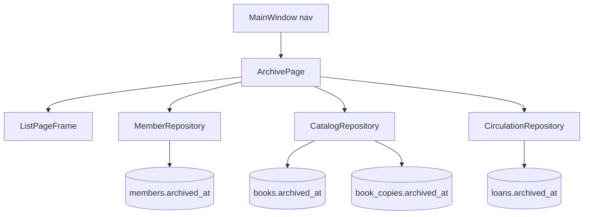
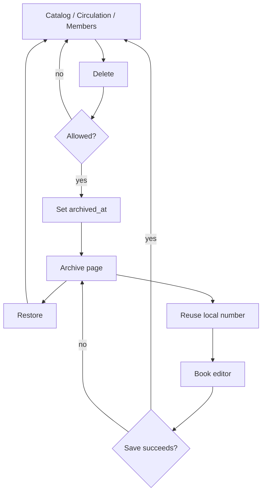

# Archive page

Approved 2026-09-19; revised the same day after a code review (see
**Revision notes** at the end). A fifth list page, same `ListPageFrame`
shell as Catalog / Members / Circulation, listing soft-archived members,
books, copies, and loans. Catalog Delete, removing a copy in the book
editor, and a new Circulation Delete on a returned loan always archive.
Local numbers stay unique; reuse and restore keep a written timeline on
the copy `notes`.

## Scope

In scope:

- `archived_at` on `books`, `book_copies`, and `loans` (members already
  have it)
- `local_id` **and `global_copy_id`** nullable so an archived copy can
  give its number away (the global id is derived from the local number,
  see Copy identity)
- Live lists and pickers hide archived rows; Archive lists only archived
  rows
- `ArchivePage` + header nav
- Restore for all four types
- Reuse local number from an archived copy into the book editor
- Catalog Delete archives a book (title + all live copies); removing a
  copy row in the book editor archives that copy on Save
- **New** Circulation Delete button: archives a returned loan only
- Checkout copy picker excludes archived copies and copies of archived
  books
- Metrics holdings figures count live books and copies only
- `archiveMember` stamps `archived_at` from `Clock::nowIso()` like the
  rest (today it uses SQLite's `datetime('now','localtime')`)
- Core and UI tests as listed below

Out of scope:

- A separate `ArchiveRepository` or archive tables
- Changing member Delete (archive checkbox vs purge stays as today)
- Permanent purge of books, copies, or loans
- Extra Archive facets (year, city, …)
- Add / Edit / Delete on Archive
- Metrics member and loan figures (they already count archived members
  and keep counting every loan as history — see Metrics)
- Import-script archive checks
- Rewriting existing live rows

## Architecture

Archive is a flag on the live row. Loan foreign keys stay on the same
member and copy ids.

`ArchivePage` takes `MemberRepository`, `CatalogRepository`, and
`CirculationRepository`. No new repository type.

`archived_at` is set from `Clock::nowIso()`. Live queries keep
`archived_at IS NULL`. Archive queries use `archived_at IS NOT NULL`.

Each existing query (`MemberQuery`, `BookQuery`, `LoanQuery`) and a new
`CopyQuery` gain `bool archived = false`. Default is live. Archive sets
`true`. List / count / rank stay one code path per entity.

Catalog `totalCopies` and `availableCopies` count only live copies. The
book editor copies table shows only live copies. A live book may have
zero live copies.

### Copy identity

`global_copy_id` is not an independent identity: it is built from the
local number (`AR-<local_id>` for `arabic`, `FR-<local_id>` for
`foreign`, `globalCopyIdFor` in `BookCopyStore.cpp`), and all 20,280
live copies follow that rule. The pair therefore moves as one:

- `id` never changes on archive, restore, or reuse.
- `local_id` and `global_copy_id` are **released together** (both set to
  `NULL`) and **assigned together** (both set, the global id derived from
  the new local number). Never one without the other.
- Only `archived_at`, `local_id`, `global_copy_id`, and `notes` (plus the
  book's `archived_at`) change.

### Every reader of these tables

"Live queries" means every query, not only the list pages:

| Reader | Rule |
|---|---|
| Catalog / Members / Circulation lists, counts, ranks | Live only (`archived = false`) |
| Book editor copies table (`listCopies`) | Live copies only |
| Checkout copy picker (`listAvailableCopies`) | Live copies of live books only |
| Checkout member picker | Live members only (already true) |
| Member loan history (`MemberLoansDialog`) | All loans, archived included: it is the member's history |
| Metrics | See Metrics |

### Metrics

- Holdings count live rows only: `bookTitles`, `totalCopies`,
  `availableCopies`, and the per-category book counts.
- Member and loan figures count every row, archived included, as they do
  for members today: they describe history, and a loan archived out of
  Circulation still happened.

An archived book still occupies
`UNIQUE (title, author_id, publisher_id, isbn, language)`. Adding the
same title again while it is archived fails with a dedicated key
`error.book.duplicateArchived` ("This book is in the Archive; restore it
from there") instead of the generic duplicate error.

## Schema

Schema version 6 (`Database::kSchemaVersion`, `PRAGMA user_version` in
`database/schema.sql`).

Add `archived_at TEXT` (nullable, same `datetime(x) IS x` check as
members) and an index on `books`, `book_copies`, and `loans`. Existing
databases get `ALTER TABLE` migrations for `books` and `loans`.

`book_copies` is **rebuilt**: `local_id TEXT` and `global_copy_id TEXT`
become nullable, and `archived_at` is added. `UNIQUE (source, local_id)`
and `UNIQUE (global_copy_id)` stay. SQLite treats `NULL` as distinct, so
many archived copies may hold `NULL` in both. Never store `''` for a
released number — that would collide.

The rebuild follows the existing pattern (`migrateBookLanguageIfNeeded`):
`PRAGMA foreign_keys = OFF` outside the transaction, create
`book_copies_new`, copy, drop, rename, recreate indexes, then
`PRAGMA foreign_key_check` must return no rows before `foreign_keys = ON`
(`loans.book_copy_id` references this table). The column order of the
rebuilt table and of `schema.sql` must match, since the schema test
compares a fresh database with a migrated one.

## Page

`ListPageFrame::buildList`: type filter, search, button pad, table,
pager, preview + details.

Header order: Catalog · Members · Circulation · **Archive** · Metrics.
`MainWindow::Page` gains `Archive`. Strings: `page.archive.title`,
`page.archive.body` in ar / fr / en.

Type filter is single-select (Circulation's status list, not Members'
multi-select facets):

- Members
- Books
- Copies
- Loans

One type at a time. Search, pager, and header-click sort apply to that
type only.

| Type | Columns | Sort keys |
|---|---|---|
| Members | number, name, city, status, archived at | `number`, `name`, `city`, `status`, `archivedAt` |
| Books | title, author, archived copies, archived at | `title`, `author`, `copies`, `archivedAt` |
| Copies | local no. (em dash if none), source, book title, archived at | `localId`, `source`, `title`, `archivedAt` |
| Loans | member, copy / title, returned at, archived at | `member`, `title`, `returned`, `archivedAt` |

Default order before a header click: `archived_at` descending, then id
descending.

Buttons:

- **Restore** — enabled when a row is selected
- **Reuse local number** — visible only on Copies; enabled when the
  selected copy has a non-null `local_id`

No Add / Edit / Delete on Archive. Member loan history stays on Members
and Circulation.

Details pane: the matching live preview (member photo, book cover, copy
fields, loan summary) plus `archived_at` and, for copies, `notes`.

## Behaviour

### Into Archive

**Member** — unchanged apart from the timestamp source. Delete offers
archive vs purge. Open loans block. `members.archived_at` set from
`Clock::nowIso()`; they cannot borrow.

**Book** — Catalog Delete archives the title and every **live** copy in
one transaction, all with the **same** `archived_at` value (one
`Clock::nowIso()` read). Refused if any live copy is on loan.
Already-archived copies keep their earlier stamp. The cover folder
`resources/books/<id>` is **kept**: archiving is not today's
`deleteBook`, which also removes that folder; the Archive details pane
shows the cover.

**Copy** — removing a copy row in the book editor (`BookCopiesTable`)
archives that copy **when the editor is saved**, inside the same
transaction as the rest of the save: the `DELETE FROM book_copies` loop
in `BookCopyStore::applyCopies` becomes an `UPDATE … SET archived_at`.
Refused if the copy is on loan (as today). The copy keeps its number. The
book stays in Catalog even when that was the last live copy.
Removing copy *N* and adding a new row with the same number *N* in one
editor session is refused with `error.copy.numberHeldByArchived`: the
archived copy still holds *N*; the way to move a number is Archive →
Reuse local number. (New rows get their number from the suggest-next
helper, which already counts archived rows, so this only happens when a
number is typed by hand.)

**Loan** — Circulation gains a **Delete** button (new; Circulation has
none today, and Core has no loan delete). It is enabled only when the
selected loan is returned, and sets `loans.archived_at`. Open and
overdue loans keep it disabled; called anyway, Core refuses with
`error.loan.archiveOpen`. Circulation still lists closed loans until
they are archived. Strings: `circulation.delete`,
`circulation.archiveLoan` (confirmation) in ar / fr / en.

Confirmations: Catalog Delete and Circulation Delete on a closed loan
ask once ("move to archive"). No purge checkbox. Members keep today's
dialog.

### Restore

**Member** — clear `archived_at`. They appear on Members and may borrow.

**Book** — clear the book's `archived_at` and the `archived_at` of every
archived copy of that book whose stamp **equals the book's** (archived
together with it) and that still has a `local_id`. Copies archived on
their own earlier (a different stamp) stay archived. Copies with `NULL`
`local_id` stay in Archive for a manual check.

**Copy** — clear the copy's `archived_at` and attach it to the original
`book_id`. If that book is archived, clear the book's `archived_at`
too. Sibling copies stay archived. If the original book row is missing,
refuse.

A numberless copy (`local_id` IS NULL) gets the next unique integer for
its `source` (the existing suggest-next helper) **and the matching
`global_copy_id`**, and appends the remark `copy.note.newIndexedAs` to
`notes`. Assignment and the flag clear are one transaction. Collision
aborts the transaction; the copy stays archived and numberless.

**Loan** — clear `loans.archived_at`. It returns to Circulation as a
closed loan.

### Reuse local number

Offered only for an archived copy that still has `local_id`.

1. A chooser lists live Catalog books **whose language maps to the same
   `source`** as the archived copy (`copySourceForLanguage`), plus "New
   book". The librarian picks one. A new book's language must map to that
   source too; otherwise the editor refuses with
   `error.copy.sourceMismatch`.
2. The book editor opens (existing book, or empty new-book editor) with a
   new copy row filled with that `source`, `local_id`, and the derived
   `global_copy_id`. Those fields are read-only for this session so the
   number cannot drift.
3. The editor must **not** clear the archived number on open.
4. On **successful save only**, one transaction, in this order:
   1. check the archived copy still holds `XXXX` (else
      `error.copy.reuseStale`, nothing written);
   2. **release** it: set the archived copy's `local_id` and
      `global_copy_id` to `NULL` and append `copy.note.wasIndexedAs` to
      its `notes`;
   3. **then** write the book and the live copy with `XXXX`.

   The release must come first: while the archived copy holds `XXXX`,
   both `UNIQUE (source, local_id)` and `UNIQUE (global_copy_id)` reject
   the live copy.
5. Cancel, validation failure, or any SQL error in any step: the
   transaction rolls back; the archived copy still holds `XXXX` and no
   remark is appended.

`XXXX` is the local number that moved. Remarks append to `notes` with a
newline separator if `notes` is already non-empty.

Remarks are written in the librarian's UI language at the time, through
`Strings::t(key, "number", XXXX)` (the project's `{name}` placeholders), so the note reads like the
rest of that librarian's data:

| Key | en | fr | ar |
|---|---|---|---|
| `copy.note.wasIndexedAs` | was indexed as {number} | était indexé sous {number} | كان مفهرسًا تحت الرقم {number} |
| `copy.note.newIndexedAs` | new indexed as {number} | nouvellement indexé sous {number} | أعيدت فهرسته تحت الرقم {number} |

Two librarians reusing the same number: the second save fails at step 4.1
(`error.copy.reuseStale`); only a committed save releases an archived
number.

## Error handling

All failures are `Result` / `Status` keys via `Strings::t`. No raw SQL
in the UI.

| Situation | Result |
|---|---|
| Archive a book or copy that is on loan | Refuse; Catalog unchanged |
| Archive an open or overdue loan | Delete disabled; if called, `error.loan.archiveOpen` |
| Archive a member with open loans | Unchanged (refuse / jump to Circulation) |
| Add a book identical to an archived one | `error.book.duplicateArchived` |
| Re-add a number removed in the same editor session | `error.copy.numberHeldByArchived` |
| Restore a row that is not archived | Not-found / already-live; no write |
| Restore a copy whose book row is missing | Validation error; copy stays archived |
| Next local number collides on restore | Transaction aborts; copy stays archived and numberless |
| Reuse when the archived copy no longer holds that number | `error.copy.reuseStale`; nothing written |
| Reuse onto a book of the other source | `error.copy.sourceMismatch` |
| Reuse save fails at any step | Whole transaction rolls back; archived number unchanged, no remark |
| List / count / rank SQL fails | Existing repo-error path; last good table kept |

New keys (ar / fr / en): `error.book.duplicateArchived`,
`error.copy.numberHeldByArchived`, `error.copy.reuseStale`,
`error.copy.sourceMismatch`, `error.loan.archiveOpen`,
`copy.note.wasIndexedAs`, `copy.note.newIndexedAs`, `circulation.delete`,
`circulation.archiveLoan`, `page.archive.title`, `page.archive.body`,
plus the Archive type, column, and button labels.

## Tests

Same executables: `test_vlms_core`, `test_vlms_ui`.

The live database has **no loans yet** (0 rows), so every loan-archive
and loan-block path is covered by seeded tests only.

**Core** (Qt-free, `TestDatabase` / `TestSeed` / `Clock` override):

- Live lists omit `archived_at` rows; `archived = true` returns only
  those rows
- Checkout picker omits archived copies and copies of archived books
- Member loan history still includes archived loans
- Metrics: archived books and copies leave `bookTitles`, `totalCopies`,
  `availableCopies`, and category counts; loan and member figures do not
  change when a loan is archived
- Archive book: all live copies flagged with the book's exact stamp;
  refused when any copy is on loan; one transaction; cover folder kept
- Archive one copy via editor save: book stays listed; last copy may
  leave a zero-copy live book; removing *N* and re-adding *N* in one save
  → `error.copy.numberHeldByArchived`, nothing written
- Archive returned loan; refuse open loan with `error.loan.archiveOpen`
- Restore book: title + copies with the same stamp and a number; a copy
  archived earlier on its own stays archived; `NULL`-number copies stay
  archived
- Restore copy: book comes back if it was archived; siblings stay
  archived
- Restore numberless copy: new unique `(source, local_id)`, matching
  `global_copy_id`, and the `copy.note.newIndexedAs` remark on `notes`
- Reuse: successful save releases the archived `local_id` **and**
  `global_copy_id`, appends `copy.note.wasIndexedAs`, live copy holds the
  number and `AR-/FR-XXXX`
- Reuse rollback: failure after the release is staged (e.g. the live
  write fails) → archived row still holds `XXXX` and its global id, no
  remark
- Reuse stale: the archived copy lost its number meanwhile →
  `error.copy.reuseStale`, nothing written
- Reuse source mismatch → `error.copy.sourceMismatch`
- Duplicate of an archived book → `error.book.duplicateArchived`
- Uniqueness: two live copies cannot share `(source, local_id)` or
  `global_copy_id`; several archived rows may hold `NULL` in both
- Migration v5 → v6: `book_copies` rebuilt with nullable numbers, data
  and loan references intact, `foreign_key_check` clean, column order
  equal to a fresh v6 database
- `archiveMember` stamps from the pinned `Clock`

**UI:**

- MainWindow has an Archive nav button and shows `ArchivePage`
- Type filter swaps columns; search / pager / header sort follow the
  selected type
- Restore enabled on selection; Reuse visible only on Copies and only
  when `local_id` is set
- Catalog Delete on a book archives (confirmation, no purge checkbox);
  removing a copy row archives it on Save
- Circulation Delete button exists, archives a returned loan, and is
  disabled on an open loan
- Reuse chooser lists only books of the matching source; the editor
  opens with the number and global id filled and read-only; cancel
  leaves the archived number in place

## Non-goals

- Remembering Archive type / sort after restart
- Editing archived records in place
- Auto-archiving a loan when it is returned
- Auto-archiving a book when its last copy is archived
- Reusing a local number onto a different *copy row* without the book
  editor

## Revision notes

Changes after the 2026-09-19 review, each checked against the code:

1. **Copy identity** — `global_copy_id` is derived from `local_id` and
   unique, so "never changes" made reuse impossible. It is now released
   and assigned together with `local_id`, and nullable.
2. **Reuse order** — release the archived number first, then write the
   live copy; the old order failed on both unique constraints.
3. **Every reader** — added the checkout picker, member loan history, and
   Metrics rules; `listAvailableCopies` had no archive filter.
4. **Book restore** — restores only copies stamped with the book's own
   `archived_at`, so a copy archived separately earlier stays archived.
5. **Copy removal** — happens at editor Save through
   `BookCopyStore::applyCopies`, whose delete loop becomes an archive;
   same-session remove + re-add of a number is refused.
6. **Cover files** — archiving keeps `resources/books/<id>`, unlike
   `deleteBook`.
7. **Circulation Delete** — marked as a new button and Core operation.
8. Minor: schema v6 and the `book_copies` rebuild procedure;
   `archiveMember` moves to `Clock`; dedicated key for a duplicate of an
   archived book; reuse chooser filtered by source; remark keys localized
   at write time.
